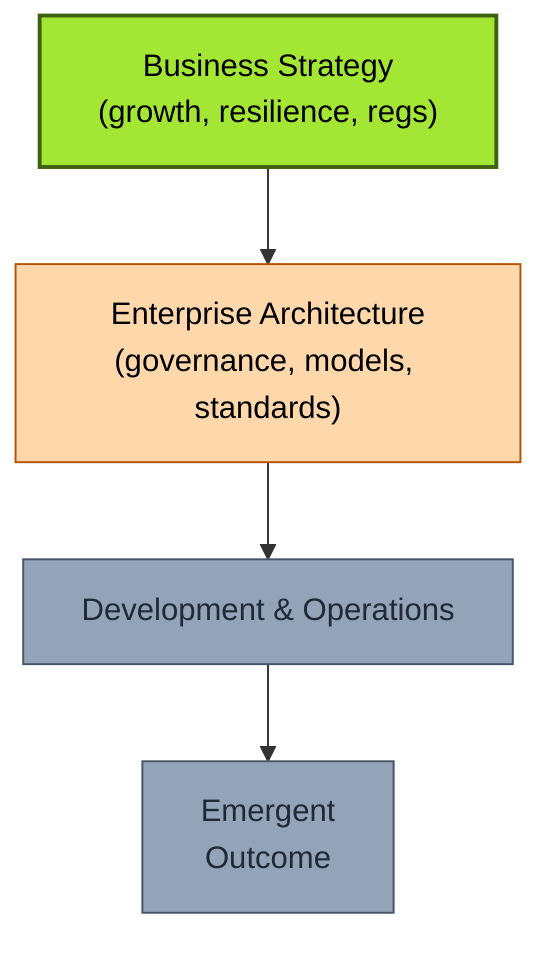

# [C1-01] What is Enterprise Architecture? — BRIEF
> **Category:** C1 Foundations · **Difficulty:** ● foundational · **Banking-relevant:** yes

> **One-liner:** Enterprise Architecture is the *systematic practice of translating enterprise governance strategy into structures, standards, and technology decisions* that align business capabilities, outcomes, and risk appetite with supporting applications, data, and infrastructure.

> **Why an EA cares:** Without a defined EA, banks accumulate "accidental architectures" — shadow IT, siloed data, inconsistent security — that cause integration failures, regulatory gaps, and billions in remediation cost.

## Quick definition
Enterprise Architecture (EA) is the practice of designing and governing the **integrated structures of an enterprise**: business capabilities, organizational flows, information, and technology — so that the whole behaves coherently and delivers on strategy. It is distinct from system/software architecture (which is one building-block view) and from IT strategy (which EA *consumes* and *translates*).

## Key ideas / terms
- **Enterprise:** the entire organization + its ecosystem of partners and regulators.
- **Architecture:** a description of components plus the relationships that produce key emergent behaviors.
- **Governance:** the policies, standards, and decision rights that constrain and direct the architecture.
- **Alignment:** the degree to which technology realizes the current and target business strategy.
- **Target architecture:** the future state the enterprise aims for.
- **Actual/Accidental architecture:** the architecture that has emerged organically — usually inconsistent and risky.

## The mental model
EA is the **translation layer** between the business strategy (what the bank must achieve — growth, market position, resilience) and the technology stack (what actually gets built). Think of it as *strategy → capability → structure → standards → enforcement*. If the translation is broken, the bank runs as a collection of capable but incoherent systems.

## One diagram (mandatory)

## When to use / when NOT to use
- ✅ **Use when:** starting a transformation, merging entities, onboarding major platform, or recovering from a failure.
- ⚠️ **Avoid when:** the organization lacks any strategic clarity, or leadership will not enforce decisions (EA becomes a presentation factory).

## Banking 💳 example
A global bank wants to enter open-banking (PSD2). Without EA, each region picks its own API gateway and PSD2-connector. EA defines a *single* Open Banking reference architecture — common authentication (OAuth 2.0 + PSU identification), common event schema, and a shared compliance/KYC layer — so all regions merge cleanly and an external auditor audits once, not 12 times.

## Common confusions (don't mix these up)
- **EA vs IT Strategy:** IT strategy says *"we will digitize."* EA says *how* and *where*, and which capabilities/data/apps are needed and why.
- **EA vs System Architecture:** EA is the *governance of many* systems; system architecture designs *one* system (e.g., the payments core).
- **Business Architecture vs Enterprise Architecture:** Business architecture describes *how the business works*; EA ensures the technology *supports* it and does not undermine it.

## Interview / recall prompt
_"Explain what Enterprise Architecture is, and why a bank specifically needs it — in 2 minutes without notes."_
→ Define EA precisely. Walk the strategy→technology translation. Mention one banking cost of not having it (integration debt, compliance gaps, shadow IT).
