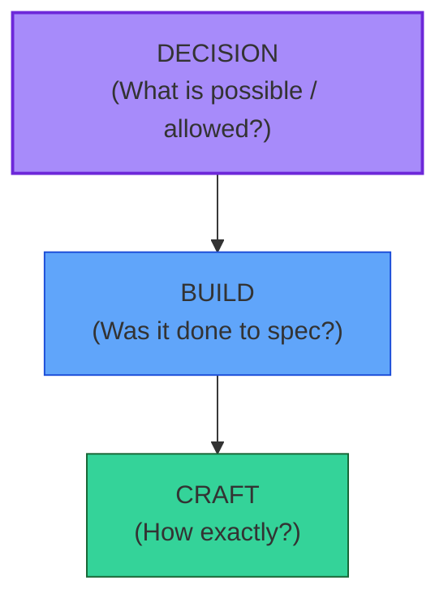

# [C1-02] Architecture vs Engineering vs Design — BRIEF
> **Category:** C1 Foundations · **Difficulty:** ● foundational · **Banking-relevant:** no
> **One-liner:** *Architecture* (a decision of options), *engineering* (enforcing the built outcome), and *design* (spec-level choices) are nested disciplines — confuse them and you lose the decision-right hierarchy.
> **Why an EA cares:** If "architecture" is treated as architecture-*delivery*, the governance role disappears and control ends at code merge — a compliance and risk nightmare in banking.

## Quick definition
- **Architecture:** making and enforcing *fundamental* choices among alternatives that constrain a system's structure, behavior, and evolution (Michel Martin's "choice of alternatives").
- **Engineering:** ensuring the *built* system matches its specification — quality, process execution, integration.
- **Design:** making *spec-level* decisions inside a given structure (e.g., class names, layout).

## Key ideas / terms
- **Fundamental vs spec-level decisions** (Bass / Clements).
- **Decision rights:** *who* makes which class of decision (AD = architecture, SD = software, L = lead).
- **Enforcement:** architecture must be enforceable beyond analysis.

## The mental model
Think of it as **three layers of a bank's decision pyramid**:
- **Top (Architecture):** *What* (e.g., " settlement uses message bus, not synchronous") — existential; we own these with governance.
- **Middle (Engineering):** *Did we build it right?* — implementation fidelity.
- **Bottom (Design):** *How exactly?* — within the constraints set above.

## One diagram (mandatory)

## When to use / when NOT to use
- ✅ **Use:** assigning decision rights, pursuing certification, designing governance.
- ⚠️ **Avoid:** treating every commit as an architectural decision; use AD for *only* putting / enforcing big decisions.
