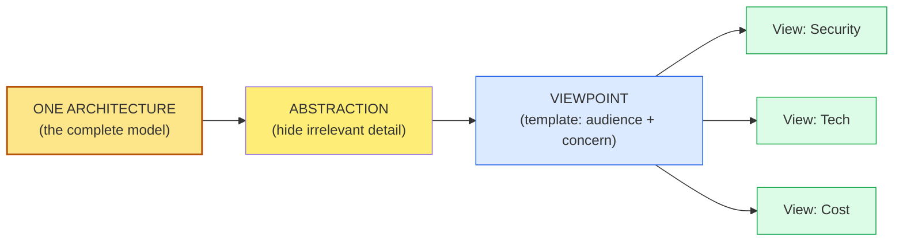

# [C1-04] Abstraction, Views & Representations — BRIEF
> **Category:** C1 Foundations · **Difficulty:** ● foundational · **Banking-relevant:** yes
> **One-liner:** Abstraction *selects what to include and hide*; a *view* is a *representation for a specific stakeholder concern*; the same architecture needs *multiple views* — one diagram never suffices.
> **Why an EA cares:** Stakeholders disagree on what matters (CTO = tech debt; CRO = regulatory exposure); without views, you argue about *the same thing with different pictures* and never decide.

## Quick definition
**Abstraction** is the deliberate simplification of a system by retaining only information relevant to a chosen viewpoint and hiding the rest. A **viewpoint** is a *template of questions* (what to show for a concern). A **view** is the actual *artifact* produced from a viewpoint (a diagram, table, narrative).

## Key ideas / terms
- **Abstraction:** omission + distortion (Simon, *Sciences of the Artificial*).
- **Viewpoint:** a set of concerns + visualization constructs (Gartner's "what each stakeholder cares about").
- **View:** one instantiation of a viewpoint (e.g., the C4 Deployment diagram).
- **Models:** the formal/informal language used (UML, ArchiMate, natural language).
- **Distilled vs rich:** how much detail a view exposes.

## The mental model
One architecture, many audiences:
- **Board/CRO:** security & compliance risk *views* (risk register, control gaps).
- **CTO:** technology & cloud *views* (platform, cost, footprints).
- **Engineers:** deployable *views* (modules, contracts, data flow).
- **Regulator:** What-is-built vs What-is-required *views*.

## One diagram (mandatory)

## When to use / when NOT to use
- ✅ **Use:** communicating with mixed audiences; auditing; compliance review.
- ⚠️ **Avoid:** creating *one* super-overloaded diagram thinking it's comprehensive.
