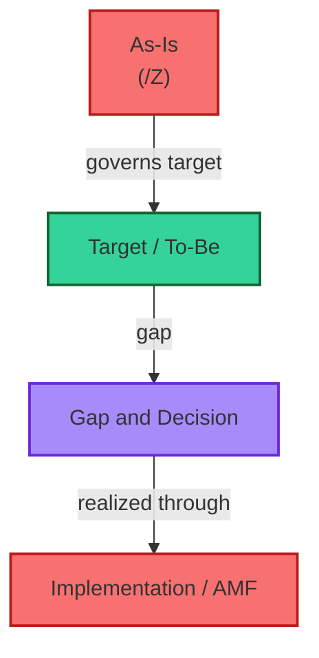

# [C1-08] Core EA Vocabulary & Glossary — BRIEF
> **Category:** C1 Foundations · **Difficulty:** ● foundational · **Banking-relevant:** yes
> **One-liner:** A maintained, cross-referenced glossary defines *every term* with identical precision across all documents — so when a CIO says "as-is" and a CISO says "as-is," they mean the same thing.
> **Why an EA cares:** In regulated banks, divergent definitions across documents are *regulatory gaps*.

## Quick definition
A **glossary** is a definitive, maintained list of terms with precise, scope-bound definitions and *cross-references* to the concepts/IDs they connect to. It is *not* synonyms — it is *reference plus provenance* (who defined it, when, against which standard).

## Core terms
| # | Term | One-line definition | Related (IDs) |
|---|------|-------------------|---------------|
| 1 | **Architecture (IEEE 1471):** | A "fundamental concept or proposition that a system is organized" — not "the things," but "the idea." | C1-01, C2-* |
| 2 | **As-Is (actual):** | The *current, implemented* structure of the enterprise, including accidental deviations. | C3-10, C1-07 |
| 3 | **Capability:** | The ability to deliver a specific outcome/risk; expressed in business language, *not* as a system. | C3-01, C6-05 |
| 4 | **Decision rights:** | *Who* may commit/bind to each class of architectural decision (AD / SD / AE / L). | C1-06, C9-02 |
| 5 | **Gap:** | The deviation between the current/actual/realized structure and the target/intented structure. | C1-07, C6-05 |
| 6 | **It:** | A body of universally-applicable architecture knowledge; a discipline, not a document. | C1-01, C2-* |
| 7 | **Individual system:** | One system/software/electrical structure/software within the enterprise. | C1-01, C1-04 |
| 8 | **Target / To-Be:** | The architecture the enterprise *intends* to have, governed by decisions. | C1-07, C8-03 |
| 9 | **To-Be (Intended / Target):** | A model of the *intended* architecture; may be frozen or agilely evolved. | C1-07, C3-03/C3-10 |
| 10 | **Build-by-zonal:** | Repeated capability-level statement-structure structure-level *ART*; *artifacts + rules + tests*. | C2-* |

## Designation graph

## When to use / when NOT to use
- ✅ **Use:** every BA/EA document + ADR template + compliance evidence packaging.
- ⚠️ **Avoid:** a glossary written once and never maintained; it must evolve with ADR outcomes (C1-09).
