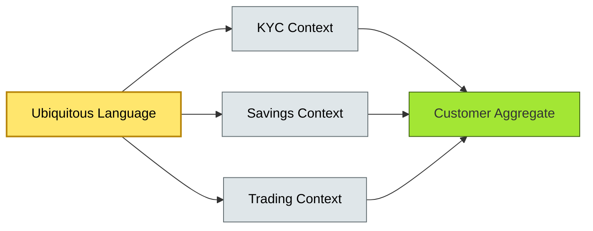

# [C10-01] Domain-Driven Design (Strategic) — BRIEF
> **Category:** C10 — Emerging & Advanced Topics · **Difficulty:** ●/◑/○ · **Banking-relevant:** yes
> **One-liner:** Domain-Driven Design is a strategic approach to complex software development where the Heart of the Domain directly shapes the code, team structure, and business rules.
> **Why an EA cares:** In capital markets and retail banking, the business domain is orders of magnitude more complex than in consumer tech; DDD prevents the divergence between regulatory models and production code that regulators now penalize under DORA and Basel III.
## Quick definition
Domain-Driven Design (DDD) is a methodology for structuring software around complex business domains rather than frameworks or tools. It prioritizes a shared, ubiquitous language between developers and domain experts to keep the code aligned with the business model. The strategic form of DDD adds organizational and governance layers so that the software architecture propagates across banks, trading houses, and central clearing facilities.
## Key ideas / terms
- **Ubiquitous Language:** A single, exact vocabulary used by both business experts and developers to describe domain concepts, reducing ambiguity and miscommunication.
- **Bounded Context:** A clear boundary within which a particular domain model applies; different contexts enable different internally consistent models (e.g., "Customer" means different things in KYC vs. WealthMgmt).
- **Aggregate:** A cluster of domain objects treated as a unit for data changes, with a single Aggregate Root ensuring consistency within the boundary.
- **Strategic Context:** The enterprise-level application of DDD principles—aligning team topology, API contracts, and regulatory reporting to domain boundaries.
## The mental model
DDD operates as a **domain-to-code feedback loop**: the deeper the shared language, the lower the cognitive load, and the more resilient the architecture to regulatory shocks. In banking, this means that a change in accounting standards (IFRS 9 vs. FASB) should require only a change within one Bounded Context rather than a global rewrite.
## One diagram (mandatory)

## When to use / when NOT to use
- ✅ **Use when:** The problem domain is rich in complex business rules (e.g., loan origination, derivatives pricing, trade finance).
- ⚠️ **Avoid when:** The domain is simple CRUD with no volatile business logic; the overhead of Bounded Contexts and Ubiquitous Language will slow delivery.
## Banking 💳 example
A major European retail bank refacts its retail lending platform into separate Bounded Contexts: *Origination* (credit scoring and eligibility), *Servicing* (repayments and collections), and *Risk * (PD/LGD modeling). Each context owns its own ubiquitous language so that product managers and engineers no longer schedule 30-minute "alignment meetings" every sprint; instead, API contracts between contexts are versioned and regulated like internal market infrastructures.
## Common confusions (don't mix these up)
- **DDD vs Microservices:** DDD is a modeling approach; microservices are an organizational pattern. You can use a macro-service that is not DDD, or a microservice with no domain model.
- **Ubiquitous Language vs Business Glossary:** A business glossary is a controlled vocabulary; Ubiquitous Language is the *conversation* that produces shared understanding.
## Interview / recall prompt
"Explain DDD in 2 minutes without notes." → 1) Define Ubiquitous Language. 2) Explain Bounded Context as a consistency boundary. 3) Name 2–3 banking contexts (KYC, Lending, Trading). 4) Link to DORA/regulation. 5) Warn against "anemic domain model."
---
**Status:** ✅ Created · See detail doc: `[details/C10-01-ddd-strategic.md](../details/C10-01-ddd-strategic.md)`
