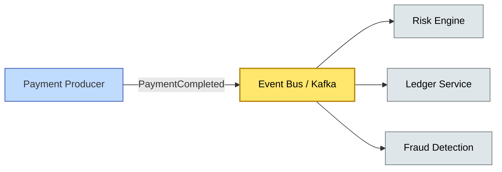

# [C10-02] Event-Driven Architecture — BRIEF
> **Category:** C10 — Emerging & Advanced Topics · **Difficulty:** ●/◑/○ · **Banking-relevant:** yes
> **One-liner:** An event-driven architecture decouples producers and consumers of business facts through asynchronous message flows, enabling real-time responsiveness and resilience in high-volume financial services.
> **Why an EA cares:** Banks process millions of payment events and market data ticks per second; event-driven systems let you scale finserv logic horizontally without calendar-clock synchronization, but they introduce exactly-once delivery and event-sourcing complexity that CIOs must govern.
## Quick definition
An event-driven architecture (EDA) is a software design pattern in which state changes are captured, published, and consumed as immutable event streams. In banking, this means that a loan approval isn't a synchronous function call; it's a published `LoanApproved` domain event that multiple downstream systems (servicing, reporting, audit) consume independently.
## Key ideas / terms
- **Event:** An immutable record that a fact has changed in the past, written once, never updated (e.g., `FundsTransferred`).
- **Event Stream:** An ordered, append-only log of events on a topic or stream (e.g., Kafka topic `payments.v1`).
- **Consumer:** Any system that reads stream events and reacts (materializes read models, updates risk aggregates, triggers downstream workflows).
- **Backpressure:** A flow-control strategy when a consumer is slower than the producer, preventing buffer overflow and message loss.
- **Eventual Consistency:** The property that all consumers will eventually reflect the same aggregate truth after processing the full stream.
## The mental model
EDA replaces the **synchronous request-reply** mental model with a **fire-and-forget publish-subscribe** model. In banking, this is the difference between a real-time gross settlement (RTGS) system and a traditional overnight batch system: events fire continuously, and consumers catch up at their own pace.
## One diagram (mandatory)

## When to use / when NOT to use
- ✅ **Use when:** High-throughput, time-sensitive processes (card authorization, ACH settlement, market data distribution) require horizontal scaling and loose coupling.
- ⚠️ **Avoid when:** Exact real-time, strongly consistent control-plane operations (e.g., a central trading desk engine requiring < 100 µs decision latency) require synchronous, shared-memory locking.
## Banking 💳 example
A Neobank processes millions of debit-card transactions per hour. On authorization, the card payment gateway publishes a `TransactionAuthorized` event to a Kafka topic. The Debit Settlement Service consumes it in real time; the AML Screening Service consumes it asynchronously for profile updates; the Customer Notification Service consumes it for push-notification delivery. Each consumer owns its own read model, so a failure in notification delivery never blocks the transaction thread.
## Common confusions (don't mix these up)
- **Event-Driven vs Message-Driven:** Event-driven focuses on *facts that changed*; message-driven focuses on *requests and commands*. In banking, a wire transfer is an event (`FundsSent`), not a message or a command.
- **Eventual Consistency vs Eventual Availability:** Eventual consistency is about *state convergence*; eventual availability is about *service uptime*.
## Interview / recall prompt
"Explain EDA in 2 minutes without notes." → 1) Define event as immutable. 2) Contrast to request-reply. 3) Mention at least one Kafka skill. 4) Name a banking use case (payments, market data, fraud). 5) Warn about ordering and idempotency.
---
**Status:** ✅ Created · See detail doc: `[details/C10-02-event-driven.md](../details/C10-02-event-driven.md)`
