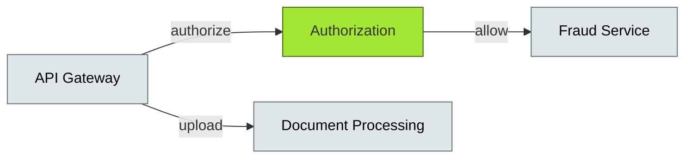

# [C10-03] Serverless Computing — BRIEF
> **Category:** C10 — Emerging & Advanced Topics · **Difficulty:** ○/◑/● · **Banking-relevant:** yes
> **One-liner:** Serverless computing is an execution model where cloud providers autonomously manage infrastructure, letting banks run discrete functions without provisioning servers—trading cold-start latency and vendor lock-in for operational agility.
> **Why an EA cares:** For compliance-driven workloads like sandbox workloads, KYC document processing, and fraud-scoring auto-scaling, serverless removes capacity planning overhead; but for core banking, the right to a "full audit trail" of platform config and the risk of cold starts on critical payment paths make it a mixed signal.
## Quick definition
Serverless computing (Function-as-a-Service, FaaS) is a cloud execution model where code runs in ephemeral, stateless functions triggered by events, with no persistent infrastructure for the customer to manage. The cloud provider handles the operating system, runtime, patching, and concurrency, while the customer supplies the function and its triggers.
## Key ideas / terms
- **Function-as-a-Service (FaaS):** The dominant serverless model: code is packaged and invoked in response to events, billed per-invocation.
- **Cold Start:** The latency penalty when a function is invoked after a period of inactivity; must be hardened for < 100 ms in banking fraud APIs.
- **Concurrency:** The number of simultaneous function instances your account/function may run; billable and rate-limited by the provider.
- **Handler / Runtime:** The entry point and the execution environment (e.g., JVM, .NET, Python, Node).
- **Idempotency Key:** A mandatory pattern in serverless; because functions can retry, callers must include a key to deduplicate.
- **Provisioned Concurrency:** A FaaS premium feature that keeps functions pre-warmed to eliminate cold starts, at higher cost.
## The mental model
Serverless is the ultimate form of **resource decoupling**: the bank writes business logic as *what to do in response to an event*, not *where to run it or how many workers to keep warm*. The operational "cattle" (functions) are consumed instantly and disappear; the only asset you deploy is your own code.
## One diagram (mandatory)

## When to use / when NOT to use
- ✅ **Use when:** Bursty, event-triggered workloads (image OCR for KYC, fraud scoring, KYC screening) where idle capacity would waste money.
- ⚠️ **Avoid when:** Long-running, stateful, or latency-sensitive core-payment paths where cold starts and<|reserved_token_163724|> execution timeouts risk SLA violations.
## Banking 💳 example
A major bank processes 50,000 KYC documents per day. Using an S3-triggered Lambda (or Azure Functions), each document scan is validated, OCR'd, and screened against sanctions lists in < 2 seconds—pay per scan. The bank saved 2 FTE infrastructure ops and eliminated monthly capacity planning. Cold-start latency is handled by provisioned concurrency for fraud-scoring APIs that must respond in < 50 ms.
## Common confusions (don't mix these up)
- **Serverless vs Containers (Kubernetes):** Serverless abstracts servers; containers still require you to provision and patch nodes.
- **Pay-per-use vs Discounted Reserved:** Serverless is generally more expensive at steady high volume; AWS Graviton + reserved EC2 can outcompete Lambda for predictable workloads.
## Interview / recall prompt
"Explain serverless in 2 minutes without notes." → 1) Define as FaaS, no server management. 2) Mention cold start and idempotency. 3) Name one provider (AWS Lambda, Azure Functions, GCF). 4) Give a banking use case (KYC, fraud, sandbox). 5) Warn about vendor lock-in.
---
**Status:** ✅ Created · See detail doc: `[details/C10-03-serverless.md](../details/C10-03-serverless.md)`
