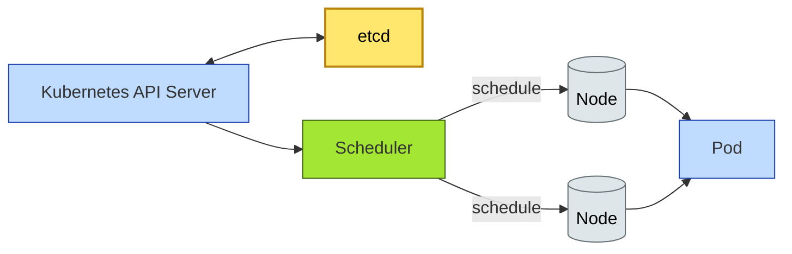

# [C10-04] Kubernetes & Containers — BRIEF
> **Category:** C10 — Emerging & Advanced Topics · **Difficulty:** ●/◑/○ · **Banking-relevant:** yes
> **One-liner:** Kubernetes is an open-source container orchestration platform that automates deployment, scaling, and recovery of containerized banking applications across hybrid and public cloud environments.
> **Why an EA cares:** For banks with strict data-residency and disaster-recovery requirements, Kubernetes gives infrastructure-as-code portability; however, the operational complexity, security surface (CNI != CNI policies vs. cloud-native security), and "it works in staging, not prod" issues make it a governance challenge for the CIO-CTO triad.
## Quick definition
Kubernetes is an open-source system for automating the deployment, scaling, and management of containerized applications. In banking, it is the de-facto standard for running microservices, fraud-scoring pipelines, and KYC workloads at scale.
## Key ideas / terms
- **Container:** A lightweight, isolated OS-level package; the unit of compute.
- **Pod:** The smallest deployable unit; one or more tightly coupled containers sharing network and storage.
- **Node:** A VM or bare-metal host that runs pods.
- **etcd:** The Kubernetes cluster's authoritative state store; sensitive for banking use.
- **CNI (Container Network Policy):** Controls pod-to-pod and pod-to-service network traffic; critical for zero-trust and segmentation.
- **Horizontal Pod Autoscaler (HPA):** Scales pods based on CPU/memory (or custom metrics) to handle demand spikes.
- **Cluster Autoscaler:** Adjusts the number of nodes to match pod demand.
- **Downgrade Impact:** The blast radius when a node is drained or the control plane fails.
## The mental model
Kubernetes is the **universal crane** in a hybrid cloud: you can provision a node on-prem for regulated workloads, in VMware Cloud on AWS for disaster-recovery testing, and on a public cloud for burst capacity. The crane itself (kubelet, kube-apiserver) is stateless in design but stateful in effect because etcd holds your secrets and configs.
## One diagram (mandatory)

## When to use / when NOT to use
- ✅ **Use when:** Multi-cloud strategies, complex CI/CD rollouts, batch workloads (GPU for KYC, fraud training), or high availability.
- ⚠️ **Avoid when:** Simple 2-3 service monoliths, single-region, or workloads where < 10 ms cost is paramount and the operational team is not staffed.
## Banking 💳 example
A global bank uses Kubernetes to run its cross-border payments platform: the Same-Day-Transfer service, the FX Swap engine, and the Compliance Screening gateway all run in separate namespaces, with strict CNI policies. When a DDoS spike hits at 11:00 UTC (market open), the Cluster Autoscaler pulls nodes from a warm pool in AWS; the HPA adds more fraud-scoring pods.
## Common confusions (don't mix these up)
- **Kubernetes vs Docker Swarm:** Swarm is simpler but less mature; K8s is the banking standard.
- **Container vs Virtual Machine:** VM is a full OS; container is a process-level isolation. K8s manages containers, but nodes are VMs.
## Interview / recall prompt
"Explain Kubernetes in 2 minutes without notes." → 1) Define as an orchestration platform for containers. 2) Mention Pod, Node, API Server. 3) Name a banking use case (payments, KYC, HFT). 4) Warn about etcd security. 5) Mention namespace and RBAC.
---
**Status:** ✅ Created · See detail doc: `[details/C10-04-k8s.md](../details/C10-04-k8s.md)`
