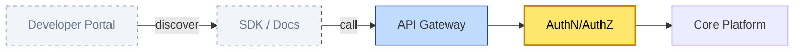

# [C10-05] API Economy — BRIEF
> **Category:** C10 — Emerging & Advanced Topics · **Difficulty:** ○/◑/● · **Banking-relevant:** yes
> **One-liner:** The API Economy is the business-ification of APIs—treating every capability (payments, identity, risk scoring) as a product that is discovered, priced, governed, and evolved like a financial instrument.
> **Why an EA cares:** Banks must expose core services (account lookup, open banking, tokenization) to external fintechs and reg-techs while maintaining PCI-DSS, SOC 2, and DORA compliance; the API acts as the enforceable, auditable contract between the bank and its 3rd-party consumers.
## Quick definition
The API Economy is the practice of thinking of APIs not as technical interfaces but as **products**—with managed lifecycle, monetization, versioning, SLAs, and developer experience (DX) managed like a retail banking product, with a product owner, roadmap, and P&L accountability.
## Key ideas / terms
- **Developer Portal / API Developer Experience (DX):** Self-service discovery, sandbox, interactive docs (OpenAPI/Swagger), and SDKs.
- **API Gateway:** The single, enforceable chokepoint for authentication, rate limiting, protocol translation, and request/response transformation.
- **API Key / OAuth 2.0 / mTLS:** Security policies enforced at the gateway; mTLS for backend-to-backend, OAuth 2.0 for consumer access.
- **Soft vs Hard Stickiness:** Where logic lives—client-side (soft) or server-side API (hard). Banking compliance favors hard stickiness (PCI-DSS auditability).
- **API Monetization:** Pay-per-call, revenue share, freemium sandbox, or premium SLA tiers (e.g., 99.999% uptime for H kinase clients).
- **API Lifecycle Management (ALM):** Design in, publish, secure, monitor, deprecate; each stage is a revenue or risk gate.
## The mental model
The Bank's API is the **new branch**: a customer (fintech founder) walks in, browses the catalog (developer portal), tests in sandbox (free tier), signs a contract (T&Cs + SLA), and then deploys real traffic. The API Gateway is the ATM/Lobby: it vets, records, and enforces the terms.
## One diagram (mandatory)

## When to use / when NOT to use
- ✅ **Use when:** You need to expose services to external developers, fintechs, or reg-techs; or you need to monetize otherwise internal capabilities.
- ⚠️ **Avoid when:** A closed, monolithic monolith with no external consumers; over-engineering an API for a single internal consumer can be overkill.
## Banking 💳 example
An investment bank exposes a "Tokenized Securities Aggregation" API: external fintechs can query available securities, subscribe to price feeds, and place trades. The gateway enforces OAuth 2.0 + mTLS, rate limits are sandboxed by tier, and every call is logged to a tamper-evident WORM database for MiFID II.
## Common confusions (don't mix these up)
- **API vs API Gateway:** The API is the contract; the gateway is the enforcement layer.
- **Soft Stickiness vs Hard Stickiness:** Soft stickiness = logic in client cache; hard = logic inside the API. Banking regulators demand hard stickiness for auditability.
## Interview / recall prompt
"Explain the API Economy in 2 minutes without notes." → 1) Define as productizing APIs. 2) Mention Developer Portal and Gateway. 3) Name a banking use case (Open Banking, payments, tokenization). 4) Warn about stickiness. 5) Mention monetization/SLAs.
---
**Status:** ✅ Created · See detail doc: `[details/C10-05-api-economy.md](../details/C10-05-api-economy.md)`
