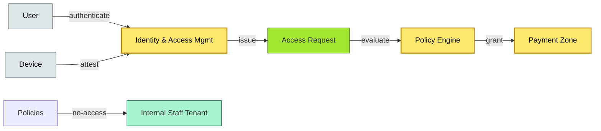

# [C10-06] Zero Trust Architecture — BRIEF
> **Category:** C10 — Emerging & Advanced Topics · **Difficulty:** ●/◑/○ · **Banking-relevant:** yes
> **One-liner:** Zero Trust Architecture is a security model that assumes no implicit trust for any user or device—inside or outside the network—verifying every access request before granting access to the least privilege necessary.
> **Why an EA cares:** For banks, this is the security posture required by DORA, CISA, and PCI-DSS v4.0: it prevents lateral movement for attackers who breach the perimeter; it forces continuous monitoring and attestation, which is mandatory for regulated fintech (ccz).
## Quick definition
Zero Trust (ZTA) is a strategic security architecture that enforces strict identity verification, least-privilege access, and continuous validation of each request in real time, regardless of whether the request originates from inside or outside the network boundary. The "don't trust, verify" tenet applies to users, devices, applications, and data flows.
## Key ideas / terms
- **Identity-Centric:** Authentication and authorization are the only gateways; the network boundary becomes irrelevant.
- **Least Privilege:** Each request gets exactly the minimum access needed for its function.
- **Micro-Segmentation:** Network traffic is segmented into small, isolated zones; a compromised zone cannot access adjacent zones.
- **Assume Breach:** The model assumes the environment is already compromised; every request is treated as potentially malicious.
- **Continuous Validation:** Real-time risk scoring, certificate rotation, and device health checks before granting access.
- **Just-In-Time (JIT) Access:** Grant elevated privileges only for the exact duration needed.
- **ATT&CK Framework:** MITRE ATT&CK for Enterprise models lateral movement, data exfiltration, and persistence.
## The mental model
The traditional network security model is a **castle with a moat**: inspect inbound traffic (firewall) and assume internal traffic is trustworthy. The bank's network is breached; once inside, a single compromised CRM VM can dump the core banking database. Zero Trust replaces the castle with a **room-by-room security system**: every door has a lock, a camera, and the tenant at risk.
## One diagram (mandatory)

## When to use / when NOT to use
- ✅ **Use when:** Multi-cloud, remote workforce, high-value data (core banking, PII, card data), and regulatory requirements (DORA, CISA, PCI v4.0).
- ⚠️ **Avoid when:** Single-site monolith with no remote workforce and the appetite for complexity is low.
## Banking 💳 example
A global investment bank mandates Zero Trust for all privileged access to its Bloomberg EMSX and trading infrastructure: every trader's device must pass certificate-based attestation, risk scoring, and JIT access. Lateral movement to the central clearing database is impossible because the mesh (Iptables/OPA) blocks 95% of internal traffic by default.
## Common confusions (don't mix these up)
- **Zero Trust vs VPN:** VPN assumes trust on transit; ZTA does not trust any network segment.
- **Zero Trust vs Micro-Segmentation:** Micro-segmentation is a *tactic* (network segmentation); Zero Trust is a *strategy* (no implicit trust + continuous validation).
## Interview / recall prompt
"Explain Zero Trust in 2 minutes without notes." → 1) Define as "trust nothing, verify everything." 2) Mention identity as the new perimeter. 3) Call out least privilege and micro-segmentation. 4) Name a banking use case (remote privileged access, JIT). 5) Warn: it is a policy/culture shift, not a product.
---
**Status:** ✅ Created · See detail doc: `[details/C10-06-zero-trust.md](../details/C10-06-zero-trust.md)`
