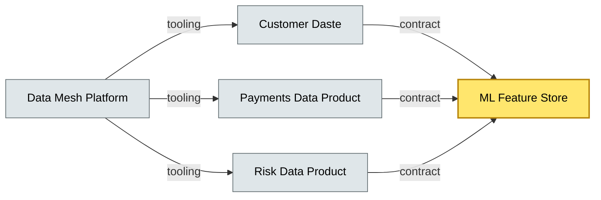

# [C10-07] Data Mesh — BRIEF
> **Category:** C10 — Emerging & Advanced Topics · **Difficulty:** ●/◑/○ · **Banking-relevant:** yes
> **One-liner:** Data Mesh is a sociotechnical architectural pattern that treats data as a product, decentralizing ownership to domain teams who publish self-serve data products that anyone can consume.
> **Why an EA cares:** Banks with global core banking, wealth, lending, and risk produce petabytes of data across silos. Data Mesh gives the bank a "decentralized" data platform where each line of business manages its own data product, reducing the bottleneck of centralized data engineering and improving data freshness for ML and analytics.
## Quick definition
Data Mesh is a data architecture pattern introduced by Zhamak Dehghani (2019) that decentralizes data ownership to business domains, treating each data artifact as a self-contained product with a clear owner, a context, and an API-like contract. It contrasts with the centralized data-lakehouse model where a central team manages all data pipelines.
## Key ideas / terms
- **Data Domain:** The business domain that owns the data (e.g., customer, payments, risk, marketing).
- **Self-Serve Platform:** The infrastructure team provides reusable tooling (CI/CD for data, observability, security) so domain teams can manage their own data products without central-team gatekeeping.
- **Data Contract:** A machine-readable (OpenAPI, Avro schema, SQL/DDL) agreement between data producer and consumer, enforced at ingestion and query time.
- **Single Source of Truth:** In a data lakehouse, every fact is centralized; in a data mesh, the *consumer* finds the truth by resolving the data contract among domain products.
- **Federated Governance:** Global standards (security, lineage, quality) are enforced centrally; business rules (competencies, P&L ownership) are enforced by the domain.
## The mental model
In a centralized data platform, all data flows through a single "pipeline factory": business analysts request a report, wait weeks, get a batch file. In a data mesh, each microservice-like "data product" has its own README, its own SLA, and its own streaming pipeline—data consumers are expected to be self-reliant, accurate.
## One diagram (mandatory)

## When to use / when NOT to use
- ✅ **Use when:** > 3 domain teams producing data; centralized pipelines are bottlenecks; data freshness < 1 hour is needed for ML; multiple line-of-business analytics teams.
- ⚠️ **Avoid when:** A single data product or < 2 domain teams; the central team is still available; the organization lacks domain ownership culture.
## Banking 💳 example
A global retail bank operates 4 data domains: Customer, Transactions, Risk, and Marketing. Each domain owns its own streaming pipeline (Kafka + Delta Lake) and maintains a data loan of its product. A data scientist who needs a "customer-risk score" composes a union query across the two domains' products, using the data contracts to resolve schema drift and lineage.
## Common confusions (don't mix these up)
- **Data Mesh vs Data Lakehouse:** Data mesh addresses ownership and governance decentralization; a lakehouse is a *storage and processing* architecture. They are orthogonal; a bank can have a data mesh on top of a lakehouse.
- **Data Mesh vs Data Virtualization:** Data virtualization is a technology layer (query-time federation); data mesh is a sociotechnical model of ownership.
## Interview / recall prompt
"Explain Data Mesh in 2 minutes without notes." → 1) Define as "data as a product, domain ownership." 2) Name at least one domain concept (data domain, data product). 3) Call out self-serve platform. 4) Name a banking use case (risk score, loan origination). 5) Warn: not a technology, but a culture shift.
---
**Status:** ✅ Created · See detail doc: `[details/C10-07-data-mesh.md](../details/C10-07-data-mesh.md)`
