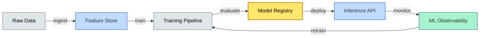

# [C10-08] AI/ML Architecture — BRIEF
> **Category:** C10 — Emerging & Advanced Topics · **Difficulty:** ●/◑/○ · **Banking-relevant:** yes
> **One-liner:** AI/ML Architecture is a hybrid software-and-data engineering discipline that deploys ML models in production by treating them as first-class services with their own CI/CD, governance, and MLOps pipelines.
> **Why an EA cares:** In banking, every ML model (credit scoring, fraud detection, trade-routing) is subject to regulatory audit, model-risk management (SAS 90 regress), and the need for explainability; the architecture must support both real-time inference and full model retraining on new data while maintaining lineage traceability for Basel/DORA.
## Quick definition
AI/ML Architecture is the software and data infrastructure that enables the full machine learning lifecycle—data ingestion, feature engineering, model training, evaluation, deployment, monitoring, and retraining—at scale. It treats ML models like first-class production services with their own CI/CD, observability, governance, and model versioning.
## Key ideas / terms
- **MLOps:** The intersection of machine learning and DevOps; operations for model training, validation, deployment, and monitoring.
- **Feature Store:** A centralized, versioned repository for features used in both training and inference; eliminates training-inference skew.
- **Model Registry:** A versioned catalog of trained models with metadata (accuracy, lineage, owner) and deployment status.
- **Inference vs Training:** Training is a batch process; inference serves predictions; the architecture must support both with separate resource profiles.
- **Training-Inference Skew:** The difference between features used in training and those served at inference; a major source of production drift.
- **Explainable AI (XAI):** Techniques (SHAP, LIME) to make model predictions interpretable; required for model risk governance.
- **AI Gateway:** An API gateway that enforces rate limits, rate limiting, input validation, and cost tracking for model inference.
## The mental model
The AI/ML architecture is a **supply chain**: raw data is the ore, features are the goods, models are the products, and the inference API is the retail storefront. Each stage has its own quality inspector, and at each boundary, a contract (schema, SLA, model card) must be enforced.
## One diagram (mandatory)

## When to use / when NOT to use
- ✅ **Use when:** Production ML models requiring continuous training, monitoring, governance, or large-scale feature serving.
- ⚠️ **Avoid when:** Simple rule-based heuristics or batch-only reporting with no model complexity.
## Banking 💳 example
A Tier-1 bank layers three ML services onto an ML mesh: a fraud-scoring model (real-time via API), a credit-default prediction model (batch + daily pipeline), and a customer-lifetime-value model (batch + feature store). Each model is registered in a central model registry with model cards describing training data, accuracy metrics, and XAI explanations required for model risk committee approval.
## Common confusions (don't mix these up)
- **MLOps vs DataOps:** MLOps focuses on model versioning and training-inference separation; DataOps focuses on data pipeline reliability.
- **Inference vs Scoring:** Inference is generic (any model output); scoring is specific to credit/risk predictions.
## Interview / recall prompt
"Explain AI/ML Architecture in 2 minutes without notes." → 1) Define MLOps. 2) Name Feature Store and Model Registry. 3) Call out training-inference skew. 4) Give a banking use case. 5) Warn about model risk.
---
**Status:** ✅ Created · See detail doc: `[details/C10-08-ai-ml-arch.md](../details/C10-08-ai-ml-arch.md)`
