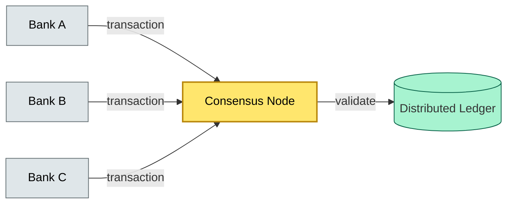

# [C10-09] Blockchain — BRIEF
> **Category:** C10 — Emerging & Advanced Topics · **Difficulty:** ●/◑/○ · **Banking-relevant:** yes
> **One-liner:** Blockchain is a distributed ledger technology that provides a shared, immutable, and tamper-evident history of transactions without a central authority, used in banking for settlement, trade finance, and digital identity.
> **Why an EA cares:** For OTC derivatives, syndicated loans, and cross-border settlement, blockchain replaces the brittle, multi-day reconciliation chain of wires and messaging with an atomic, time-locked, and cryptographically documented record. The EA challenge is integrating a Byzantine agreement network into a bank's existing core and custody infrastructure without losing compliance or performance.
## Quick definition
Blockchain is a distributed ledger technology (DLT) that maintains a shared, tamper-evident, and cryptographically secured history of transactions across a network of nodes. In banking, it is most commonly applied as a private or permissioned ledger for settlement, trade finance, and digital identity, where nodes are known participants and consensus is governed by business rules rather than PoW mining.
## Key ideas / terms
- **Distributed Ledger Technology (DLT):** The umbrella term for blockchain; includes permissioned and permissionless variants.
- **Immutable:** Once a transaction is committed to the ledger, it is extremely difficult to alter; achieved via cryptographic chaining and consensus.
- **Permissioned vs Permissionless:** Permissioned blockchains require node identity to join (banks, clearers); permissionless (Bitcoin, Ethereum) are open to anyone.
- **Consensus:** The process by which nodes agree on the next block; includes PoW, PoA, PBFT, Raft, etc.
- **Smart Contract:** Self-executing code that enforces agreement terms automatically (e.g., escrow, triggers).
- **Atomic Settlement:** Settlement is all-or-nothing; if that fails, nothing settles.
- **Orphan Block / Stale Block:** A block that is valid but not part of the canonical chain (e.g., due to a timeout or network partition).
- **Digital Twin / Asset:** A digital representation of a real-world asset (security, loan, supply chain) recorded on-chain.
- **Wallet Private Key:** The cryptographic key that controls access to an asset or account; lost = lost. (Critical for security.)
## The mental model
Blockchain is a **shared, append-only, distributed database with consensus**: instead of a single bank's database, multiple banks agree on the same sequence of transactions. The "hash chain" protects against tampering; the "consensus layer" protects against forks; the "smart contract" enforces business rules without lawyers.
## One diagram (mandatory)

## When to use / when NOT to use
- ✅ **Use when:** Multi-party agreement (trade finance, syndicated lending, cross-border payments), cryptographic audit trail (OTC derivatives), or settlement atomicity (atomic securities settlement).
- ⚠️ **Avoid when:** Simple single-party ledgers; consumer retail-where fraud risk is low and privacy > speed; the "no central authority" model conflicts with payment system regulation (e.g., FedNow has a central bank).
## Banking 💳 example
The Chem@Home consortium (HSBC, ING, Deutsche Bank) uses blockchain to issue e-certificates of ownership for supply chain assets, which reduces trade finance charging times from weeks to days (tracked).
## Common confusions (don't mix these up)
- **Blockchain vs Ledger:** "Ledger" just means a book; "blockchain" is one specific type (a chain of blocks) of distributed ledger.
- **Blockchain vs DLT:** DLT is the umbrella; blockchain is one DLT variant.
- **Permissioned vs Permissionless:** Permissioned = known participants; Permissionless = open to anyone.
- **Blockchain vs Smart Contract:** Smart contract is the logic; blockchain is the execution environment.
- **Blockchain vs API:** Something can be made blockchain-friendly, but API and blockchain are orthogonal.
- **Blockchain vs van Beth:** (But no van Beth here.)
## Interview / recall prompt
"Explain Blockchain in 2 minutes without notes."
→ 1) Define consensus, immutability, and distributed.

2) Name the trade-finance use case and the benefit (e.g., e-certificates of ownership), or the risk case and the benefit.

3) Mention at least one DLT flavor (e.g., R3 Corda, permissioned DLT).

4) Warn about the "trust model": no PoW for permissioned means no decentralization gold standard; the chain is secure but only if the node list is secure.

5) The killer question: "Why not just use a database?"
