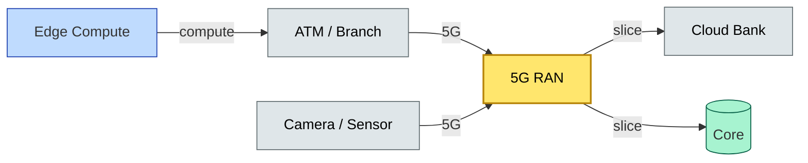

# [C10-10] 5G / IoT / Edge — BRIEF
> **Category:** C10 — Emerging & Advanced Topics · **Difficulty:** ○/◑/● · **Banking-relevant:** yes
> **One-liner:** 5G is the radio access network that enables ultra-reliable, low-latency, and massive connectivity, which banks use for real-time payment processing, ATM monitoring, distributed branch monitoring, and retail asset tracking.
> **Why an EA cares:** 5G/IoT/Edge reduces "last-mile" latency for cash-in-transit monitoring and branch operations; however, the security surface, signaling vulnerabilities, and massive device scale make it a compliance risk under DORA and NIST 800-217 if not architected with zero-trust segmentation and RF-level encryption.
## Quick definition
5G / IoT / Edge computing is the convergence of the fifth-generation cellular radio access network (5G), billions of connected IoT devices (vehicles, ATMs, kiosks, sensors), and compute close to the data source (edge) to reduce latency. In banking, this enables real-time ATM cash management, video surveillance, and low-latency payment transactions at the point of need.
## Key ideas / terms
- **5G Radio Access Network (RAN):** The wireless infrastructure that connects devices to the core network; provides ultra-reliable low-latency communications (URLLC) and massive IoT (mMTC).
- **IoT (Internet of Things):** A network of physical devices (sensors, ATMs, kiosks, biometric readers) embedded with software and connectivity.
- **Edge Computing:** Processing data near the source (at the bank branch or ATM) instead of sending to a central cloud; reduces latency and bandwidth.
- **Network Slicing:** Virtualized network partitions that offer different QoS, security, and latency profiles to different services on the same physical infrastructure.
- **URLLC (Ultra-Reliable Low-Latency Communication):** 5G use-case class for applications requiring < 1 ms latency and 99.999% reliability.
- **MQTT / CoAP:** Lightweight protocols for IoT device communication, used for ATM status and low-bandwidth telemetry.
- **OTA Updates:** Over-the-air firmware updates for edge devices; a security vector if not signed and verified.
- **Device Access / SIM:** Each edge device has a unique identity; SIM-based or certificate-based authentication is required per device.
- **SU (Serving Network):** The secure network segment; relevant for zero-trust; the access network is the riskiest part.
- **V2X (Vehicle-to-Everything):** For cash-in-transit vehicles (benefit but the vehicle is the device).
## The mental model
5G/IoT/Edge is the **nervous system**: the ATM is a sensor that sends a cash-level alert via 5G to the branch manager; the branch camera sends video via a network slice to the cloud; the latency advantage of edge is that the video is processed locally (e.g., fraud detection on ATM camera) before it's sent.
## One diagram (mandatory)

## When to use / when NOT to use
- ✅ **Use when:** ATM cash management, branch surveillance, real-time payment processing, IoT inventory (cash-in-transit), and distributed branch monitoring where low latency and high reliability are essential.
- ⚠️ **Avoid when:** Ultra-secure air-gapped systems where connectivity introduces unacceptable attack surface (e.g., nuclear/physical security systems).
## Banking 💳 example
A major bank uses 5G to connect 12,000 ATMs across the UK, sending real-time cash-level telemetry and transaction logs every 30 seconds. The data is routed through a dedicated 5G network slice with a separate firewall. Edge compute at the branch (e.g., a mini-hypervisor) preprocesses video for fraud detection (e.g., biometric matching) before sending metadata to the cloud.
## Common confusions (don't mix these up)
- **5G vs 4G vs LTE-A:** 5G is a generation of the radio access network; 5G also includes URLLC and network slicing.
- **IoT vs Edge vs Fog:** IoT = devices; Edge = compute close to the device; Fog = intermediate layer between edge and cloud.
- **5G vs Wi-Fi:** 5G is a cellular network and a radio; Wi-Fi is a local area network; 5G can be used in enterprise Wi-Fi with a network.
- **Edge vs Cloud:** Edge is near the data source; Cloud is centralized; the architecture must decide where latency-critical vs storage-heavy workloads go.
- **IoT vs M2M:** IoT = a network of devices; M2M = machine-to-machine; M2M is a subset of IoT.
## Interview / recall prompt
"Explain 5G/IoT/Edge in 2 minutes without notes." → 1) Define 5G as the radio access network with URLLC/mMTC. 2) Mention three use cases: ATM cash telemetry, real-time payments, branch video. 3) Call out network slicing as the key architectural enabler. 4) Warn that edge security is the risk surface. 5) State one DORA compliance gap for IoT.
---
**Status:** ✅ Created · See detail doc: `[details/C10-10-5giot-edge.md](../details/C10-10-5giot-edge.md)`
