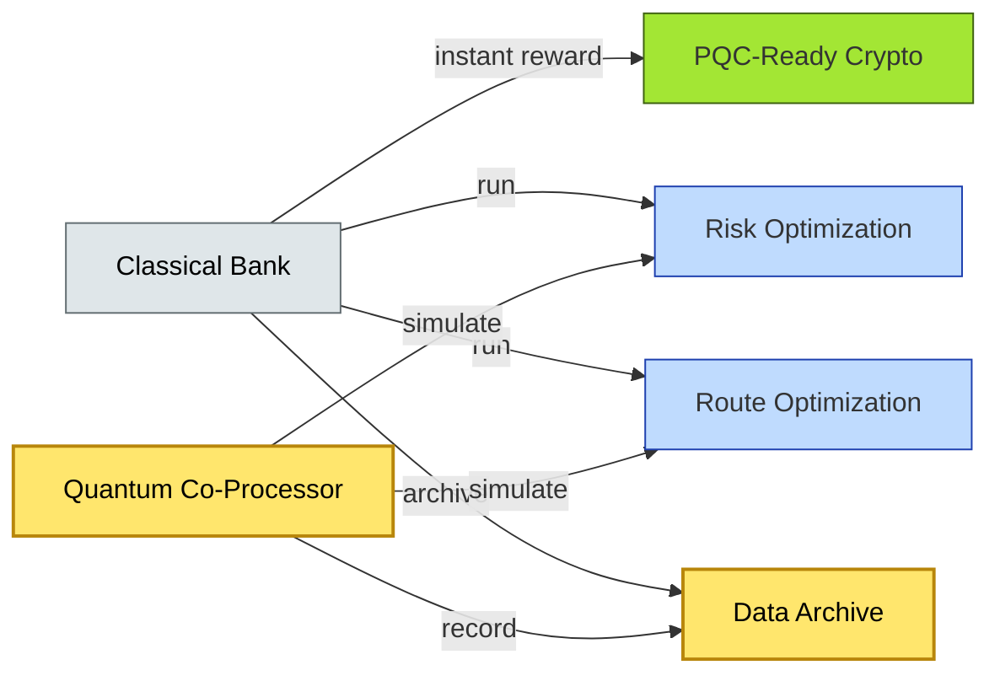

# [C10-11] Quantum Computing — BRIEF
> **Category:** C10 — Emerging & Advanced Topics · **Difficulty:** ○/◑/● · **Banking-relevant:** maybe
> **One-liner:** Quantum computing leverages quantum mechanical phenomena—superposition, entanglement, and coherence—to solve specific intractable problems (optimization, estimation, cryptanalysis) that classical supercomputers cannot solve at scale today.
> **Why an EA cares:** Quantum computing threatens current asymmetric cryptography (RSA, ECC) underpinning all financial messaging. For banks, the immediate risk is "harvest now, decrypt later"—sensitive data archived under RSA/ECC must be traceable and migrated to post-quantum cryptography (PQC).
## Quick definition
Quantum computing is an emerging computing paradigm that performs calculations using quantum bits (qubits) and quantum mechanical phenomena—superposition (qubits can be 0 and 1 simultaneously), entanglement (correlations between qubits stronger than classical), and interference (encoding data into wave-like states to amplify correct answers). In banking, the primary threat is cryptanalysis: Shor's algorithm can break RSA/ECC, which underpins digital signatures and key exchanges in secure banking communications.
## Key ideas / terms
- **Qubit:** The quantum analog of a classical bit; exists in a superposition of 0 and 1 until measured.
- **Coherence / T1 (relaxation) and T2 (decoherence):** Qubits are fragile; they lose their quantum state over time (measured in milliseconds).
- **Superposition:** A qubit can be 0 and 1 at the same time; implements a Hilbert space.
- **Entanglement:** Two or more qubits that are correlated; measuring one instantly determines the other.
- **Interference:** The process of encoding data into wave-like states (wavefunctions) that amplify correct answers and cancel incorrect ones.
- **Coherence time / Error threshold:** The time before a qubit degrades; error-correction (Surface Code) is required.
- **Quantum Supremacy / Quantum Advantage:** The point where a quantum processor solves a problem infeasible for classical supercomputers.
- **Shor's algorithm:** Quantum algorithm for factoring large integers; breaks RSA encryption and digital signatures.
- **Grover's algorithm:** Quantum search algorithm; provides a quadratic speedup for unstructured search.
- **Quantum-safe / PQC:** Post-quantum cryptography; algorithms expected to resist near-term quantum computers. NIST selected CRYSTALS-Dilithium, CRYSTALS-Kyber.
- **Harvest Now, Decrypt Later:** An adversary records encrypted financial data now (e.g., 20-year loan defaults) and decrypts it later with a quantum computer.
## The mental model
Quantum computing does not replace classical servers; it works with them. A bank uses a classical engine for day-to-day operations and a quantum co-processor or emulator for specific problems: portfolio optimization, credit risk aggregation, or fraud pattern detection. The bank's "quantum strategy" is not a single chip; it is a governance layer (cryptographic agility) and a portfolio of use cases (risk, compliance, optimization, data archiving).
## One diagram (mandatory)

## When to use / when NOT to use
- ✅ **Use when:** Hard optimization (credit risk, trading, insurance), cryptography (harvest-now-decrypt-later), or when a large-scale quantum computer is available or expected within 10 years.
- ⚠️ **Avoid when:** The cost is high, coherence time is low, the algorithm is still research-stage, or the problem is simple enough for classical optimization.
## Banking 💳 example
A global bank is evaluating quantum-safe cryptography for SWIFT message signing and TLS 1.2 termination. The EA team has mapped 85% of the bank's cryptographic surface to NIST PQC candidates (CRYSTALS-Dilithium, CRYSTALS-Kyber). The bank has also identified 2 petabytes of legacy data (loan defaults, derivatives exposure) that must be protected for 20-year regulatory retention; these data are now at risk of "harvest now, decrypt later."
## Common confusions (don't mix these up)
- **Quantum Supremacy vs Quantum Advantage:** Supremacy is a benchmark achievement; advantage is a practical speedup.
- **Entanglement vs Superposition:** Superposition is multiple states simultaneously; entanglement is a correlated relationship.
- **Quantum Computing vs Quantum Communications:** Computing is algorithms; communications is cryptography and key exchange.
## Interview / recall prompt
"Explain quantum computing in 2 minutes without notes."
→ 1) Define superposition, entanglement, coherence.
→ 2) Name Shor's and Grover's algorithms.
→ 3) Explain the harvest-now-decrypt-later threat to 20-year financial data.
→ 4) Mention NIST PQC (CRYSTALS-Dilithium, CRYSTALS-Kyber).
→ 5) Warn: quantum is not a universal replacement for classical; the cost and coherence barrier is still high for near-term banking workloads.
---
**Status:** ✅ Created · See detail doc: `[details/C10-11-quantum.md](../details/C10-11-quantum.md)`
