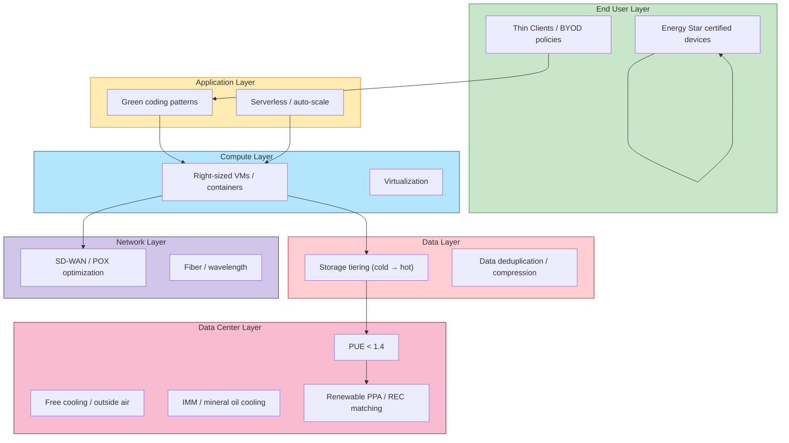

# C10-12-Green-IT.md — Brief: Sustainable / Green IT Architecture

## One-Liner
Designing and operating information-technology systems to minimize energy consumption, carbon emissions, and electronic waste while meeting business and regulatory targets.

## Quick Definition
Green IT Architecture applies environmental-performance criteria to every layer of the technology stack—servers, storage, network, data centers, end-user devices, and cloud services—so that IT becomes a net contributor (or less net contributor) to ESG targets.

## Key Terms
| Term | Meaning |
|---|---|
| **Carbon footprint** | Total GHG emissions (Scope 1, 2, 3) attributed to IT operations, measured in CO₂e. |
| **PUE (Power Usage Effectiveness)** | Ratio of total facility power to IT equipment power; lower is better (target < 1.4). |
| **EEE (Energy Efficiency Europe)** | Policy direction (now ECO Design) that sets minimum efficiency requirements for IT equipment. |
| **Resource efficiency** | Delivering the same compute / storage / service throughput with fewer physical resources. |
| **Right-sizing** | Matching compute, storage, and network capacity precisely to workload demand; avoiding over-provisioning. |
| **Green coding** | Software-level optimization (algorithmic efficiency, lazy loading, idempotency, background batching) to reduce runtime compute. |
| **Renewable energy** | IT consumed from or matched to renewable generation; verified via PPAs, RECs, or green tariffs. |

## Diagram: Green IT Stack

## When to Use, When Not to Use
- **Use** when carbon-accounting is mandatory (SFDR, CSRD, TCFD), when cloud spend is high and right-sizing yields savings, or when sustainability is a brand differentiator.
- **Do not use** when regulatory override demands maximum availability (e.g., real-time trading systems with 99.999% SLA) unless latency can be traded for efficiency; or when legacy hardware must be kept offline for compliance isolation.

## Banking Example (💳)
A **European retail bank** targets a **TCFD-aligned 42% carbon reduction by 2030**:
- **Scope 2**: Match all data-center and cloud consumption to renewable PPA and RECs (Green-E/G-RECS).
- **Scope 3 — downstream**: Extend supplier requirements to hyperscaler green-energy sourcing; disclose Financed Emissions (GHG Protocol Scope 3 Category 15).
- **Operational**: Implement idle-CPU throttling in Kubernetes nodes; shut down redundant dev/test clusters overnight.
- **Reporting**: Publish TCFD scenario analysis and GRI-aligned energy intensity per €m revenue.

## Common Confusions
| Confusion | Clarification |
|---|---|
| **Green IT vs. ESG** | Green IT is a *subset* of IT governance within the broader ESG/CSR framework; ESG also covers governance and social dimensions beyond IT. |
| **Green IT vs. CSRG (Corporate Social Responsibility Guidelines)** | CSRG is a *policy document*; Green IT is the *implementation domain* of infrastructure and operations within CSRG. |
| **Green IT vs. Net Zero** | Net Zero is an *absolute* target by date; Green IT is the *operational levers* (PUE, renewable PPA, idle-CPU throttling) used to get there. |

## Interview Prompt
> “Our bank is finalizing its TCFD disclosure. The CFO asks: ‘What IT-specific evidence can we provide for Scope 2 and the use-of-sold-products (Scope 3 Category 15) carbon intensity?’ Walk me through the metrics, data sources, and governance you’d rely on.”
