# [C2-01] TOGAF ADM — BRIEF

> **Category:** C2 — Reference Frameworks & Methods · **Difficulty:** ●/◑/○ · **Banking-relevant:** yes
> **One-liner:** The TOGAF Architecture Development Method is a step-by-step process for developing enterprise architecture that iteratively progresses from Business Architecture through Technology Architecture to Implementation Governance.
> **Why an EA cares:** In banking, regulators (EBA, OCC), auditors, and the CIO demand a repeatable, auditable method to sequence transformation programs across core banking, payments, and risk-management platforms without gaps or duplicated effort.

## Quick definition

TOGAF ADM is the Open Group standard’s phased methodology for producing a coherent, layered enterprise architecture. It consists of a main cycle (Preliminary, phases A–H) and a subsidiary Enablement stream. Every banking transformation roadmap—whether core-modernization, cloud migration, or data-platform build—should map onto ADM so that business drivers, application portfolios, and infrastructure plans are traceably aligned.

## Key ideas / terms
- **ADM (Architecture Development Method):** The eight-phase iterative process for producing enterprise architecture, preceded by a Preliminary Phase.
- **Preliminary Phase:** Gap analysis, methodology selection, and stakeholder definition before Phase A begins.
- **Phase A (Architecture Vision):** Business drivers, stakeholder analysis, and scope definition; produces the Statement of Architecture Work.
- **Phase B (Business Architecture):** Functional/business decomposition, process mapping, and value stream identification.
- **Phase C (Information System Architecture):** Application portfolio map, data architecture, and integration strategy.
- **Phase D (Technology Architecture):** Baseline/target infrastructure, standards, and platform decisions.
- **Phase E (Opportunities & Solutions):** Transition architecture, project sequencing, and portfolio selection.
- **Phase F (Migration Planning):** Detailed implementation plan, governance setup, and risk register.
- **Phase G (Implementation Governance):** Built-to-spec, compliance checking, and specification update.
- **Phase H (Architecture Change Management):** Post-implementation review, requirements updates, and feedback to the Preliminary Phase.
- **Enablement:** Supplementary guidance streams (Business Architecture, Information Security, Enterprise Interoperability, Application Architecture) that provide deeper methodology within the prep/primary phases.
- **ADM+:** TOGAF’s current versioning approach that extends the method with continuous evolution patterns rather than strict one-year releases.

## The mental model

TOGAF ADM is a *guarded waterfall*: each phase delivers a tangible artifact (SOA, BIZBOK mapping, TAFIM alignment) that gates the next, but feedback loops (especially IGA to A and G to H) allow iteration. It is the only enterprise-architecture methodology banks can present to regulators as a structured, repeatable transformation method without inventing the wheel.

## One diagram (mandatory)

```mermaid
graph LR
    classDef critical fill:#ffe66d,stroke:#b8860b,stroke-width:2px,color:#000
    classDef context fill:#dfe6e9,stroke:#636e72,color:#000
    classDef decision fill:#a3e634,stroke:#3f6212,color:#000
    Preliminary:::context --> A[Phase A Vision]:::critical
    A --> B[Phase B Business]:::decision
    B --> C[Phase C Application]:::context
    C --> D[Phase D Technology]:::critical
    D --> E[Phase E Solutions]:::decision
    E --> F[Phase F Migration]:::context
    F --> G[Phase G Governance]:::critical
    G --> H[Phase H Change]:::decision
    H --> A
```

## When to use / when NOT to use
- ✅ **Use when:** You need a repeatable, phase-gated architecture method that links business drivers to infrastructure roadmaps and produces audit-friendly artifacts.
- ⚠️ **Avoid when:** You need rapid, lightweight greenfield team experimentation; ADM’s phase-gate overhead can slow Agile squads. Also avoid forcing every project through all eight phases— lighter arcs exist.

## Banking 💳 example

A global retail bank with seven countries is modernizing its core banking platform and PSD2-open-banking APIs. The bank’s CIO mandates TOGAF ADM to sequence the effort: Phase A defines the vision (open banking gateways, event-driven core); Phase B maps zero-based process changes in retail branch and corporate treasury; Phase C rationalizes ten legacy loan origination applications; Phase D selects a cloud-native, event-sourced platform on hardened VPCs; Phase E sequences three releases over 24 months with a maintain-the-lights budget; Phase F defines readiness criteria and a rollback decision gate; Phase G runs monthly compliance sweeps against PCI-DSS and DORA; Phase H captures lessons to refine the next-generation mortgage platform.

## Common confusions (don’t mix these up)
- **TOGAF ADM** vs **Zachman Framework:** ADM is a *process* for *building* architecture; Zachman is a *taxonomy* for *organizing* it. You can use both simultaneously.
- **Preliminary Phase** vs **Phase A:** The Preliminary Phase is project-setup and gap analysis; Phase A is architecture vision and stakeholder mapping.

## Interview / recall prompt
"Explain TOGAF ADM in 2 minutes without notes." → Hit these 5 points:
1. Eight main phases (A–H) plus the Preliminary Phase and Enablement streams.
2. Each phase produces a concrete architecture artifact (SOW, BAST, TRM, etc.) and gates the next.
3. The cycle is iterative—likely multiple passes from vision through implementation.
4. Banking use case: regulator-auditable, program-sequencing, cross-border transformation governance.
5. Contrast with light methods (SAFe PI, LeSS) by noting ADM’s artifact-heavy, phase-gated nature.

---
**Status:** ☐ Not started · See detail doc: `[details/C2-01-togaf.md](../details/C2-01-togaf.md)
