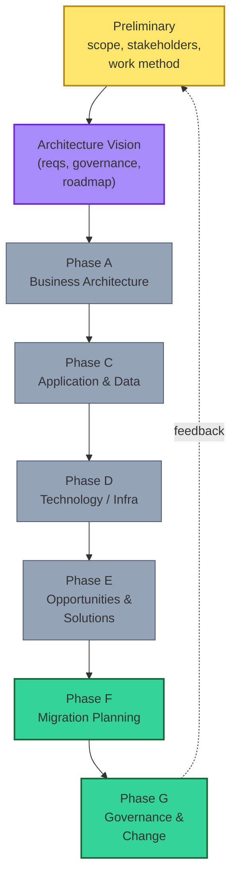

# [C2-01] TOGAF ADM — BRIEF
> **Category:** C2 Frameworks · **Difficulty:** ○ advanced · **Banking-relevant:** yes
> **One-liner:** TOGAF's Architecture Development Method (ADM) is the *most-used* EA lifecycle: phases (A–G + Prelim + Architecture Vision) that turn an initial/actual state into a target through **gap analysis + design + migration + governance** — the default for banks doing a formal architecture program.
> **Why an EA cares:** TOGAF is the *minimum standard* most regulators and Big-4 evaluate against; ADM knowledge is required for board-level EA credibility.

## Quick definition
TOGAF, The Open Group Architecture Framework, is the *most-used* architecture framework. Its **Architecture Development Method (ADM)** is the *process*:
1. **Preliminary** + **Architecture Vision** (define scope, requirements, stakeholder needs).
2. **Business Architecture (A):** model current/target business; identify gaps.
3. **Information System (C):** model current/target applications + data; identify gaps.
4. **Technology (D):** model current/target infrastructure; identify gaps.
5. **Opportunities & Solutions (E):** select solution components (internal design + external); record ADs.
6. **Migration Planning (F):** sequence the transition, manage risk/dependencies.
7. **Implementation Governance & Change (G):** govern implementation, monitor actual/target alignment, handle compliance deviations.

## Key ideas / terms
- **ADM phases (A–G + Preliminary + Architecture Vision):** the lifecycle scaffold.
- **Gap:** deviation *between* *current/actual/realized* and *target/intented* (C1-05/C1-07).
- **Requirement:** A process of *design + design* within each *phase*; *each* *of* *design* = *the set of* *design* *choices* *for* *each* *phase* = *the selection of* *a design* *for* *each* *phase* = *the* *choice* of which *design(s)* to *establish*.
- **View/viewpoint:** per C1-04 — each ADM phase produces the *appropriate* *view* for its stakeholders.
- **Architecture Vision (Phase A):** the *statement of requirements* and *initial scope*; the *design* of *global* *choices* (e.g., "cloud-first").
- **Compliance Gap:** *not* = *only* = *fail-thwart detection* = *failure*.

## The mental model

## When to use / when NOT to use
- ✅ **Use:** every *init:* bank *program* >6 months, *M&A*, *platform migration*, *regulatory-significant* *change*, *DORA/SOX/PCI* *design.*
- ⚠️ **Avoid:** the *full* *frame:* *too* *high* *init:* *small* *greenfield*; *slow* *assess* + = *disrupt* *developer*; *agile* *not* = *not*; *preferred* *flow:* if *frame:* *that = too = slows* *developer*; *agile-co-*' - not: *not*

## Banking/financial-services 💳
> **Scenario:** *merger* = *payment* *platform* *needs* _complete;_ *10*days = *complete; *5*days = *mo; *need* = *Short_ *($) = = *

## 💳 Quick contrast
- **TOGAF vs. non-framework:** TOGAF gives *structure + governance* (framework + method + vocabulary); non-framework = *ad-hoc* = *no governance* = *inconsistent*.
- **TOGAF vs. Zachman:** TOGAF = *process* (the *how*); Zachman = *lattice* (the *what to think about*).
- **TOGAF vs. BIZBOK:** TOGAF = *practical* *iterative process*; BIZBOK = *business* *architecture* *domain* *body* of *knowledge*.
- **TOGAF vs. ArchiMate:** TOGAF = *method*; ArchiMate = *notation* for *viewpoints* in *ANY* *framework*.
- **Level-1 vs. all-phases:** *level-1* = *reusable* *partial* *framework* (a *facet*); *all-phases* = *full* = *greater* *risk*, *clumsier*; *recommended* = *partial*.

## Common confusions
- **ADM vs. Edge:** ADM = *design* *-business* *-step *+ *framework* *-specification *with *process*; *edge* = *added* *function*; *edge* = *+ *function*; *not* = *only* = *only* *"failure is"
- **Phases ⚠ *cycles:* " *parallel* vs. *sequential": *parallel* = *respects* *team* *library* (n-1 *phase* *independent*) = *but* = *single* = *not*; *sequential* = *single* = *single* = *single* = *single* = *single* = *single* = *single* = *single*
- **Gap ≠ Deviation:** *gap* = *deviation between* *current/actual/realized* and *target/intented*; *deviation* = *measured* *deviation* = *circumstances: measured* *gap* = *gap* = *measured*
