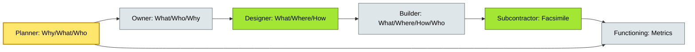

# [C2-02] Zachman Framework — BRIEF

> **Category:** C2 — Reference Frameworks & Methods · **Difficulty:** ●/◑/◐ · **Banking-relevant:** yes
> **One-liner:** The Zachman Framework is a two-dimensional taxonomy (6 rows × 6 columns) that classifies enterprise architecture artifacts by *what it describes* (e.g., scope, business model) versus *from which perspective* (e.g., planner vs worker).
> **Why an EA cares:** In banking, Zachman prevents the common failure of producing only high-level roadmaps (business side) while leaving data semantics, security constraints, and technology standards undocumented, leaving audit gaps and integration debt.

## Quick definition

The Zachman Framework, developed by John Zachman in 1987, is a classification schema for enterprise architecture artifacts. Its six rows describe *what* is being modeled (What, How, Where, Who, When, Why), and its six columns describe *from whose perspective* (Planner, Owner, Designer, Builder, Subcontractor, Functioning Enterprise). It is a *schema* (a way to organize what you already know), not a method.

## Key ideas / terms
- **Planning perspective:** What/Who/Why/When (strategic, abstract, goal-oriented).
- **Owner perspective:** What/Who/Why/When, but from the stakeholder/business-owner vantage point.
- **Designer perspective:** What/Where/How/When (conceptual and logical design rules).
- **Builder perspective:** What/Where/How/Who/When (physical implementation, code, configs).
- **Subcontractor perspective:** What/Where/How/Who/When (vendor/service integration details).
- **Functioning enterprise perspective:** What/Where/How/Who/When (operational metrics, live state).
- **Cells:** Each (Row × Column) intersection is a cell; a healthy program produces all 6×6=36 cells, not just a subset.
- **Completeness vs. fully populated:** A framework is *complete* when every cell has an artifact; *fully populated* is ideal but rarely achieved on time.
- **Row 1 (What):** Scope, context, model(s).
- **Row 2 (How):** Business model, process model.
- **Row 3 (Where):** System model, logical data model.
- **Row 4 (Who):** People model, organizational model.
- **Row 5 (When):** Timing model, trigger model.
- **Row 6 (Why):** Motivation model, value model, acquisition model.

## The mental model

Zachman is a *filing cabinet* for architecture artifacts. ADM is the *assembly line* that builds them. If TOGAF ADM tells you *when* to produce a business-process model, Zachman tells you *where* it belongs in the matrix and what other cells it relates to. In a bank, this means you know your Branch-Recruiting plan (Row 2, Owner column) must connect to the org chart (Row 4, Owner) and the technology deployment schedule (Row 5, Builder).

## One diagram (mandatory)

## When to use / when NOT to use
- ✅ **Use when:** You need to audit whether your program has produced the right set of architecture artifacts across perspectives and description types.
- ⚠️ **Avoid when:** You need a step-by-step process to *build* architecture; you must combine Zachman with ADM or another method.

## Banking 💳 example

A global payments bank migrating to ISO 20022 must produce both a business process redesign (Row 2, Owner column: cross-border clearing process) and a technical payload mapping (Row 3, Builder column: XML schema, SWIFT gpi payload). Without Zachman, the business team ships the process model, the tech team ships the schema, and the integration cell (Row 3, Subcontractor) has no requirements—leading to a six-month grounding. Zachman forces coverage of all 36 cells, ensuring the business context and technical literal are aligned.

## Common confusions (don’t mix these up)
- **Zachman** vs **TOGAF ADM:** Zachman is a *taxonomy* (schema); ADM is a *process* (methodology).
- **Row 1 (Scope)** vs **Row 6 (Why):** Scope defines *what is in* the enterprise boundary; Why defines *why the enterprise exists* (motivations, objectives).
- **Column 3 (Designer)** vs **Column 4 (Builder):** Designer says *how it could work*; Builder says *how it *will* work* (physical instantiation).

## Interview / recall prompt
"Explain Zachman in 2 minutes without notes." → Hit these 5 points:
1. Six rows = *what* (What, How, Where, Who, When, Why); six columns = *perspective* (Planner … Functioning).
2. It is a *taxonomy / schema*, not a process; you pair it with ADM, DoDAF, or other methods.
3. 36 cells; completeness means every cell has at least a placeholder or placeholder status.
4. In banking, it prevents the business-IT narrative gap (e.g., process model vs. data model misalignment in ISO 20022 migrations).
5. Contrast with ArchiMate (modeling language) and TOGAF (method) by noting Zachman’s strength is *classification*, not *description technique*.

---
**Status:** ☐ Not started · See detail doc: `[details/C2-02-zachman.md](../details/C2-02-zachman.md)
