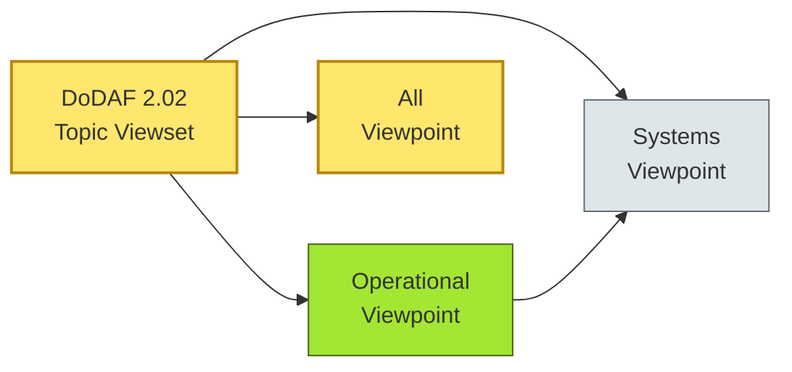

# [C2-03] DO-DAF (Government) — BRIEF
> **Category:** C2 — Frameworks & Methods · **Difficulty:** ● · **Banking-relevant:** no
> **One-liner:** DO-DAF is a US DoD standard for describing defense-sector architectures, adapted by government-heavy industries to formalize compliance and interoperability.
> **Why an EA cares:** In banking, government segmentation requirements (CCAR, stress-testing, FedRAMP for fintechs) force defense-style framework discipline; DO-DAF gives a vocabulary for "military-grade" compliance without actual DoD applications.

## Quick definition
DO-DAF (formerly C-AF) is the Department of Defense's architecture framework for capturing defensible, decision-ready information. Every architecture description in use in a Department of Defense program domain uses a standard set of views and products. It is the sibling to DoDAF, but DO-DAF is the operational-level standard; this brief treats the family together because banks working with government contracts encounter both.

## Key ideas / terms
- **DoDAF (Department of Defense Architecture Framework):** Original DoD architecture framework (v2.02) that formalized seven viewpoints: All, AV, OV, SV, TV, DV, PV.
- **DO-DAF / AF (Architecture Framework):** Successor family that added mission profiles and improved organizational descriptions; used for operational architectures.
- **Viewpoint (VP):** A template-based specification of how one kind of stakeholder consumes architecture information.
- **Model (in DoDAF):** A composition of one or more views, tailored to a specific architecture context.

## The mental model
DO-DAF is the discipline of "architecture by viewpoint." In a bank, if the architecture is the house, DO-DAF says: demand a cross-section (All View), a floor plan (OV), and a wiring diagram (SV) before anyone approves the mortgage. It borrows heavily from IEEE 1471 / ISO/IEC/IEEE 42010, so it maps cleanly onto TOGAF ADM once you translate the seven viewpoints into ADM phases.

## One diagram (mandatory)

## When to use / when NOT to use
- ✅ **Use when:** You must satisfy a government contract, APR summary-request, or FedRAMP / CMMC control.
- ⚠️ **Avoid when:** The framework is being used as *decoration* — producing seven viewpoints with no operational data quality discipline just to check a box.

## Banking 💳 example
A regional U.S. bank runs a partnership with a VA-loan servicer. The VA requires an architecture description that proves FCRA and VCFIA compliance. The bank produces an OV-2 High-Level Operational Concept Graphic (HLOMG) that shows the loan-origination workflow (Broker → Bank → Servicer), then an OV-5 Logical Data Model that proves PII fields are hashed before leaving the bank's boundary. DO-DAF is overkill for consumer lending, but non-negotiable when the partner is a government entity.

## Common confusions (don't mix these up)
- **DoDAF vs TOGAF:** DoDAF prescribes *what* to model (seven viewpoints); TOGAF prescribes *how* to run the architecture process (ADM). They are complementary.
- **DoDAF vs NAF / MODAF:** MODAF (UK) and NAF (Netherlands) are close cousins; DoDAF is U.S.-centric. A multinational bank must decide which variant to align its baseline with.

## Interview / recall prompt
_“Explain DO-DAF in 2 minutes without notes.”_ →
- Seven viewpoints, each for a different stakeholder (strategy, ops, systems, data).
- Mandatory model structuring: every model is a composition of views.
- Credit: U.S. DoD / IEEE 1471 lineage; it is the reason government-compliance architectures exist in fintech.

---
**Status:** ✅ Written · See detail doc: `[details/C2-03-dodaf-govt.md](./details/C2-03-dodaf-govt.md)`
