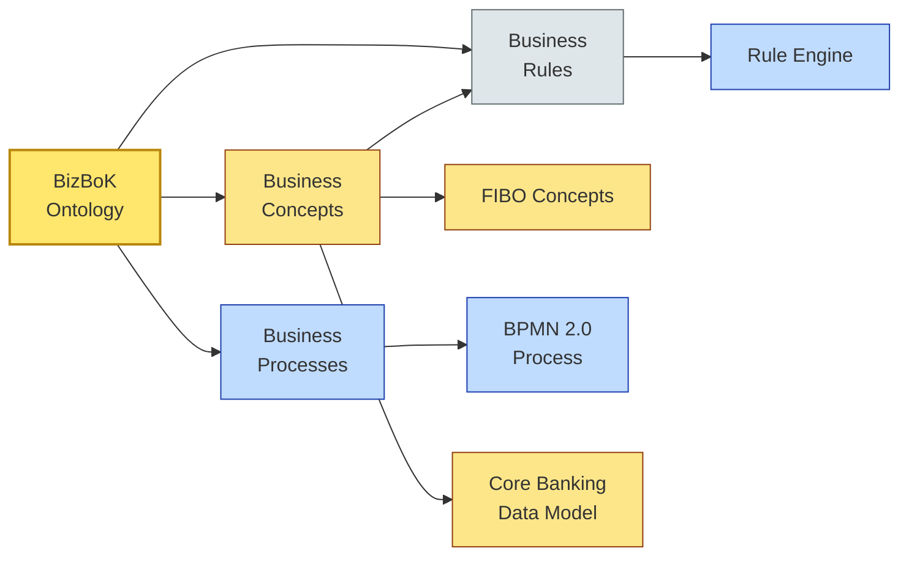

# [C2-04] Business Book of Knowledge (BizBoK) — BRIEF
> **Category:** C2 — Frameworks & Methods · **Difficulty:** ● · **Banking-relevant:** yes
> **One-liner:** BizBoK is the OMG's standardized business-glossary/business-process model that turns informal enterprise language into a precise, interoperable ontology.
> **Why an EA cares:** In banking, every core-system (ACI / FIS / Temenos) has its own business vocabulary. BizBoK is the only vendor-neutral, OMG-standardized ontology that lets a bank map "account," "deposit," and "overdraft" into a single shared business concept without writing 200 pages of bespoke clarifications.

## Quick definition
The Business Book of Knowledge (BizBoK) is an OMG (Object Management Group) standard for describing, formalizing, and managing business concepts (business concepts, business rules, and business processes). It provides a standard meta-model — called *Business Integrated Meta-Model (BIMM)* — that enables enterprises, systems vendors, and regulators to agree on the *meaning* of business terms across boundaries.

Created largely through the OMG's Business Metadata and Business Process initiatives, BizBoK is the governance layer *above* BPMN and above any particular industry taxonomy. It lets a bank describe "product," "risk appetite," "customer onboarding," and "payment" in a machine-interpretable way, then stitch those concepts into process models, data models, or regulatory filings.

## Key ideas / terms
- **Business concept:** A named entity in the business domain with a definition, attributes, and relationships; e.g., `BankAccount`, `OverdraftFacility`, `Risk Appetite`.
- **Business rule:** A constraint or obligation that governs business concepts and processes; expressed in plain language or semi-formal notation.
- **Business process:** A set of business activities performed by business actors to yield a business outcome; structured via the BizBoK business process meta-model (BPMM).
- **Ontology:** A formal, explicit specification of a shared conceptualization; BizBoK is an *industry-standard* ontology.
- **BIMM (Business Integrated Meta-Model):** The OMG meta-model that defines concepts, rules, and processes and their relationships.
- **FIBO (Financial Industry Business Ontology):** A companion OMG standard, sponsored by AnIML / EDM Council, specifically for the finance domain; often used with BizBoK because BizBoK is domain-agnostic.
- **Linked Open Data / Semantic Web:** BizBoK concepts can be represented as RDF triples, enabling semantic querying across bank systems.

## The mental model
BizBoK is the *dictionary* that sits between your written policies (sox.pdf) and your computer systems (core banking API). In a bank, BPMN tells you *how* the loan approval runs; BPMN can reference a Lanes and Its Logical Order (LILO), but BizBoK tells you *what* "approved loan" *means* — its attributes, risk thresholds, and legal obligations. Without BizBoK, every BPMN model is a translation layer waiting to degrade.

## One diagram (mandatory)

## When to use / when NOT to use
- ✅ **Use when:** You have multiple systems / vendors / jurisdictions that *must* agree on "what" something means before they agree on "how" it works.
- ⚠️ **Avoid when:** Your organization is a 30-person startup solving one use case; a lightweight glossary beats an OMG ontology.

## Banking 💳 example
A multi-jurisdiction retail bank runs a mortgage origination platform with three technology vendors (core banking, LOS, CRM) and three regulators (OCC, FDIC, PRA). The word "mortgage" means different things in each system:
- Core bank = `LoanAsset` with a 10-year amortization.
- LOS = `ProductFeature` tied to borrower income verification.
- PRA = `RetailStatedLending` with 4.5 LTV maximum.

Using BizBoK, the bank defines a single `RetailMortgage` concept with attributes: `interestRate`, `amortizationSchedule`, `maxLTV`, `regulatoryJurisdiction`. All three systems import this ontology via FIBO mappings. A BPMN 2.0 loan-approval process then references `RetailMortgage` directly; when the regulator asks "show me all products labeled retail mortgage," the query runs once against the ontology and resolves to all three systems.

## Common confusions (don't mix these up)
- **BizBoK vs FIBO:** BizBoK is the *method* (how to build an ontology); FIBO is the *content* (the actual financial-domain concepts).
- **BizBoK vs BPMN:** BPMN describes *how* work happens; BizBoK describes *what* the work is *about*.
- **BizBoK vs TOGAF:** TOGAF is an *EA process framework*; BizBoK is a *domain-modeling standard*. TOGAF Phase B outcomes (Building Blocks) can *instantiate* BizBoK concepts, but they are not the same.

## Interview / recall prompt
_“Explain BizBoK in 2 minutes without notes.”_ →
- OMG standard; provides meta-model for business concepts, rules, and processes.
- Enables semantic interoperability between systems, vendors, and regulators.
- Usually paired with FIBO in banking because BizBoK is domain-agnostic.
- The "dictionary" layer between policy documents and system APIs.

---
**Status:** ✅ Written · See detail doc: `[details/C2-04-bizbok.md](./details/C2-04-bizbok.md)`
