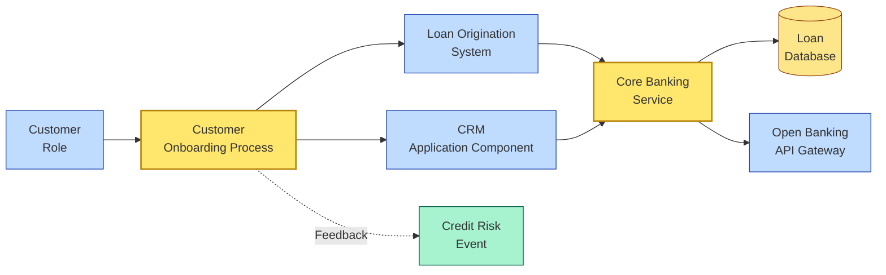

# [C2-05] ArchiMate — BRIEF
> **Category:** C2 — Frameworks & Methods · **Difficulty:** ●★★ · **Banking-relevant:** yes
> **One-liner:** ArchiMate is a standardization (The Open Group) for visual modeling of enterprise architecture, bridging business processes, applications, and infrastructure into a single, color-coded language.
> **Why an EA cares:** In banking, regulatory auditors and IT/business stakeholders speak different dialects. ArchiMate provides a *single visual grammar* that translates "regulatory reporting" into application services and infrastructure components without re-explaining the relationships.

## Quick definition
ArchiMate (v4.1) is The Open Group's standard for architecture description and visualization. It is an abstract, technology-neutral language that models three domains:

- **Business Layer:** Business processes, actors, events, business objects, value streams, and realizations.
- **Application Layer:** Application components, services, processes, interfaces, and hardware.
- **Technology Layer:** Technology services, devices, system software, and infrastructure nodes.

ArchiMate is *not* a process (like TOGAF) or a reference architecture (like TOGAF ADM); it is a *taxonomy and notation* — a visual vocabulary with defined colors, icons, and structural rules.

## Key ideas / terms
- **Layer:** A horizontal slice of ArchiMate (Business, Application, Technology); nodes and relationships are typed to a layer.
- **Business element:** A concept in the Business Layer (e.g., Business Process, Event, Business Object, Business Role).
- **Application element:** A concept in the Application Layer (e.g., Application Component, Service, Technology Process).
- **Technology element:** A concept in the Technology Layer (e.g., Device, Technology Service, System Software).
- **Active / passive structural element:**
  - *Active*: has behavior (Process, Service, Device, Function).
  - *Passive*: has state but no behavior (Node, Artifact, Business Artifact, Meaning).
- **Specialization hierarchy:** ArchiMate elements inherit from a shared meta-model (`Element` → `ActiveStructure` / `PassiveStructure` / `Grouping / Path`).
- **Relationship type:** Composition, association, aggregation, realization, flow, assignment, access, trigger, project, influence.
- **Motivation / implementation / migration / transformation / description:** The four *architectural principle* categories that organize *why* an element exists (motivation), *how* it is built (implementation), and *what* drives or consumes it (migration, transformation, description).

## The mental model
ArchiMate is the *lens* through which an architect looks at a bank. The **Business Layer** is "what the bank *wants* to do" (e.g., "onboard a retail customer"). The **Application Layer** is "which software *helps*" (e.g., "Core Banking Cloud Service"). The **Technology Layer** is "which servers and network *run* it" (e.g., "Azure / AWS / On-Premise Cluster"). ArchiMate's `% Composition` relationship (`→` dashed with a filled diamond) says "A is *composed of* B," while `% Realization` (`→` solid with a hollow triangle) says "A *is a kind of* B." In a bank, this is the difference between "the loan approval process *uses* the Decision Engine Service" (flow) and "the Decision Engine Service *realizes* the Lending Policy Process" (realization).

## One diagram (mandatory)

## When to use / when NOT to use
- ✅ **Use when:** You need a *single visual* for a board, a regulator, or a vendor negotiation that shows business, application, and technology together.
- ⚠️ **Avoid when:** You need quantitative analysis (costing, latency, fault-tree); ArchiMate is a *communication* and *governance* tool, not a *math* tool.

## Banking 💳 example
A regional U.S. bank (Riverside) wants to launch a 15-minute mortgage origination experience. The CRO is skeptical ("our AMI processes take 45 minutes and we have a 99% first-pass close rate"). Riverside's EA translates the initiative into an ArchiMate diagram:

- **Business Layer:** `Mortgage Origination Process` → `Digital Self-Service Channel`.
- **Application Layer:** Deployment of `Mobile App Service` (new) + `Omnichannel Banking Platform` (API — composable) + `Modern Core Banking` (agile-ready).
- **Technology Layer:** `Mobile CDN` (AWS CloudFront), `Container Platform` (K8s), `Runtime Database` (Postgres).

The CFO sees the same diagram and points to the `% Deployment` relationships; he realizes the vendor's "mobile app" is *realizing* the bank's `Digital Channel Strategy`, not the bank's `Mortgage Origination Process`. This catches a mis-scoped product before the RFP is issued.

## Common confusions (don't mix these up)
- **ArchiMate vs TOGAF:** ArchiMate is The Open Group *layering vocabulary*; TOGAF is *process methodology*. TOGAF ADM *uses* ArchiMate concepts as its Building Blocks / Architecture Vision outputs.
- **ArchiMate vs BPMN:** ArchiMate is *high-level, multi-layer*; BPMN is *task-level, single-process* depth.
- **ArchiMate vs Zachman:** Both are matrix-based; ArchiMate is semantic / visual / layer-based; Zachman is cell-based and *method*-oriented.
- **ArchiMate vs UML:** UML is object-oriented, implementation-focused, and code-aligned. ArchiMate is business-system-focused, technology-neutral, and zoomable (business-level to tech-level in one diagram).

## Interview / recall prompt
_“Explain ArchiMate in 2 minutes without notes.”_ →
- Three layers (Business, Application, Technology) with typed, color-coded elements.
- Two structural categories: active (has behavior) vs passive (has state).
- Four architectural principles: Motivation, Implementation, Migration, Transformation, Description.
- Not a process framework — it is a *notation* that complements TOGAF and BPMN.
- Used to align IT to business strategy and to communicate across non-technical stakeholders.

---
**Status:** ✅ Written · See detail doc: `[details/C2-05-archimate.md](./details/C2-05-archimate.md)`
