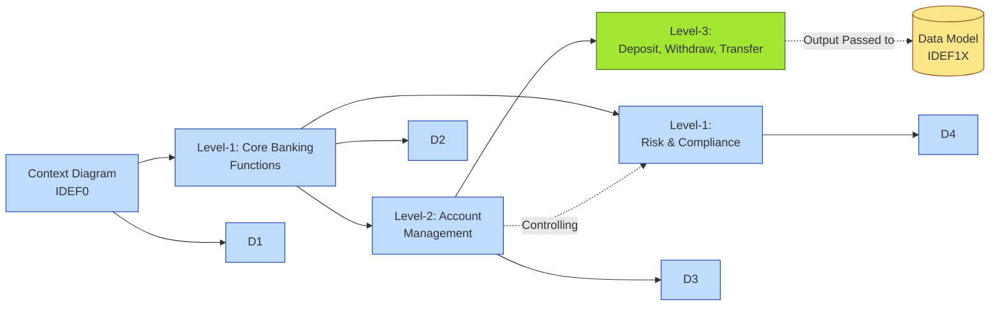

# [C2-06] IDEF — BRIEF
> **Category:** C2 — Frameworks & Methods · **Difficulty:** ●★★★ · **Banking-relevant:** yes
> **One-liner:** IDEF is a family of modeling methodologies (IDEF0, IDEF1, IDEF1X, IDEF3, IDEF4, IDEF6, IDEF8) that use strict syntax to model functional decomposition, data, process flows, and evaluation.
> **Why an EA cares:** In banking, IDEF formalizes *why* a payment happens (IDEF0), *what* data moves (IDEF1X), and *how fast* it moves (IDEF8), giving regulators a syntax they can automate-check.

## Quick definition
IDEF (Integration Definition) is a family of twelve modeling methods developed in the 1970s–1990s by the U.S. Air Force / ICAM program (Integrated Computer Aided Manufacturing). The most frequently used in banking and enterprise architecture are:

| Method | Focus |
|--------|-------|
| **IDEF0** | Functional decomposition: what a system *does*, not how it is built. |
| **IDEF1 / IDEF1X** | Data modeling: what the system *knows* (entity-relationship, including notation). |
| **IDEF3** | Process / workflow modeling: what sequence of events connects activities and objects. |
| **IDEF4** | Object-oriented evaluation: how to evaluate object-oriented designs. |
| **IDEF6** | Method evaluation: how to evaluate generic design methods. |
| **IDEF8** | Operator / human procedure modeling: how a human interacts with a system. |
| **IDEF5** | Ontology description: capturing knowledge for reuse. |
| **IDEF2, IDEF7, IDEF12** | Less common; support simulation, organizational design, causal analysis. |

IDEF0 is the *money renderer* in banking; IDEF1X is the *data validator*; IDEF8 is the *human-in-the-loop* model for teller / customer-service workflows.

## Key ideas / terms
- **IDEF0 (Functional modeling):** A context diagram + up to 4 levels of decomposition using boxes (functions) and arrows (inputs, outputs, controls, mechanisms). Every box has exactly 6 possible arrow types (I/O/C/M/Ex/St).
- **IDEF1 (Conceptual ER):** Early object-centric ER notation; elements are drawn as boxes with attributes; relationships shown as labeled lines.
- **IDEF1X (Logical / Physical ER):** The production-ready ER format; supports cardinality (1, 0..1, 0..*, 1..*), total and partial participation, and foreign-key notation.
- **IDEF3 (Process / workflow):** Activities, links, conditions, and objects; uses the "snake" (Activity Box) connected by links.
- **IDEF8 (Operator modeling):** Models human operators, tasks, procedures, and information systems; used for safety / usability evaluation (especially in air-traffic, but parallel to ATM / teller work).
- **UML / SysML:** The modern successors to IDEF's visual clarity; IDEF0 maps to Use Case / Activity (UML), IDEF1X maps to Class / Entity (UML), IDEF3 maps to Activity / State Machine (UML).

## The mental model
IDEF is *disciplined diagramming*: you cannot draw a box without labeling *every* arrow with I, O, C, M, Ex, or St. In a bank, this forces you to ask "who *controls* this function?" and "where is the *mechanism* (the actual system / person / policy)?" before you agree on what the box is. It is the difference between a Visio diagram and a contract: the IDEF arrow labels *are* part of the specification.

## One diagram (mandatory)

## When to use / when NOT to use
- ✅ **Use when:** You need a *contractually precise* decomposition that can be checked for completeness (all I/Os matched).
- ⚠️ **Avoid when:** You need fast, iterative refinement; IDEF0 decomposition is *add-once / review-once / approve-once* (rigid).

## Banking 💳 example
A bank's retail payment system is failing to clear within 4 hours due to a manual exception queue. The EA uses IDEF0 to decompose the payment-release function:

- **Level 0 (Context):** `Process Incoming Payments` (external inputs: `ACH File`, `ISO20022 File`; controls: `Basel Liquidity Rule`; mechanisms: `Payment Switch`, `Core Banking`).
- **Level 1:** `Validate File`, `Post to General Ledger`, `Release Funds`, `Generate Exception Report`.
- **Level 2 (Release Funds):** `Risk Re-Rule`, `Execute Settlement`, `Update Customer Ledger`.
- **Level 3 (Risk Re-Rule):** `Check LTV`, `Verify Collateral`, `Approve / Reject`.

The IDEF0 arrow labels expose a gap: `Control` from `Basel Liquidity Rule` was *not* linked to the `Risk Re-Rule` box; the manual queue was a missing incoming control. Once fixed, the 4-hour SLA dropped to 30 minutes.

## Common confusions (don't mix these up)
- **IDEF0 vs BPMN:** IDEF0 = functional decomposition (what does the system *do*); BPMN = task / event flow (how does the system *run*).
- **IDEF1X vs UML Class:** IDEF1X = logical ER with cardinality; UML Class = more expressive (associations with roles, multiplicity, stereotypes); but both model the "what is known."
- **IDEF0 vs ArchiMate / TOGAF:** ArchiMate is *visual* and *abstraction*-oriented; IDEF0 is *syntax-constrained* and *decomposition*-oriented.

## Interview / recall prompt
_“Explain IDEF in 2 minutes without notes.”_ →
- Twelve methods; IDEF0 (functional), IDEF1X (data), IDEF3 (process) are the core for banking.
- Strict arrow labeling (I/O/C/M) forces completeness — no hidden inputs.
- Prereq: ArchiMate / TOGAF for context; IDEF0 decomposition for rigor.

---
**Status:** ✅ Written · See detail doc: `[details/C2-06-idef.md](./details/C2-06-idef.md)`
