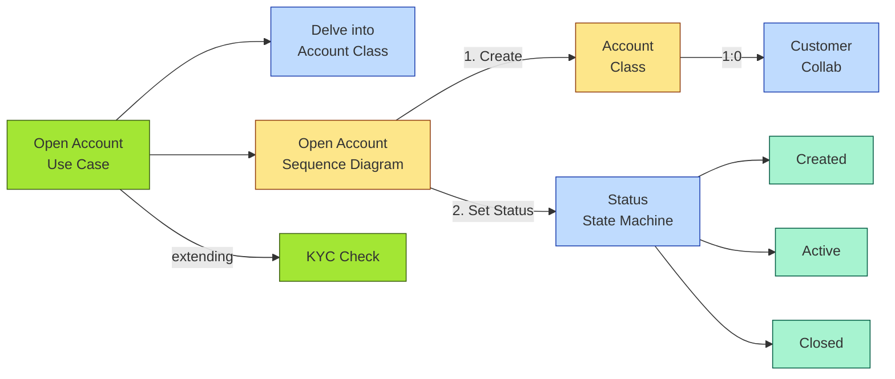

# [C2-07] UML — BRIEF
> **Category:** C2 — Frameworks & Methods · **Difficulty:** ●★★ · **Banking-relevant:** yes
> **One-liner:** UML (Unified Modeling Language) is the OMG-standardized notation for visualizing, specifying, constructing, and documenting system architecture; in banking, it is the contract between business analysts and software engineers.
> **Why an EA cares:** Every bank's software delivery cycle (Agile / DevOps) lives at the UML level: class diagrams for data models, sequence diagrams for microservice calls, state machines for transactional workflows. Without UML discipline, integration regressions in settlement / custody become inevitable.

## Quick definition
The **Unified Modeling Language (UML)** is an OMG standard notation for visualizing, specifying, constructing, and documenting software-intensive systems. Originally a heavyweight diagram language (14+ diagram types), modern UML 2.x / 2.5 has pruned configuration and composite structure to stable, tool-supported subsets.

In banks, UML is not an EA *process* (like TOGAF) but an *implementation-level* standard that EA must gate and govern: every microservice contract, state machine, or data-migration logic is rendered in UML.

## Key ideas / terms
- **Use Case:** A brief description of a system's function from an external point of view; the *starting point* for every bank product requirement.
- **Sequence / Communication:** Time-based interactions between objects / lifelines; the *alphabet* of microservice choreography.
- **Activity / State Machine:** Workflow and state transitions; critical for *transactional guarantees* and *regulatory audit logic*.
- **Class / Composite Structure / Object:** Static structure; maps directly to domain models (e.g., `Account`, `Transaction`, `Loan`).
- **Component / Deployment:** The structural building blocks of cloud-native / containerized banks; Component = logical service boundary; Deployment = physical nodes.
- **Profile (UML):** A domain-specific extension of UML; e.g., SysML (systems engineering), UML for Qt (embedded), UML for DCOM (legacy COBOL interop).
- **Profiled for ArchiMate:** Some vendors use UML profiles to import into ArchiMate diagrams (e.g., mapping `Application Component` to `Component`).

## The mental model
A bank's architecture is often described as "UML-for-analysts, BPMN-for-processes, ArchiMate-for-the-board, and TOGAF-for-strategy." UML is the *code-adjacent* layer: it is the contract that a software engineer actually implements. In a bank, "API Gateway → Core Banking Rest Service → Response" is a sequence diagram; "Account" is a class with attributes and associations; "Loan" is a state machine (Pending → Underwriting → Approved / Rejected → Funded / Defaulted).

Without UML governance, the "same" business concept becomes three different software objects in three different systems — a classic sources-of-truth catastrophe.

## One diagram (mandatory)

## When to use / when NOT to use
- ✅ **Use when:** You need a *technology-neutral, code-independent* description that a software team and an architecture board can both read.
- ⚠️ **Avoid when:** You need *business-level process* navigation (swim lanes, event triggers); use BPMN, not UML Activity.

## Banking 💳 example
A bank's deposit product (single / joint / business) is modeled in UML as a class `Account` with associations to `Customer`, `AccountHolder`, and `AccountType`. The `Account` class has attributes: `accountId`, `balance`, `overdraftLimit`, `currency`, `status`. A state machine (PostgreSQL / DDD effect) models `status` transitions: `Created → Validated → Active → Suspended → Closed → Frozen`.

When the FRB requires a "model inventory" of all "material" credit-risk models (Basel III / FR Y-14), the bank renders the `CreditRiskModel` as a UML Class + a UML State Machine. The EA validates that the UML model's `PD` (probability of default) field maps to the `.py` or `.R` source (the FRB audit requirement). Without UML discipline, `PD` in the source code might mean "payment due," "loss given default," or "probability of default" depending on which team updated the file.

## Common confusions (don't mix these up)
- **UML vs BPMN:** UML = structural / interaction / flow; BPMN = process-centric with explicit event triggers, gateways, and lanes.
- **UML vs ArchiMate:** ArchiMate = business / application / technology *layer* abstraction; UML = implementation-level *detail*.
- **UML vs SysML / UML Profile:** SysML is a UML *profile* for systems engineering; misuse leads to mixing hardware and software notation in the same diagram.

## Interview / recall prompt
_“Explain UML in 2 minutes without notes.”_ →
- OMG standard for software-system visualization; 14 diagram types pruned to stable core.
- Class + Sequence + Activity + State Machine + Use Case are the banking staples.
- Governed by the EA to prevent semantic drift between analysts and engineers.
- Maps to ArchiMate and TOGAF via profiles, but is *not* an EA process.

---
**Status:** ✅ Written · See detail doc: `[details/C2-07-uml.md](./details/C2-07-uml.md)`
