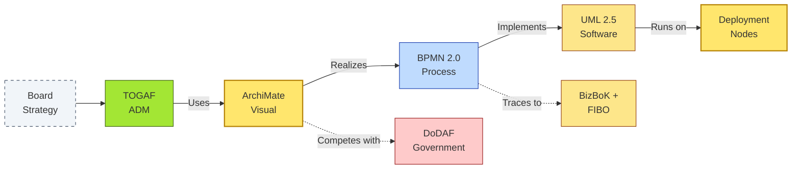

# [C2-08] Framework Selection — BRIEF
> **Category:** C2 — Frameworks & Methods · **Difficulty:** ●★★· **Banking-relevant:** yes
> **One-liner:** Framework selection is the strategic decision of which combination (TOGAF, ArchiMate, BPMN, U UML, etc.) to adopt across an enterprise, optimized for governance depth, tooling cost, and compliance coverage.
> **Why an EA cares:** In banking, the wrong framework choice is not a "styling error" — it is a cost center: licensing, training, and, worst case, a regulatory submission that fails because the framework did not capture the necessary dependency trace.

## Quick definition
Framework selection is the process by which an enterprise architecture practice chooses which framework(s) to deploy, where to deploy them, and how to *map* between them so that different stakeholders (board, audit, procurement, vendors, CRO) all look at the same artifact and mean the same thing.

Framework selection is not "pick one tool"; it is a *portfolio* decision. The most widely adopted pattern in banking is **TOGAF + ArchiMate + BPMN + UML**:
- TOGAF = *how* to do architecture (process / methodology).
- ArchiMate = *what* the architecture looks like (visual, multi-layer).
- BPMN = *how* the business processes flow (workflow, event-driven).
- UML = *what* the software looks like (class / sequence / state machine).

Other frameworks are *specialized* (BizBoK for semantic interoperability, DoDAF for government contractors, IDEF for decomposition rigor).

## Key ideas / terms
- **Framework:** A defined set of concepts, relationships, and notations to support a specific task (e.g., TOGAF's ADM, ArchiMate's layers).
- **Strategy-to-implementation gap:** The set of artifacts that links a strategic layer (Board / EAM) to an implementation layer (code / deployment); bridges like ArchiMate → UML / BPMN → ArchiMate are the *architecture measures*.
- **Profile:** A mechanism to map concepts from one framework to another (e.g., mapping TOGAF Building Blocks to ArchiMate Application Services).
- **Traceability:** The ability to follow a requirement from a Board strategy document → a BPMN process → a UML class → a Deployment node; *mandatory* for bank regulatory reports.
- **Lazy evaluation:** The idea that not all frameworks need full adoption; a bank can adopt TOGAF ADM for strategic priorities and use informal Visio + BPMN for tactical execution, linked by lightweight traceability.
- **ArchiMate as the lingua franca:** In practice, ArchiMate becomes the "common notation" because it spans business / application / technology without forcing every stakeholder to learn TOGAF or UML.
- **Framework obsolescence / technical debt:** Every framework carries maintenance cost (license, training, tool updates). The A B C model: A = *Adoption* (cost), B = *Breadth* (coverage), C = *Currency* (edition updates / tool plugin support).

## The mental model
In a bank, framework selection is like choosing the operating system for a physical infrastructure portfolio: you do not pick *every* OS (Windows, Linux, VFW, your own air-gapped variant). You pick a *primary* set, define *interoperability rules*, and retire the rest. The primary set is typically:
- **Strategic / governance:** TOGAF ADM.
- **Visual / stakeholder communication:** ArchiMate.
- **Process / workflow:** BPMN 2.0 (or IDEF3 if historically mandated).
- **Software / implementation:** UML 2.5 + SysML (for systems).
- **Semantic / ontology:** BizBoK + FIBO (for multi-vendor / regulatory taxonomy).

Framework selection decides the *boundary* between "this stack is for the board" and "this stack is for the sprint."

## One diagram (mandatory)

## When to use / when NOT to use
- ✅ **Use when:** You need to make budget / tooling / compliance decisions about your architecture stack.
- ⚠️ **Avoid when:** You are a 10-person fintech building a single microservice with no external audit; a lightweight spec is enough.

## Banking 💳 example
A national retail bank (BrightWealth) ran a *S_REFM * (self-reliance / minimal external framework) strategy for 5 years. The board realizes that:

- 67% of vendor negotiations fail because the technical solution maps to *no* ArchiMate artifact.
- Regulatory submissions (CCAR, DORA) require trace between a risk model (UML) and a deployment (Deployment diagram).
- M&A due diligence requires a *comparable* business dictionary; the target has 4 conflicting glossaries.

The EA runs a **Framework Portfolio Analysis**:
- **Adopt:** TOGAF ADM 10.2 (governance), ArchiMate 4.1 (visual), BPMN 2.0 (process), UML 2.5 (software), BizBoK + FIBO (semantic).
- **Pilots:** DoDAF (only if a VA contract is won), SysML (only for ATM hardware).
- **Deprecate:** Custom Visio + Word; Informatica/PowerPoint decks.

Result: 23% engineering time saved in API governance; 40% faster CCAR drill-down; M&A target (another bank) was already ArchiMate-ready, reducing due-diligence from 18 weeks to 6.

## Common confusions (don't mix these up)
- **Framework selection vs. tool selection:** Framework = *what* to model and *when*; Tool = *how* to draw it (e.g., Archi vs Sparx).
- **Adoption vs. tailoring:** Adopting TOGAF means running ADM phases; tailoring means removing phases (e.g., skip Phase H / Migration Planning if there is no migration planned).
- **Consolidation vs. simplicity:** Fewer frameworks are easier to train on; more frameworks cover more domains but increase glue cost.

## Interview / recall prompt
_“Explain framework selection in 2 minutes without notes.”_ →
- It is a portfolio decision, not a single-tool decision.
- The "lingua franca" layer (usually ArchiMate) maps across TOGAF, BPMN, UML, and BizBoK.
- In banking, it is driven by regulatory traceability, vendor alignment, and M&A integration.
- The cost of the wrong choice: non-auditable integrations, failed submissions, and inflated M&A due diligence.

---
**Status:** ✅ Written · See detail doc: `[details/C2-08-framework-selection.md](./details/C2-08-framework-selection.md)`
