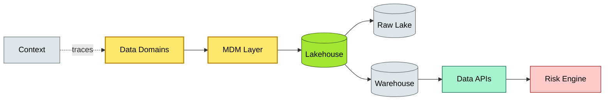

# C3-02 Data Architecture — BRIEF
> **Category:** C3 — Architecture Domains · **Difficulty:** ◑ · **Banking-relevant:** yes
> **One-liner:** Engineering the lifecycle, storage patterns, and semantic consistency of enterprise data so that every payment, ledger, and risk signal is discoverable, governed, and reused safely across channels.
> **Why an EA cares:** In a 💳 bank, data is the core asset—ledger records, fraud signals, KYC profiles, and stress-test results flow through dozens of systems; without a coherent data architecture, duplication, drift, and audit gaps become existential.

## Quick definition
Data architecture defines how data is captured, stored, transformed, distributed, and consumed across an organization to support decision-making and operations. It specifies the structural blueprint for data assets, addressing quality, consistency, integration, governance, and semantic interoperability across the enterprise 💳 technology landscape.

## Key ideas / terms
- **Data Domain:** A subject-area-oriented grouping of data entities (e.g., Customer, Account, Payment, Risk).
- **Master Data Management (MDM):** The discipline of maintaining a single, trusted source of truth for core entities.
- **Semantic Consistency:** Shared vocabulary and meaning across business units, systems, and reports.
- **Data Mesh:** A decentralized data ownership model where data is treated as a product, owned by domains.
- **Data Lakehouse:** A hybrid architecture combining the low-cost storage of a data lake with the management and transactional features of a data warehouse.

## The mental model
Think of data architecture as the plumbing and zoning of a 💳 bank’s information estate: just as plumbing must carry clean water to every tap without contamination, data architecture must carry clean, governed data to every consumer—while data mesh is the shift from a single municipal provider to each neighborhood running its own licensed utility.

## One diagram (mandatory)

## When to use / when NOT to use
- ✅ **Use when:** You are designing a new data platform, consolidating ETL, or creating a customer-360 view for a 💳 bank.
- ⚠️ **Avoid when:** The requirement is a simple report on a single operational table that is fully owned by one system and has no downstream consumers.

## Banking 💳 example
A universal bank needs a real-time payments hub: it must join live transaction streams with KYC profiles and AML risk scores. The data architecture defines a payments 💳 domain (owner: Payments), a customer 💳 domain (owner: Retail Banking), and an MDM hub for Customer that de-duplicates identities across both—ensuring that a sanction check returns in <200 ms for every outbound wire.

## Common confusions (don't mix these up)
- **Data Architecture** vs **Data Engineering:** Architecture decides *what* the data landscape looks like and *why*; engineering builds *how* the pipelines and stores work.

## Interview / recall prompt
_“Explain data architecture in 2 minutes without notes.”_ →
- 1) It’s the blueprint for an organization’s data
- 2) It covers capture, storage, governance, and consumption
- 3) Domains group related entities; MDM keeps them coherent
- 4) It must balance central consistency with domain autonomy (mesh vs vault)
- 5) In banks, it underpins payments, risk, and compliance signals

---
**Status:** ✅ Covered
