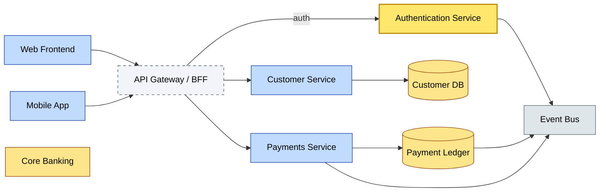

# C3-03 Application Architecture — BRIEF
> **Category:** C3 — Architecture Domains · **Difficulty:** ◑ · **Banking-relevant:** yes
> **One-liner:** Designing the structure, patterns, and lifecycles of software applications so that each banking system—from core platforms to APIs—delivers the right capabilities at the right cost and risk.
> **Why an EA cares:** 💳 banks run hundreds of applications spanning legacy mainframes, cloud-native APIs, and data platforms; without coherent application architecture, integration becomes a tangle of point-to-point adapters, duplication explodes, and compliance becomes impossible to trace.

## Quick definition
Application architecture is the subsystem-level engineering of software and its environment(s): runtime platforms, deployment models, integration mechanisms, library dependencies, and the matching between business services and technical components. It defines how applications are built, deployed, and connected to serve business capabilities.

## Key ideas / terms
- **Microservices:** Fine-grained, independently deployable services with well-defined APIs and bounded contexts.
- **Service Orientation:** Organizing capabilities as reusable, interoperable services rather than monolithic functions.
- **Layered/N-Tier Architecture:** Separation of presentation, business logic, and data access layers within a single application.
- **Event-Driven Architecture (EDA):** Components communicate via events published to a middleware layer, enabling loose coupling.
- **API Composition / Backend-for-Frontend (BFF):** Aggregating multiple backend services to serve a specific frontend (web, mobile) rather than direct client-to-backend calls.
- **Antifragile Architecture:** Systems that gain strength from volatility (e.g., self-healing, circuit breakers) rather than merely resisting failure.

## The mental model
Think of application architecture as the interior design of a 💳 bank’s buildings: architecture decides which rooms (services) exist, how they share utilities (data, identity), which corridors (APIs) connect them, and whether the building is a single fortress or a campus of semi-independent towers.

## One diagram (mandatory)

## When to use / when NOT to use
- ✅ **Use when:** Replacing a greenfield capability, decoupling a legacy monolith, or exposing services behind APIs for digital channels (omnichannel, 💳 mobile banking).
- ⚠️ **Avoid when:** You have <2 development teams, a single business function, or a system that changes less than once per year and has no consumer diversity.

## Banking 💳 example
A universal bank launches a real-time onboarding flow for retail deposits. The application architecture splits the monolith: a Customer BFF handles profile enrichment; a Payments Service manages deposit activation; a KYC Service invokes an external bureau via API. Each service deploys independently, reducing the blast radius of a change and allowing SMEs to move faster.

## Common confusions (don't mix these up)
- **Application Architecture** vs **Software Architecture:** Application architecture covers the full app and its interactions with other apps/data; software architecture often limits itself to a single codebase and its components.

## Interview / recall prompt
_“Explain application architecture in 2 minutes without notes.”_ →
- 1) It’s the design of how applications are structured and deployed
- 2) It balances cohesion, coupling, and deployment autonomy
- 3) Patterns range from monoliths to microservices to events
- 4) The BFF pattern decouples frontend diversity from backend multiplicity
- 5) In banking, it underpins omnichannel and regulatory auditability

---
**Status:** ✅ Covered
