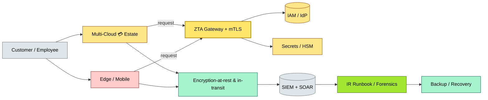

# C3-05 Security Architecture — BRIEF
> **Category:** C3 — Architecture Domains · **Difficulty:** ● · **Banking-relevant:** yes
> **One-liner:** Engineering the protective, detective, and responsive layers of the 💳 bank’s technology and data landscape—from identity to encryption to incident response—so that confidentiality, integrity, and availability are enforced by design, not bolted on.
> **Why an EA cares:** 💳 banks are the primary attack surface for financial crime; a single misconfiguration or unpatched runtime can expose millions of customer records, trigger regulatory censure (e.g., DORA, PCI-DSS), and destroy trust.

## Quick definition
Security architecture is the strategic design of controls, policies, and mechanisms—proactive and reactive—that govern the identification, authentication, authorization, encryption, monitoring, and recovery of enterprise assets (data, applications, infrastructure) across all wings of the IT portfolio.

## Key ideas / terms
- **Zero Trust (Zero Trust Architecture):** Never trust, always verify; every request is authenticated, authorized, and encrypted regardless of source.
- **Defense in Depth:** Multiple, layered security controls so that a failure in one layer does not compromise the entire system.
- **Comprehensive Endpoint Security:** Maintaining the security of all connected points (PCs, mobile 💳 apps, IoT) to the data center.
- **High-assurance Security (e.g., STAMP, CMMC:** Standards for safety-critical and defense/critical infrastructure.
- **Attack Surface Mapping:** The systematic identification of log(e(n)), outbound, and internal to understand where adversaries can reach in the technology estate.
- **Cryptographic Controls:** Key management, algorithm agility, hardware security module (HSM), and post-quantum readiness.
- **Incident Response (IR):** Planning, detection, containment, evidence preservation, and remediation when a security breach or anomaly occurs.

## The mental model
Security architecture is the 💳 bank’s immune system: it includes barriers (firewalls, encryption), surveillance (SIEM, SOAR), and adaptive memory (threat intelligence, pattern matching). It is not a single product but a layered strategy that evolves as threats do.

## One diagram (mandatory)

## When to use / when NOT to use
- ✅ **Use when:** Designing a new 💳 digital channel, migrating to cloud, or responding to a regulatory audit (DORA, PCI-DSS, Basel II/III).
- ⚠️ **Avoid when:** A single developer tests a proof-of-concept with no customer data.

## Banking 💳 example
A 💳 neobank launches a mobile 2-factor authentication flow: the security architecture mandates hardware-backed keystore (Android Keystore / iOS Secure Enclave), mTLS between the mobile app and the API gateway, token-rotation every 15 minutes, and real-time SIM-swap detection via SSP integration—ensuring that a compromised phone does not lead to unauthorized transfers.

## Common confusions (don't mix these up)
- **Security Architecture** vs **Application Security:** Security architecture covers the entire estate (infrastructure, data, identity, IR); application security is the code-level practice (SAST, DAST, dependency scanning).

## Interview / recall prompt
_“Explain security architecture in 2 minutes without notes.”_ →
- 1) It’s the strategic design of all protective, detective, and responsive mechanisms
- 2) Zero Trust replaces the old “trust but verify” perimeter model
- 3) Defense in depth means no single point of failure in controls
- 4) In banking, it must satisfy PCI-DSS, DORA, GDPR, and AML/KYC requirements
- 5) Cryptography and key management are foundational, not optional

---
**Status:** ✅ Covered
