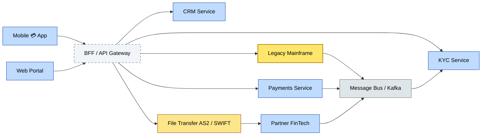

# C3-06 Integration Architecture — BRIEF
> **Category:** C3 — Architecture Domains · **Difficulty:** ◑ · **Banking-relevant:** yes
> **One-liner:** Engineering the controlled, observable, and resilient pathways by which 💳 bank applications share data and workflows—synchronously and asynchronously—so that systems stay coherent without becoming a maintenance nightmare.
> **Why an EA cares:** Integration is the connective tissue of a bank; without governed integration, you rapidly spin into a “Spaghetti Integration” of point-to-point adapters that no one understands, failing audits and blocking agile delivery.

## Quick definition
Integration architecture defines the framework, patterns, and infrastructure that enable 💳 banking applications and services to exchange data, events, and control signals—through APIs, message buses, file transfers, or event streams—according to security, latency, and reliability principles.

## Key ideas / terms
- **Enterprise Service Bus (ESB):** Centralized message routing and transformation; historically dominant, now often replaced by lightweight API gateways & Kafka.
- **Enterprise Integration Patterns (EIP):** Digital Patterns Library (O. Hopper, K. Hohpe) for common integration challenges (content-based router, saga, pipe-and-filter).
- **Event-Driven Architecture (EDA):** Integration via events published to a middleware layer; consumers subscribe to relevant events.
- **API Management / Governance:** Design, publish, secure, monitor, and version-manage APIs; includes Developer Portal, rate limiting, and lifecycle.
- **Canonical Data Model (CDM):** A single, shared data model that all systems map to, reducing conversion overhead.
- **API Composition / BFF:** Aggregating multiple backend services to serve a specific frontend, hiding backend complexity.
- **Message-Driven Tetration (MDT):** (Ref: Martin Fowler) a pattern where a message queue persists work during outages, with external storage.
- **Middleware:** Software that sits between applications, providing messaging, transformation, queuing, and routing.
- **Synchronous vs Asynchronous:** Synchronous = immediate request/response (REST, gRPC); asynchronous = decoupling via events or queues.
- **Back-end-for-Frontend (BFF):** Integration layer tailored for a specific consumer (web, mobile, partner) that aggregates and adapts multiple backend services.

## The mental model
Integration architecture is the road and rail network of a 💳 bank—high-speed highways for urgent payments, reliable railways for batch settlement, and controlled border crossings (APIs) with customs checks (auth, rate-limiting). Without planning, every town builds its own unpaved road; with planning, nothing breaks the network.

## One diagram (mandatory)

## When to use / when NOT to use
- ✅ **Use when:** Composing multi-system workflows (e.g., account opening), exposing APIs for open banking, or replacing point-to-point EDI with a managed bus.
- ⚠️ **Avoid when:** A single system serves one customer with no downstream consumers; use direct RPC.

## Banking 💳 example
When a customer opens a savings account in the 💳 mobile app, the integration architecture must consume:
1. Customer profile (identity service)
2. AML/KYC-cleared status (KYC service)
3. Product definitions (products-as-a-service)
4. Ledger setup (core banking)
All via a BFF + synchronous calls to synchronous services, and asynchronous events to the analytics data lake (EventBridge) and the customer data platform (CDP).

## Common confusions (don't mix these up)
- **Integration Architecture** vs **Application Architecture:** Integration is the *movement* between apps; application is the *internal* design of each app.

## Interview / recall prompt
_“Explain integration architecture in 2 minutes without notes.”_ →
- 1) It’s the design of how 💳 bank systems exchange data and control signals
- 2) It covers sync (APIs, REST, gRPC) and async (events, queues, files)
- 3) EIP patterns (saga, content-based router) solve real-world integration problems
- 4) API management, canonical models, and BFFs reduce coupling and duplication
- 5) Without it, you get spaghetti integration and audit nightmares

---
**Status:** ✅ Covered
