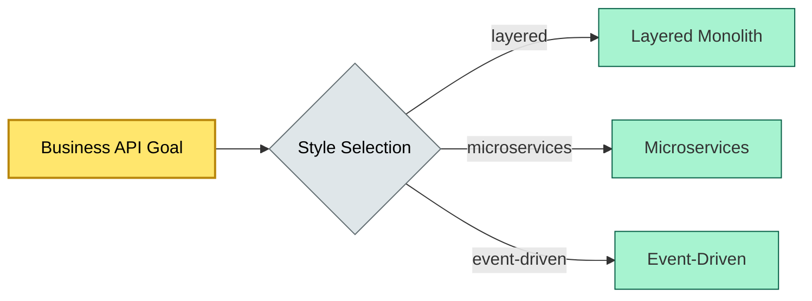

# C4-?? architectural styles — BRIEF

> **Category:** C4 — System & Software Design · **Difficulty:** ● · **Banking-relevant:** yes
> **One-liner:** _Architectural styles are repeatable patterns of structural organization (e.g., layered, microservices, event-driven) that provide a vocabulary for describing, comparing, and evolving software systems._
> **Why an EA cares:** _In a regulated 💳 bank with legacy COBOL cores, multiple acquisition-driven greenfield apps, and a 5-year modernization roadmap, choosing the wrong style compounds technical debt, blocks API-first compliance, and inflates cost of change. The EA must therefore map each style to a risk-adjusted acquisition and migration strategy._

## Quick definition

An **architectural style** is a reusable, high-level pattern that defines how system components are decomposed, how they interact, and what constraints govern their composition. Styles provide a common vocabulary: when an architect says "layered," every stakeholder shares a mental model of separation of concerns. In enterprise architecture, styles are the "nouns" of system design; they are chosen before the "verbs" (specific algorithms or protocols).

## Key ideas / terms

- **Style:** A family of systems sharing a shared set of structural properties (e.g., all request-reply, all event-sourcing).
- **Pattern:** A concrete, localized solution to a recurring problem within a style (e.g., gateway pattern in microservices).
- **Quality attribute driver:** A measurable criterion (latency, throughput, compliance, auditability) that tilts style selection.
- **ADR (Architecture Decision Record):** A lightweight document logging *why* a style was chosen, to avoid future re-architecting.

## The mental model

Architectural styles sit between business goals and detailed design. A bank's **API-first strategy** (business goal) may be realized through either a **service-oriented architecture** (SOAP) or **microservices** (REST/gRPC). The stakeholder cares about the API contract; the EA cares about how the style enables evolution, resilience, and compliance without re-platforming.

## One diagram (mandatory)

## When to use / when NOT to use

- ✅ **Use when:** The system must be decomposed across teams, deployed independently, and evolve on different release cadences (e.g., payments, onboarding, analytics).
- ⚠️ **Avoid when:** The problem is a single, tightly coupled transaction with zero tolerance for network latency; a monolith with internal components may be cheaper and simpler (e.g., a real-time SWIFT settlement engine).

## Banking 💳 example

A global retail bank operates a **legacy core** (COBOL mainframe) and acquired three **neobank mobile apps** in two years. The EA recommends a **strangler fig** style for the core (keeping stable, wrapping new APIs) and **microservices** for the acquisitions. The critical trade-off: PII-heavy KYC must remain on-premise for GDPR Art. 45, while digital identity can run in a hybrid cloud microservices style, giving the bank a **cloud-native payments** capability without migrating all risk data.

## Common confusions (don't mix these up)

- **Style vs pattern:** A style is a *global* structural organization (e.g., microservices); a pattern is a *local* solution (e.g., circuit breaker, saga).
- **Style vs framework:** A framework is code (Spring, .NET); a style is a *constraint set* (e.g., "every service must be independently deployable").

## Interview / recall prompt

_"Explain architectural styles in 2 minutes without notes."_ →

- An architectural style = repeatable structural organization (layered, microservices, event-driven).
- It governs decomposition, interaction rules, and constraints.
- It is the bridge between business goals and detailed design choices.
- Banks pick styles to balance legacy stability, acquisition velocity, and compliance (GDPR, DORA).
- ADRs capture style decisions to prevent future re-platforming.

---
**Status:** ☐ Not started · See detail doc: `../details/C4-01-architectural-styles.md`
