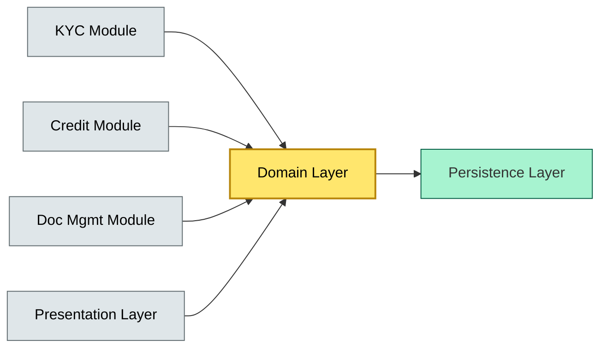

# C4-?? layering & modularity — BRIEF

> **Category:** C4 — System & Software Design · **Difficulty:** ● · **Banking-relevant:** yes
> **One-liner:** _Layering partitions a system into horizontal strata for cross-cutting concerns (UI, business logic, persistence), while modularity groups functionality into vertically cohesive modules; together they control complexity but at the cost of performance and deployment velocity._
> **Why an EA cares:** _Regulators audit *where* data is stored and *who* may access it; layering must isolate PII and audit logs, while modularity must align with bounded contexts for team ownership. A violation breaks both compliance and developer productivity._

## Quick definition

**Layering** is the *horizontal* separation of concerns into stacked, independent strata, each exposing a well-defined interface upward and hiding implementation below. **Modularity** is the *vertical* decomposition of a system into cohesive, loosely coupled modules that can be developed and tested independently. Layering controls if *which* concerns cross the boundary; modularity controls if *which* features share the boundary.

## Key ideas / terms

- **Layer / Stratum:** A horizontal slice (e.g., presentation, application, domain, infrastructure).
- **Module:** A vertical, cohesive unit of functionality with a clear public interface.
- **Cohesion:** Degree to which elements inside a module belong together.
- **Coupling:** Degree of interdependence between modules or layers.
- **Inversion of Control (IoC):** The principle that high-level modules do not depend on low-level modules; both depend on abstractions (e.g., interfaces, DI).

## The mental model

Imagine a bank's **loan-origination system** as a filing cabinet: PII, credit scoring, and document management are separate modules, each with its own lock (access control). But *all* modules share the same room (the same process/deployment), and the clerk (UI layer) must touch each lock in order (layered pass-through). Layering and modularity are orthogonal: you can have layered modules, modular layers, or a monolithic mix where every module violates layering.

## One diagram (mandatory)

## When to use / when NOT to use

- ✅ **Use when:** The system must separate auditability, security, and business rules; or when multiple teams own different cross-cutting concerns.
- ⚠️ **Avoid when:** The system is extremely latency-sensitive (sub-10 ms) and every layer adds an indirection; or when the architecture is still being discovered (pre-alpha).

## Banking 💳 example

A **universal bank** runs a **universal credit engine** where one analyst team owns risk scoring and another owns onboarding. The EA enforces:

- **Layering:** Presentation → Application → Domain → Infrastructure. The *PII* layer (capture) and *audit* layer (logging) must live in the infrastructure layer, isolated by encryption-at-rest and access keys.
- **Modularity:** One module per bounded context: KYC, Credit Decisioning, Fraud Checks, Document Upload. Each module is independently deployable only after budget approval, but each has its own CI/CD pipeline.

## Common confusions (don't mix these up)

- **Layering vs modularity:** Layering = horizontal (UI, business, data); Modularity = vertical (KYC, Credit, Documents).
- **Loose coupling:** Can mean *decoupled in time* (async) or *decoupled in space* (network). Layering primarily addresses space.

## Interview / recall prompt

_"Explain layering and modularity in 2 minutes without notes."_ →

- Layering = horizontal strata; modularity = vertical groups.
- Together they reduce cognitive complexity and enforce access controls.
- Excessive layers → performance overhead; excessive granularity → operational pain.
- In banking, layering isolates PII and audit; modularity maps to bounded contexts and team ownership.

---
**Status:** ☐ Not started · See detail doc: `../details/C4-02-layering-modularity.md`
