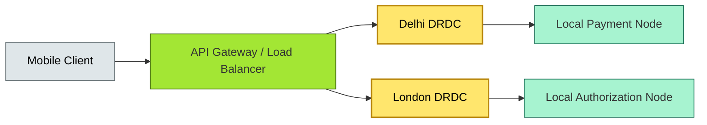

# C4-?? distributed fundamentals — BRIEF

> **Category:** C4 — System & Software Design · **Difficulty:** ●● · **Banking-relevant:** yes
> **One-liner:** _Distributed systems are collections of autonomous computers that communicate via a network to achieve a common goal; in banking, they are the default because regulatory mandates require geographic distribution, fault isolation, and multi-region resilience._
> **Why an EA cares:** _Every endpoint, every cloud region, and every message broker is a new blast radius. The EA must enforce chaos-engineering, circuit-breaking, and network-partition awareness to keep payments and core banking functional during regional outages._

## Quick definition

A **distributed system** is a system whose components are located on different networked computers, which communicate and coordinate their actions by passing messages. The defining properties are *autonomy*, *asynchrony*, and *partial failure*: subsystems can fail independently, network delays are unbounded, and components cannot share memory. In banking, “distributed” is not a choice—it is a regulatory and geographic necessity.

## Key ideas / terms

- **Node / process:** An autonomous runtime (VM, container, function) executing a component.
- **Message / RPC:** The primitive of distribution; sync (RPC/REST) vs async (event/message).
- **Partition tolerance:** The system must operate even when the network partitions; CAP theorem.
- **CAP theorem:** Consistency, Availability, Partition Tolerance—pick any two.
- **Byzantine fault:** A node or the network behaves arbitrarily; relevant for MPC, fraud detection.
- **Idempotency:** An operation that can be applied multiple times with the same result; essential for async retries.

## The mental model

Imagine a **branchless bank** with 200 million mobile users in India and 50 million in the EU. The **core ledger** must be consistent; the **fraud service** can be eventually consistent; the **KYC pipeline** must tolerate a slow upstream identity provider. Distributed architecture means *not everything works the same way*. The EA decides *which* services can tolerate partition and *which* must be linearizable.

## One diagram (mandatory)

## When to use / when NOT to use

- ✅ **Use when:** The system serves 100+ million users, spans regions, or must survive a datacentre outage.
- ⚠️ **Avoid when:** The system is a single-machine utility (e.g., a nightly ETL script to a single data warehouse) or cost must be minimal and latency is sub-millisecond.

## Banking 💳 example

A **global payments platform** processes 5B transactions/month across 18 countries. During the 2024 London-datacentre outage, London-bound transactions were *circuit-broken* and re-routed to Dublin (≤ 200 ms latency penalty). The EA mandated:

- **CAP:** for the payment ledger, *Consistency + Partition Tolerance* (CP); the ledger must never double-spend, even if it goes read-only during a partition.
- **CAP:** for the fraud-scoring analytics, *Availability + Partition Tolerance* (AP); a 5-minute stale score is acceptable, but the engine must remain online.
- **Byzantine resilience:** The MPC-based card-issuance service requires 3 of 5 cloud regions to be honest; a single region compromise with invalid keys is rejected.

## Common confusions (don't mix these up)

- **Distributed vs decentralized:** Distributed = network-partitioned; Decentralized = no single leader (e.g., blockchain vs traditional distributed system).
- **Conflict-free replicated data types (CRDT) vs Conflict resolution:** CRDTs are *data types* that converge without coordination; conflict resolution is a *process* (last-write-wins, human adjudication).

## Interview / recall prompt

_"Explain distributed fundamentals in 2 minutes without notes."_ →

- A distributed system = autonomous computers + network messages.
- The network is the new shared memory; it fails in ways memory cannot.
- CAP theorem forces trade-offs: in banking, payments are CP (consistency), retail analytics are AP (availability).
- Idempotency and retries are mandatory for async distributions.
- Chaos engineering (Netflix Simian Army) is the only way to *prove* resilience before a real outage.

---
**Status:** ☐ Not started · See detail doc: `../details/C4-03-distributed-fundamentals.md`
