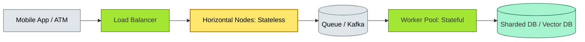

# C4-?? scalability — BRIEF

> **Category:** C4 — System & Software Design · **Difficulty:** ●● · **Banking-relevant:** yes
> **One-liner:** _Scalability is the ability of a system to grow in throughput, capacity, or geographic reach without a linear increase in cost or complexity; in banking, peak-load seasonality (Black Friday, year-end salaries, tax season) makes scalability a regulatory and P&L concern._
> **Why an EA cares:** _A payment platform that cannot scale during peak volumes fails PSD2 and DORA SLAs, triggers regulatory penalties, and destroys customer trust. The EA must model load curves, set auto-scaling policies, and separate *capacity scaling* (vertical) from *throughput scaling* (horizontal)._

## Quick definition

**Scalability** is a property of a system that allows it to handle a growing amount of work by adding resources. There are three fundamental axes:

- **Vertical scalability (scale-up):** Adding more CPU, RAM, or faster disks to a single node.
- **Horizontal scalability (scale-out):** Adding more nodes to a cluster.
- **Functional scalability:** Supporting more types of transactions, products, or regulatory regimes without re-architecting.

Scalability is distinct from performance (a single request) and availability (system uptime).

## Key ideas / terms

- **Peak-to-average ratio:** The ratio of maximum load to average load; retail banking often has 10x–50x ratios.
- **Auto-scaling:** The automated addition/removal of compute resources based on metrics (CPU, latency, queue depth).
- **Sharding:** Partitioning data across nodes so that each node serves a subset.
- **Read-heavy vs write-heavy:** A ratio (e.g., 99:1 for read-heavy analytics vs 1:1 for ledger).

## The mental model

Imagine a **CBDR (currency-denominated banking data repository)** that must process the end-of-year salary deposits of a nation. The system is idle 350 days/year and must handle 5x normal volume on December 31st. Vertical scaling (buying a bigger server) is *not* an option because it sits idle for 350 days. Horizontal scaling (adding 50 identical nodes) with **stateless frontends** and **queued message processing** is the only viable pattern.

## One diagram (mandatory)

## When to use / when NOT to use

- ✅ **Use when:** Throughput demand is unpredictable, multi-tenant, or subject to seasonal spikes (retail: Black Friday; utilities: first of month).
- ⚠️ **Avoid when:** The system is a single-node batch job (ETL) or a low-traffic internal tool where vertical scaling is cheaper.

## Banking 💳 example

A **retail payment gateway** in India processes UPI transactions. The **NCA (National Payments Corporation of India)** and the **State Bank of India** simulate **peak-load tests** (e.g., New Year, Diwali) where UPI handles 10 B+/day. The EA mandates:

- **Horizontal auto-scaling** on the authorization workers (stateless) to handle 5x traffic.
- **Queue-based backpressure** (Kafka) so that a slowdown in the ledger or fraud module never drops or times out the client.
- **Read-only shard** for balance inquiries (read-heavy, eventually consistent), and **write-heavy Raft** for settlement (CP, 3-node quorum).
- **Cold-storage tier:** After 7 years, transaction records move to S3 Glacier (regulatory retention); the hot tier remains at 3-node Raft.

## Common confusions (don't mix these up)

- **Scalability vs performance:** Scalability = system-wide growth; performance = single-request speed.
- **Scale-up vs scale-out:** Scale-up = bigger machine; scale-out = more machines; scale-out is cheaper for large banks but introduces network overhead.

## Interview / recall prompt

_"Explain scalability in 2 minutes without notes."_ →

- Scalability = ability to grow without proportional cost increase.
- 3 axes: vertical, horizontal, functional; each has a cost curve.
- Banking peaks (UPI, Black Friday) make horizontal scaling mandatory.
- Queue-based backpressure decouples peak arrival from processing capacity.

---
**Status:** ☐ Not started · See detail doc: `../details/C4-04-scalability.md`
