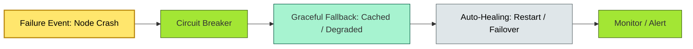

# C4-?? resilience — BRIEF

> **Category:** C4 — System & Software Design · **Difficulty:** ●● · **Banking-relevant:** yes
> **One-liner:** _Resilience is the ability of a system to degrade gracefully, recover automatically, and survive failure domains (node, network, region) without violating SLOs or regulatory continuity requirements; in banking, resilience is a *license-to-operate*.\n> **Why an EA cares:** _A  இந்தியாவில் bank with a single DC and no DR site cannot pass RBI's disaster recovery tests; every tier—compute, storage, network, power—must have a *design* for failure, not just a *hope* for uptime._

## Quick definition

**Resilience** is the property of a system to withstand, absorb, and recover from disruptive events (hardware failure, network partition, attacker action, natural disaster) while maintaining critical functions within agreed SLOs. It comprises *reliability* (does it work today?), *availability* (is it accessible?), and *recoverability* (how fast can it be restored?).

## Key ideas / terms

- **Failure modes:** Crash, permanent failure, transient fault, Byzantine fault.
- **Circuit breaker:** A pattern that fails fast when a downstream service is unhealthy.
- **Self-healing:** Automatic recovery (restart, failover, retrain).
- **Idempotency:** A guarantee that retrying an operation is safe.
- **MTTR (Mean Time To Repair):** How fast a failed component is restored.
- **MTBF (Mean Time Between Failures):** Predictable interval; independence assumes a memoryless failure model.

## The mental model

Resilience is *anti-fragile*: the system should be *stronger after* a controlled failure. A **retail bank** loses money not only when a server dies but also when:

- The payment processor is *slow* (queue buildup) → customers retry → credit double-spends.
- A security scan *blocks* all traffic (false positive) → branch offline during business hours.
- A fraud model *twitches* (overfit) → false positives spike → £100M in affected transactions.

Resilience therefore means *designing away* these amplifications.

## One diagram (mandatory)

## When to use / when NOT to use

- ✅ **Use when:** The system handles money, PII, or regulatory reporting; or when it is customer-facing at scale.
- ⚠️ **Avoid when:** The system is experimental, <-dev, or a one-time research script.

## Banking 💳 example

A **global bank** must pass **DORA** (EU), **RBI** (India), and **Basel III** stress tests. The EA mandates:

- **Compute:** Stateless containers with liveness/readiness probes; 1 n+1 pod replica in each DC.
- **Fault injection:** Chaos Mesh / Gremlin tests weekly (kill the payment pod during the morning peak; verify 500s < 5%).
- **Network:** Egress firewall rules per service mesh; a DMZ breach cannot reach the *CP ledger*.
- **Data:** Cross-region Kafka mirroring (MirrorMaker 2) with 1-minute RPO for AP topics, 0 RPO for CP topics.
- **Fraud:** Circuit breaker on the ML inference endpoint; fallback to *rule-based* scoring (≤ 5% degradation in precision).

## Common confusions (don't mix these up)

- **Resilience vs availability:** Resilience = *how it behaves under failure*; availability = *fraction of time it is up*.
- **Self-healing vs self-repairing:** Self-healing = automatic (restart); self-repairing = human-driven.
- **Graceful degradation vs circuit breaker:** Graceful degradation = reduce functionality (e.g., skip fraud); circuit breaker = stop calling a failing dependency.

## Interview / recall prompt

_"Explain resilience in 2 minutes without notes."_ →

- Resilience = ability to absorb and recover from failure without violating SLOs.
- Failure modes: crash, transient, Byzantine; each needs a distinct mitigation.
- Banking resilience is *regulatory* (DORA, RBI); a failure is a *license-to-operate* risk.
- Self-healing + circuit breakers + graceful degradation form a resilience triad.

---
**Status:** ☐ Not started · See detail doc: `../details/C4-05-resilience.md`
