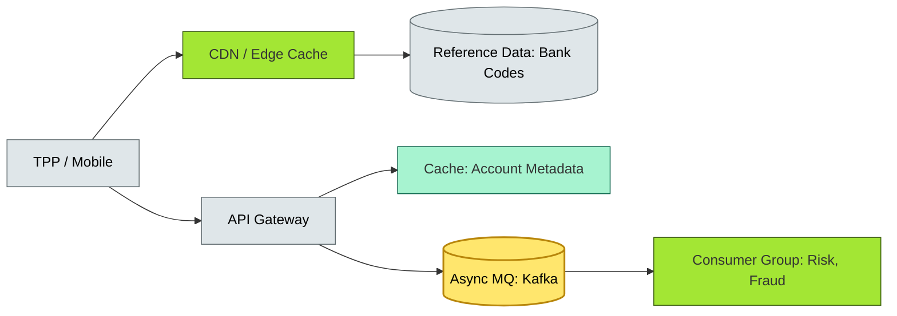

# C4-?? caching & async communication — BRIEF

> **Category:** C4 — System & Software Design · **Difficulty:** ●● · **Banking-relevant:** yes
> **One-liner:** _Caching and asynchronous communication (async) reduce latency and decouple system boundaries, but they introduce stale data, replay risk, and operational complexity that must be managed with TTLs, idempotency, and observability._
> **Why an EA cares:** _In a 💳 payment gateway, a cached risk score of 30 seconds (TTL) is acceptable for a £1 lunch transaction but not for a £500k RTGS transfer; the EA must tier caching and async patterns by *business criticality*._

## Quick definition

**Caching** is the temporary storage of frequently accessed data closer to the consumer, to reduce latency and origin load. **Asynchronous communication** (async/messaging) decouples producers and consumers by exchanging messages (events, topics) rather than making synchronous calls (RPC). In banking, both are *essential for scale* but *dangerous for consistency*.

## Key ideas / terms

- **Cache-aside / Read-through / Write-through:** Patterns for cache management.
- **Message-oriented middleware (MOM):** Kafka, Pulsar, SQS, RabbitMQ.
- **Saga / compensation transaction:** Maintaining distributed consistency across async operations.
- **Idempotency:** A property that makes a repeated operation safe.
- **Staleness / TTL:** cached data may be out of date; TTL governs acceptability.

## The mental model

Imagine a **retail bank's open-banking API** that serves 1,000 TPPs. If each TPP bank-account look-up hits the **core P&L DB**, latency is 400 ms and throughput is 1 k TPS. Instead, the EA caches *reference data* (bank codes, IBAN structures) at the CDN edge and offloads *account metadata* to an **event-sourced** async pipeline. The tradeoff: *reference data* is *stateless* and safe to cache; *account metadata* is *stateful* and needs a **CRDT** or **quorum read** to stay accurate.

## One diagram (mandatory)

## When to use / when NOT to use

- ✅ **Use when:** Read-heavy workloads, cross-network decoupling, or bursty traffic (Black Friday, UPI peak).
- ⚠️ **Avoid when:** Real-time accounting integrity (settlement), low-consistency tolerance, or need for immediate strong consistency under load.

## Banking 💳 example

A **global card-issuing bank** integrates with 120 third-party acquirers via **PCI-DSS v4.0**-mandated tokenization services. The EA caches:

- **Reference data:** Merchant category codes, BIN ranges, KYC-country mappings (CDN, 5-minute TTL).
- **Risk scores:** Pre-computed for frequent merchant profiles (Redis, 30-second TTL).
- **Async events:** Monthly charge-back batches, settlement reconciliations (Kafka, processed by 15 consumer groups).

For **RTGS** (real-time gross settlement), the EA *does not* cache; the ledger is CP Raft with **zero-TTL** and **quorum reads**.

## Common confusions (don't mix these up)

- **Cache-aside vs read-through:** Cache-aside = application reads from cache; misses then populates. Read-through = cache reads from DB automatically.
- **Async vs sync:** Async = fire-and-forget (best-effort, bounded staleness); sync = *guaranteed* delivery (at-least-once, request-reply).
- **Idempotency vs exactly-once:** Idempotency = safe to retry; exactly-once = no duplicate delivery (Kafka guarantees no duplicate, not exactly-once by default).

## Interview / recall prompt

_"Explain caching and async in 2 minutes without notes."_ →

- Caching = fast local data; asynchrony = decoupling senders and receivers.
- Both trade *consistency* for *performance* and *resilience*.
- Banking tiers caching by risk: reference data = cheap to cache; settlement = never cache.
- Async needs idempotency, dead-letter queues, and observability.

---
**Status:** ☐ Not started · See detail doc: `../details/C4-06-caching-async.md`
