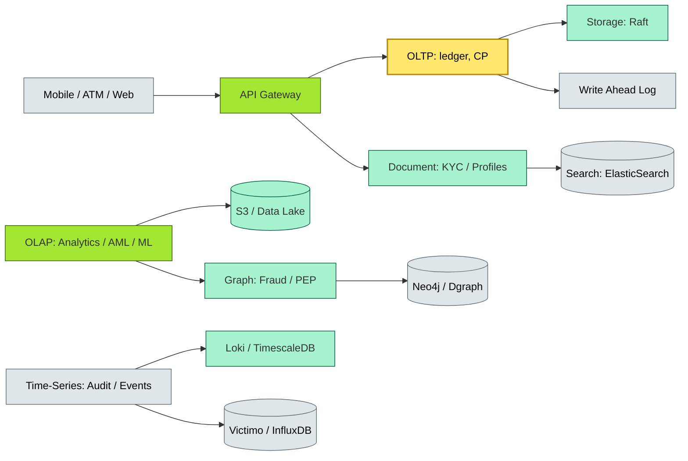

# C4-?? datastores — BRIEF

> **Category:** C4 — System & Software Design · **Difficulty:** ●● · **Banking-relevant:** yes
> **One-liner:** _Datastores are the persistent foundations of any system; in banking, the correct choice among OLTP, OLAP, document, graph, blockchain-anchored, and time-series stores is governed by regulatory requirements (immutability, solvability, audit trails), data volume, and access patterns (OLTP vs OLAP)._
> **Why an EA cares:** _A single data store chosen for the wrong workload (e.g., a graph database for core ledger) will collapse under BCBS 239 regulations, inflate infrastructure costs by 10x, and make the bank unable to produce a single source of truth for auditors._

## Quick definition

### OLTP (Online Transaction Processing)
**Online Transaction Processing (OLTP):** A class of systems designed for high-volume, short, atomic transactions (INSERT, UPDATE, DELETE on single rows or documents). *Example:* a payment API updating account balances.

### OLAP (Online Analytical Processing)
**Online Analytical Processing (OLAP):** A class of systems optimized for complex, multi-dimensional queries over large historical datasets. *Example:* an AML investigative analyst filtering by date range, entity, and scheme.

### Document / NoSQL
**Document / NoSQL store:** A store that models data as self-contained documents (JSON, BSON), preferred when schema evolution is frequent or the workflow is polymorphic (e.g., KYC documents with field differences by country).

### Graph
**Graph database:** A store that models entities as nodes and their relationships as edges; ideal for fraud ring detection, KYC PEP/sanctions screening, and network-risk analysis.

### Time-Series
**Time-series database:** A store optimized for time-stamped metric, event, and sensor data (e.g., IoT card readers, market data, audit logs).

### Distributed Ledger / Blockchain
**Distributed Ledger Technology (DLT):** A consensus-maintained data store where records are replicated and append-only; ideal for settlement, trade finance, and cross-border payments.

## The mental model

Think of datastores as **specialized vaults** in a bank's vault architecture. The *main vault* (core ledger) must be a **CP (Consistency+Partition-Tolerance) datastore**: Raft-based or a *single-master* with *2PC*. The *locker boxes* (customer profiles, documents) are **document stores**: append-only, anonymized, *sharded per country*. The *investigation room* (ML feature store, graph) is an **OLAP / graph** cluster. The *temporal archive* (every press of the card, every permitted API call) is a **time-series** system.

## Key ideas / terms

- **ACID vs BASE:** ACID = Atomicity, Consistency, Isolation, Durability (OLTP, ledger). BASE = Basically Available, Soft state, Eventually consistent (OLAP, cache).
- **River pattern:** `database → extract → transform → load → scenario` (ETL/ELT) for data-warehousing.
- **Feature store:** A curated, versioned dataset for ML models.
- **Search store (FOSS / commercial):** Elasticsearch, OpenSearch; for full-text KYC/sanctions search.
- **Immutable/append-only data:** BCBS 239 requires state must be *immutable and identifiable*; an *append-only* datastore is the technical enabler.
- **Data sovereignty:** Data must remain within geography boundaries (e.g., India, EU); shards per country to avoid *cross-border data flow*.
- **Zero data removal:** GDPR right-to-erasure vs. BCBS 239 *no-removal* requirement; must be *logically* deleted but *physically* retained.

## One diagram (mandatory)

## When to use / when NOT to use

- ✅ **Use when:** A bounded context has a *clear* access pattern (many small writes, or many analytic scans) and a *regulatory* data-retention requirement.
- ⚠️ **Avoid when:** The data model is *unknown* or *frequently changing* in real-time without a feature-store layer; the *wrong* pattern (e.g., graph for ledger) will cripple ACID guarantees.

## Banking 💳 example

A **global retail bank** operates:

- **Core ledger (CP):** 3-node Raft (CockroachDB or Spanner) for *double-spend safety*; regulatory rule: no deletion, immutable append-only.
- **Customer profiles (document):** MongoDB per country shard for *GDPR sovereignty*; encrypted at rest; AI / LLM integration for customer-support; Elasticsearch for search dashboards.
- **AML / sanctions (graph + OLAP):** Neo4j for *PEP/sanctions relationship detection*; Graph DB connected to a **feature store** for ML scoring; occasional **export** to a **columnar database** for rule-based detection.
- **Audit / audit logs (time-series):** Every *permitted* access to *controlled* data is recorded in a append-only, encrypted audit log. Long-term archive is offline; hot-searchable in **VictoriaLogs** for 30-day real-time.
- **Card transactions (OLTP + streaming):** Each swipe updates a Spanner *row* (atomic, consistent); a *consensus-less* layer streams to **Kafka** for downstream risk scoring.
- **Regulatory reporting (OLAP):** A **data lake** (Delta on S3) with **partitioned** tables by *date* and *region*; queried by **Presto / Trino** + **Grafana**.

## Common confusions (don't mix these up)

- **DBMS vs NoSQL:** A *DBMS* (PostgreSQL, MySQL) enforces a *schema*; a *NoSQL* ( MongoDB, DynamoDB ) offers *flexible schemas*; both can be *distributed*.
- **OLTP vs OLAP:** OLTP = many small writes; OLAP = few large analytical scans; they serve *different users* and *different times*.
- **Graph vs document:** A graph models *relationships between entities*; a document models *a single entity's self-contained state*.

## Interview / recall prompt

_"Explain datastores in 2 minutes without notes."_ →

- Datastores = the persistent foundation; each paradigm serves a distinct access pattern.
- Bank: core ledger = CP Raft (ACID); KYC = document; fraud = graph + OLAP; audit = time-series.
- BCBS 239 requires immutable, identifiable state; an append-only log is the technical answer.
- Data sovereignty = shard by country; GDPR right-to-erasure vs. BCBS no-removal = *logical* deletion + *physical* retention.
- Recovery from wrong datastore: graph for ledger → 4x cost, 10x complexity, audit failure.

---
**Status:** ☐ Not started · See detail doc: `../details/C4-07-datastores.md`
