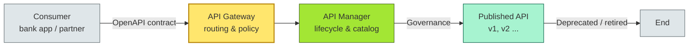

# [C4-08] API Design & Management — BRIEF
> **Category:** C4 — Architecture & Design · **Difficulty:** ◑ · **Banking-relevant:** yes
> **One-liner:** _How to design, protect, and govern external-facing and internal APIs for scale, security, and regulatory compliance in a federation of banking microservices._
> **Why an EA cares:** _In a bank, every channel—mobile, web, ATM, POS, partner, wealth, trade finance—touches a succession of APIs. Bad API governance = broken payments, leaked PII, failed audits, and vendor lock-in. The EA owns the "API contract first" discipline._

## Quick definition
An API is a **published, versioned interface contract** between a consumer and a provider of services, expressed through machine-readable definitions (OpenAPI/Swagger) and managed through an API lifecycle: design, publish, deprecate, and retire. In enterprise architecture, APIs are first-class architectural assets, not merely code endpoints.

## Key ideas / terms
- **API Lifecycle:** {Design → Build → Publish → Operate → Deprecate → Retire, with explicit versioning.}
- **API Contract:** {A machine-readable specification (OpenAPI/AsyncAPI) that is the single source of truth.}
- **API Federation:** {The strategy and tooling (center-led, decentralized, or hybrid) used to govern hundreds or thousands of APIs at scale.}
- **API Gateway:** {A single entry point that handles routing, security, rate-limiting, observability, and protocol translation.}

## The mental model
APIs sit at the **boundary layer** of a service architecture. They are the public face of internal capabilities—a customer service request, a fraud engine check, a ledger transfer—and must be treated as **products with owners, consumers, SLAs, and deprecation policies**. Think of them as "payroll checks at every branch": someone must ensure they are issued, cashed, and retired on schedule.

## One diagram (mandatory)

## When to use / when NOT to use
- ✅ **Use when:** you need a stable, versioned, contract-driven interface across teams, channels, or business units; when compliance requires audit-traceable API governance; when integrating regulated third parties.
- ⚠️ **Avoid when:** building a throwaway internal script; a monolith where the boundary is an internal method call; when you cannot afford even minimal contract management overhead.

## Banking 💳 example
A bank rolls out a new "instant wealth-management onboarding" journey. The front-end team, a fintech partner integration team, and the internal KYC team all consume an `OnboardingProfile` API. The EA mandates an OpenAPI contract, a single API Gateway entry point, and a 90-day deprecation timeline. The partner signs the contract; the GDPR audit confirms data minimization; the PCI-DSS assessment validates tokenization in transit.

## Common confusions (don't mix these up)
- **API vs API Gateway:** *API* is the contract and lifecycle; *Gateway* is the runtime enforcement layer.
- **API Management vs API Gateway:** *Management* = design, catalog, analytics; *Gateway* = proxy, policy, routing at runtime.

## Interview / recall prompt
_"Explain API governance in 2 minutes without notes."_ →
- APIs are first-class assets with lifecycle ownership.
- Design, publish, and deprecate through a contract.
- Federate governance; don't gate all decisions centrally.
- Banking adds PCI-DSS, GDPR, and audit-traceability.
- Deprecation policy prevents zombie APIs.

---
**Status:** ☐ Not started · See detail doc: `[details/C4-08-apis.md](../details/C4-08-apis.md)`
