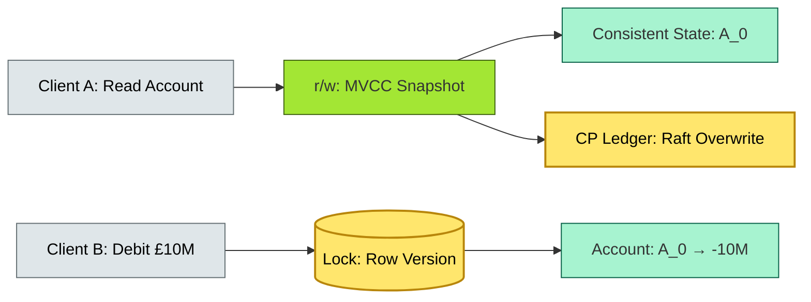

# C4-?? concurrency & consistency — BRIEF

> **Category:** C4 — System & Software Design · **Difficulty:** ●● · **Banking-relevant:** yes
> **One-liner:** _Concurrency and consistency are the twin constraints in banking: concurrency models (locks, MVCC, CRDTs) enable parallel reads/writes, while consistency models (strong, eventual, causal) determine whether a £10M trade or a 50,000 P2P transfer sees the *right* *state* *at* *the* *right* *time*._
> **Why an EA cares:** _A concurrency bug in the core ledger can double-spend; a consistency anomaly in fraud monitoring can miss a ring; the EA must match *each* *transaction* *type* to a *correct* *consistency* *and* *concurrency* *model* and mandate *idempotency* everywhere._

## Quick definition

**Concurrency** is the ability of a system to *exceed* *1* *thread* *where* *multiple* *threads* *access* *the* *same* *data* *concurrently*; it is *managed* by *control structures* (locks, MVCC, optimistic concurrency, CRDTs). **Consistency** is the property that *a read* *returns* *the* *most *recent* *write* *or* *a* *guaranteed* *state*; a *concurrency model* *enforces* *consistency*.

## Key ideas / terms

- **ACID / BASE:** ACID = atomicity, consistency, isolation, durability (CP, ledger); BASE = basically available, soft state, eventual consistency (AP, analytics).
- **MVCC:** Multi-version concurrency control; *each read sees a snapshot*; reader-writer *no-block*.
- **CRDT:** Conflict-free replicated data type; *converges* *without* *coordination*; used in *event-driven* *AP* *systems*.
- **Linearizability:** *Operations* *appear* *to* *occur* *at* *a* *single* *instant*; the *gold standard* for *payment* *ledger*.
- **Causality:** Weaker than *linearizability*; *read-your-writes* and *monotonic reads*; used in *user-facing* *features*.
- **Idempotency:** *An* *operation* that *can* *be* *applied* *multiple* *times* *with* *the* *same* *result*; *the* *only* *safe* *pattern* for *retries*.

## The mental model

In a banking system, *transactions* and *users* *run* *in* *parallel* 24/7. The *ledger* *locks* *the* *account* *record* *on* *every* *debit*; an *omission* *that* *does* *not* *lock* *it* creates a *race* *condition* where *two* *10* *million* *LTC* *transactions* *can* *deduct* *the* *same* *balance*. The *EA* *must* *map* *every* *transaction* *to* *a* *correct* *lock* *scope* and *consistency* *level* at *design* *time*.

## One diagram (mandatory)

## When to use / when NOT to use

- ✅ **Use when:** *Transactions* *are* *concurrent* *and* *must* *not* *lose* *data*; *high* *integrity* *is* *required* (ledger, settlement).
- ⚠️ **Avoid when:** *Reads* *are* *99%* *with* *no* *write*; use *eventual* *consistency* (read models, ML feature store).

## Banking 💳 example

A **global securities firm** requires:

- **Trading engine:** *Raft* *cluster* with *MVCC* *and* *pessimistic* *row* *locks* *occur* on *order* *border*; *linearizable* *across* *all* *nodes*.
- **APB/Monitoring:** *Read-only* *view* over *Kafka* *topic* *with* *CRDT* *counters*; *eventual* *consistency* *acceptable*; *10-second* *staleness* *tolerated.
- **Fraud:** *Event-sourced* `FraudAlert` * subscribed* *by* *15* *SGRE* *workers*; *idempotent* *deduhlation* *via* *ding+2* *v2* *schema*; *STALENESS* *15* *seconds* *tolerated*.
- **Settlement:** *No concurrency model possible* *without* *global* *consistency*; *single* *CP* *path*; *never* *async*.

## Common confusions (don't mix these up)

- **Consistency vs concurrency:** *Consistency* = *what* *state* *is* *visible*; *concurrency* = *how* *many* *threads* *run* *in* *parallel.
- **MVCC vs optimistic:** *MVCC* *is* *a* *concurrency* *control* *method*; *optimistic* *concurrency* *control* *is* *a* *strategy*; *MVCC* *is* *optimistic* *when* *using* *version* *checking.
- **Idempotency vs exactly-once:** *Idempotency* = *safe* *to* *retry*; *exactly-once* = *no* *duplicate* *delivery*;
  *Kafka* *provides* *at-least-once*; *idempotency* *is* *the* *mechanism*.

## Interview / recall prompt

_"Explain concurrency and consistency in 2 minutes without notes."_ →

- *Concurrency* = *multiple* *threads* *accessing* *shared* *data*; *consistency* = *read* *sees* *the* *right* *state.
- *Banking* *requires* *CP* *concurrency* *for* *the* *ledger*; *AP* *for* *analytics* *and* *fraud.
- *Idempotency* *is* *the* *only* *safe* *pattern* *for* *retries; *duplicate* *checks* *are* *built* *in* *to* *every* *async* *path.
- *MVCC* *is* *the* *default* *pattern* *for* *read-heavy* *apps; *row locks for* *low-latency* *debit.

---
**Status:** ☐ Not started · See detail doc: `../details/C4-09-concurrency-consistency.md`
