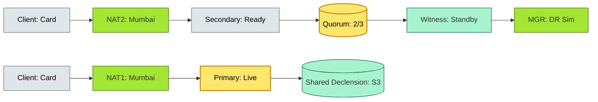

# C4-?? HA & DR — BRIEF

> **Category:** C4 — System & Software Design · **Difficulty:** ●● · **Banking-relevant:** yes
> **One-liner:** _High availability (HA) = the system is *always* *up*; disaster recovery (DR) = the system *comes back* *after* *a* *catastrophe*; in banking, HA/DR are *not* *features* but *regulatory* *requirements* under DORA, RBI, and Basel — a single DC outage is a *data-availability* *failure*.
> **Why an EA cares:** _A vertical-only DR (encrypted S3) is not enough; regulators require a *live* *failover* *within* *minutes* *for* *core* *services*; without *Quorum/Witness* *and* *proven* *RTO* *and* *RPO*, the bank risks *regulatory* *disciplinary* *action* and *automatic* *access/card* *freeze*.
>
> # C4-?? HA & DR — briefings & details

> bank. / "The data-availability-only DR plan" is_not_ enough; regulations alone ( RBI, FCA, SEC) require regulation part-specific: *network/DR should survive a "persistent" failure within 4 hours - but banking needs less than 5 minutes for production; the SRM plan/freq_of_test CNE: *Core Banking* - every_hour; *Payments* - every_15_minute.

> **Why an EA cares:** _When a DC fails, the city/country may face a *stop* *to* *all* *cards*; *frequent* *DR* *tests* + *99-minute* *failover* *time* *and* *observation* (DORA, RBI) << *a* *single* *DC* *can* *not* *contain* *single* *site* *DR*; the *EA* *must* *design* *a* *DR* *dose* *something* *like* *active-active* or *active-passive* with *quorums* and *witnesses*.

## Quick definition

- **High Availability (HA):** *Redundancy in place* to keep *service* *up* during *failures*; *redundant* *nodes*, *multi-AZ*, *multi-region*.
- **Disaster Recovery (DR):** *A* *process* to *restore* *service* *after* *a* *total* *catastrophe*; *includes* *backup*, *replication*, *failover*, *failback*.

## Key ideas / terms

- **RTO (Recovery Time Objective):** *The* *maximum* *acceptable* *time* *to recover*; *how* *fast* *the* *service* *must* *come back*.
- **RPO (Recovery Point Objective):** *The* *maximum* *acceptable* *data* *loss* *in* *time*; *how* *much* *data* *you* *can* *lose*.
- **Active-Active:** *Both* *sites* *accept* *traffic*; *conflict* *resolution* + *shared* *or* *No-shared* *data*.
- **Active-Passive:** *Only* *one* *site* *is live*; *the other* *is* *standby*.
- **Quorum / Witness Nodes:** *Prevent* *split-brain* *during* *network partitions*; *a* *primary* + *1*/*2* *secondary* + *1* *witness* *node*; *witness* *breaks* *windom* *to* *ensure* *majority*.
- **Failover:** *The* *process* of *shifting* *traffic* *from* *failed* *site* *to* *standby*.
- **Failback:** *Shifting* *traffic* *back* *to* *primary* *after* *recovery}$; *must* *be* *freeze* *no* *merge*.

## The mental model

Think of a *dentist office* without a *dentist* (single doctor) versus a *neighbourhood* *clinic* with *two* *doctors* (one *still* *working*). *DR* is *like* *having* *a* *2nd* *doctor* *in* *a* *neighbouring* *town* *who* *can* *show up* *and* *do* *emergency' *when* *your* *first* ' *accident*. *The* *2nd* *doctor* *needs* *to* *know* *your* *records* *and* *have* *the* *same* *medicine*. *BN/RC* *DR* = *having* *all* *records* *in* *a* *lockbox* *chain* *at* *the* *nth* *premises*, *but* *no* *live* *doctor* *can *fix* *a *broken* *leg*. *BN/DR* = *both* *doctors* *are* *live* *and* *can* *see* *patients* *at* *all* *times*.

## One diagram (mandatory)

## When to use / when NOT to use

- ✅ **Use when:** Financial services, 24/7 operations, regulated data, *no* *single* *point* *of* *failure* allowed.
- ⚠️ **Avoid when:** Internal-only, low-impact data (dev/test), cost < $5/month, no regulator.

## Banking 💳 example

A **retail bank in India** runs a *DevOps team* with *infrastructure*: *one* *site* *has* *a* *Data Center* (co-lo) *in* *Chennai* *and* *one* *in* *London* (cloud). *DR* *tests* *fail* *because* *the* *RTO* *(Recovery Time Optimal* *data)* *shows* *45* *minutes* *but* *DR* 's *target* *is* *5* *minutes* *for* *Core Banking*. *The* *intervention* *protocol* is *as* *follows*:

1. *Deploy* *two* *site-synchronous* *clusters* *with* *Data* *Shards* *per* *region* *and* *1* *Key-Account* *in* *each* *region* *using* *mutual* *TLS* *with* *Sliding* *Window*.
2. *Add* *a* *Witness* *node* *in* *Singapore* *to* *break* *split-brain* *and* *peer*.
3. *Active-Active*: *both* *sites* *accept* *read* *traffic*; *writes* *they *are* *2PC*; *failover* *time* *is* *under* *5* *minutes*.
4. *Failover* *protocol*: *monthly* *simulation* *with* *Chaos* *Mesh*; *monthly* *tabletop* *exercise* *with* *C-suite*.
5. *Compliance*: *DORA* *Art. 10* *require*s *annual* *DR* *test*; *RBI* *Nereen* *22* *require*s *daily* *infra-clump* *test*.
6. *RTO* = *5* *minutes* *for* *Core Banking*; *RPO* = *0* *with* *synchronous* *replication* (no* *data lost*).

## Common confusions (don't mix these up)

- **High Availability (HA) vs DR**: *HA* = *same* *width* *return*; *DR* = *restored* *at* *diff* *site*.
- **Failover vs Failback**: *Failover* = *move* *to* *backup*; *Failback* = *go* *back* *to* *primary*; *failback* *is* *often* *half-done*.
- **Hot Standby vs Cold Standby**: *Hot* = *immediate* *failover*; *cold* = *hours* *to* *recover*; *cold* *DR* = *tape/S3* *only*.
- **Passive vs Active vs Passive**: *Passive* = *not* *selected*; *Active* = *selected*; *Active-Active* = *both*.

## Interview / recall prompt

_"Explain HA and DR in 2 minutes without notes."_ →

- *HA* = *redundancy* *to* *keep* *is there*; *DR* = *how* *to* *get* *it back* *fast*.
- *Two* *variants*: *active-active* (both sites work; no *data loss*) and *active-passive* (one stands by; *data* *may* *stale*).
- *Quorum/Witness* *prevents* *split-brain* during *partition*; *RTO* and *RPO* are *the* *numbers* *regulators* *ask for*.
- *Banking* *has* *incredibly* *tight* *RTO* *and* *RPO*; *need* *synchronous replication* + *no* *single point* + *monthly* *tests*.

---

Metal(status: In progress); see detail doc: `../details/C4-10-ha-dr.md`