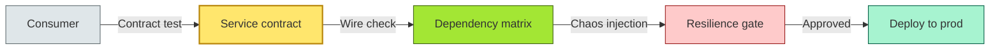

# [C4-11] Architectural Testing — BRIEF
> **Category:** C4 — Architecture & Design · **Difficulty:** ◑ · **Banking-relevant:** yes
> **One-liner:** _Testing the architecture itself—contracts, topology, non-functional properties, and dependency integrity—rather than testing any single line of code._
> **Why an EA cares:** _In banking, a single architectural flaw (missing circuit-breaker, unbounded queue, missing failover) can cost millions in downtime, fines, or reputational loss. The EA must verify the architecture before it ships, not after incidents._

## Quick definition
Architectural testing is the **verification of non-functional requirements, behavioral contracts, and structural invariants at the system level**. It includes contract tests, topology/dependency tests, penetration and chaos tests, load/stress tests, and integration tests between major components.

## Key ideas / terms
- **Contract Testing:** {verifying that the provider's actual payload conforms to the published API contract.}
- **Topology & Dependency Tests:** {validating that required upstream and downstream contracts are wired correctly.}
- **Chaos / Resilience Testing:** {injecting failures (latency, loss, kill) to verify graceful degradation and failover.}
- **End-to-End (Architectural E2E):** {test from real user touchpoint through all tiers to validate architectural cuts, not just unit boundaries.}

## The mental model
Architectural testing is the **airbag for the system's shape**. Unit tests guard individual components; architectural tests guard the *relationships* between them. In a bank, the shape includes latency from payments to core, data-plane isolation between retail and investment, and failover from disaster-recovery across regions.

## One diagram (mandatory)

## When to use / when NOT to use
- ✅ **Use when:** non-functional requirements (latency, availability, security, regulatory SLAs) are binding; the system crosses jurisdictions or data sensitivity tiers; banking transactions require audit-grade verification.
- ⚠️ **Avoid when:** pure proof-of-concept with no production path; internal dev environment without real traffic patterns; chaos tests that mask actual business KPIs behind failures.

## Banking 💳 example
A bank's instant payment system must settle transactions in <200 ms, guarantee exactly-once semantics, and failover between EU and APAC within 10 s. The architecture team runs contract-based tests on the ledger service, topology tests on the service mesh, chaos tests for Kafka broker loss, and load-tests against peak month-end volume before every release.

## Common confusions (don't mix these up)
- **Architectural testing vs integration testing:** *Integration testing verifies that two concrete code paths work together*; *architectural testing verifies that the design intent (NFRs, topology, contracts) holds at scale*.
- **Load test vs business simulation:** *Load test throws traffic at the system*; *business simulation exercises realistic user journeys with transactional context*.

## Interview / recall prompt
_"Explain architectural testing in 2 minutes without notes."_ →
- It tests the system shape, not the code.
- Contract, topology, chaos, and load layers.
- In banking: failures cost money; verify SLAs and isolation before go-live.
- Automate in CI; gate deploys on pass.

---
**Status:** ☐ Not started · See detail doc: `[details/C4-11-testing.md](../details/C4-11-testing.md)`
