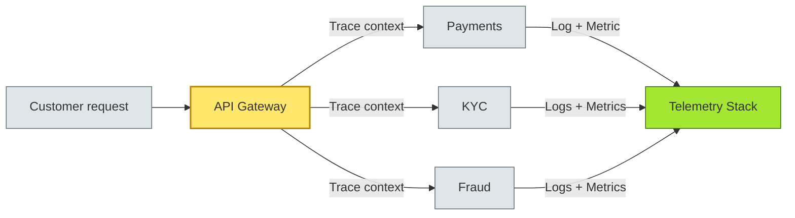

# [C4-12] Observability — BRIEF
> **Category:** C4 — Architecture & Design · **Difficulty:** ◑ · **Banking-relevant:** yes
> **One-liner:** _The ability to ask arbitrary questions of a running system and get answers—telemetry-driven, not event-pre-defined, essential for complex distributed banking platforms._
> **Why an EA cares:** _In a bank, not every failure has a known signature. Observability—metrics, traces, and logs—lets you discover the unknown unknowns before regulators do._

## Quick definition
Observability is the **measurement of a system's internal state through externally observable outputs** (metrics, logs, traces), enabling engineers to infer causes of unseen failures without prior hypotheses.

## Key ideas / terms
- **Telemetry:** {Automatically emitted measurements from the system—logs, metrics, distributed traces.}
- **Three pillars:** {Metrics (numerical aggregates), Logs (discrete events), Distributed Traces (request paths across services).}
- **Golden signals:** {LATENCY, THROUGHPUT, ERRORS, SATURATION—core metrics to monitor for every service.}
- **Correlation:** {Linking a trace, log, and metric to a single causal incident across microservices.}

## The mental model
Observability is your **black-box spectrometer**. When a transaction fails in a distributed saga, you cannot open every service; you need a traceable path from the API gateway to the ledger and then to the fraud engine. Observability turns opaque boxes into a connected, queryable map.

## One diagram (mandatory)

## When to use / when NOT to use
- ✅ **Use when:** systems are distributed (>2 services), traffic is non-deterministic, regulatory audits require evidence of incident response, third-party dependencies are opaque.
- ⚠️ **Avoid when:** a single monolith with a single database; a proof-of-concept without production stakes; telemetry without a runbook becomes noise.

## Banking 💳 example
A real-time wealth-management platform experiences sporadic 500 ms p99 latency spikes. Observability—three golden signals per service, distributed tracing across broker, vault, ledger, and payment rails—reveals that the latency spike correlates to a slow downstream broker partition. Before observability, this would be a 4-hour incident investigation; with it, a 15-minute root-cause correlation.

## Common confusions (don't mix these up)
- **Observability vs monitoring:** *Monitoring = known-known alerts*; *observability = unknown-unknown discovery*.
- **Metrics vs traces vs logs:** *Metrics = aggregate numbers; Traces = request paths; Logs = discrete records*.

## Interview / recall prompt
_"Explain observability in 2 minutes without notes."_ →
- Metrics, traces, and logs.
- Allows arbitrary future questions.
- Three pillars: logs, metrics, distributed traces.
- In banking: DORA, PCI-DSS, and incident response require evidence.
- Correlation across services is what makes it powerful.

---
**Status:** ☐ Not started · See detail doc: `[details/C4-12-observability.md](../details/C4-12-observability.md)`
