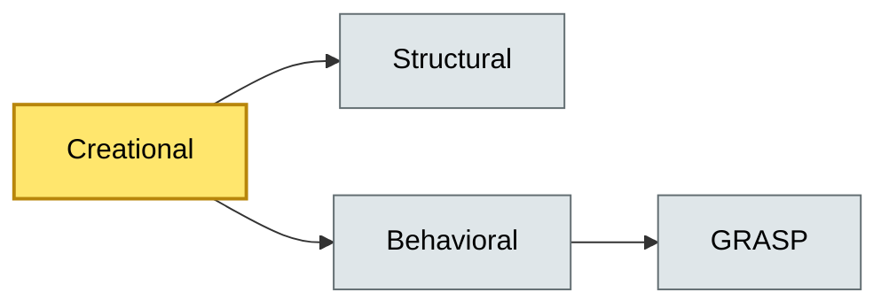

# [C5-01] GoF Design Patterns — BRIEF
> **Category:** C5 — Patterns & Archetypes · **Difficulty:** ●/◑/○ · **Banking-relevant:** yes
> **One-liner:** The 23 Gang of Four software design patterns classify recurring object-oriented solutions to maintainable, testable, and evolvable software structures, which underpin every banking system from core-banking ledgers to front-office trading desks.
> **Why an EA cares:** Architects must justify why a pattern is adopted, who owns its conformance, and whether it introduces hidden coupling that jeopardizes PCI-DSS or DORA resilience mandates.

## Quick definition
The GoF patterns (Gamma et al., *Design Patterns*, 1994) are 23 reusable solutions to commonly occurring problems in object-oriented systems. They describe object and class compositions to solve specific issues, implying that a single pattern speaks for a family of architectures.

## Key ideas / terms
- **Creational patterns:** Strategies for object instantiation (Singleton, Factory Method, Abstract Factory).
- **Structural patterns:** Composition solutions without changing class interfaces (Adapter, Decorator, Proxy).
- **Behavioral patterns:** Communication and responsibility delegation (Observer, Strategy, Template Method).
- **GRASP patterns:** Complementary expert-level patterns such as Polymorphism, Singleton, and Pure Fabrication that refine GoF guidance.

## The mental model
GoF patterns sit one level below architecture; they are design-time blueprints architects recommend to reduce later refactoring costs. In banking, they prevent brittle domain models during rate-change cycles or new payment-instrument onboarding.

## One diagram (mandatory)

## When to use / when NOT to use
- ✅ **Use when:** The domain has stable business rules and you need interchangeable algorithms (e.g., rate calculators for FX vs. deposits).
- ⚠️ **Avoid when:** You have no clear indirection requirement; premature pattern adoption bloats code and hurts performance audits.

## Banking 💳 example
A **Strategy** pattern separates interest-calculation engines so German Pfandbrief, US 30-year MBS, and Islamic sukuk products each have a self-contained class, allowing one bank to swap them without touching the account-ledger.

## Common confusions (don't mix these up)
- **GoF patterns** vs **GRASP patterns:** GoF is 23 OOP solutions; GRASP is a complementary set of expert heuristics for assigning responsibility.

## Interview / recall prompt
"Explain the Singleton pattern in 2 minutes without notes." → 1) One-class global access control; 2) Base in Controller or Logger; 3) Risk: hidden global state makes test mocking painful; 4) Banking limit: avoid for multi-tenant rate servers; 5) Thread-safe init matters under PCI-DSS logging.

---
**Status:** ✅ Covered · See detail doc: `details/C5-01-gof-patterns.md`
