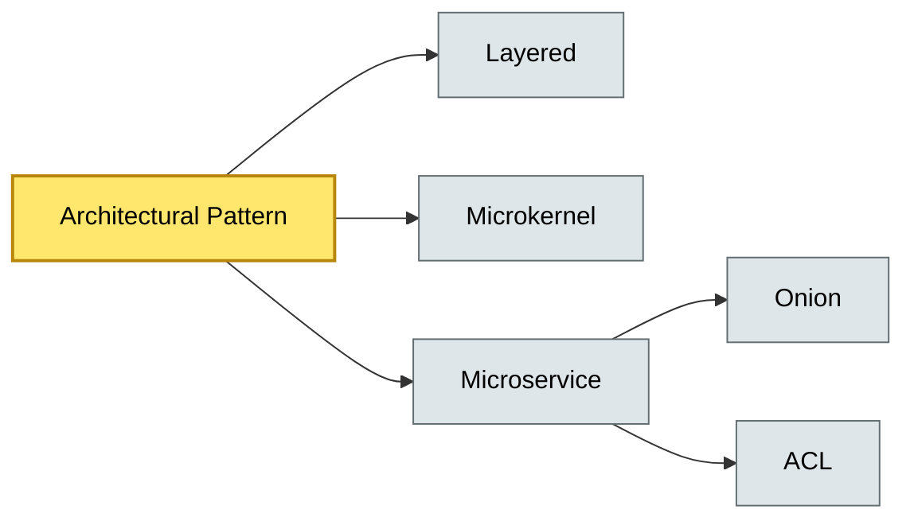

# [C5-02] Architectural Patterns — BRIEF
> **Category:** C5 — Patterns & Archetypes · **Difficulty:** ●/◑/○ · **Banking-relevant:** yes
> **One-liner:** Architectural patterns describe the fundamental organization of a system—elements, relationships, and rules—at the highest level, from layered monoliths to event-driven microservice ecosystems, and are the primary currency of enterprise architecture.
> **Why an EA cares:** They determine budget, latency, compliance, and operational cost curves for 10–20 year horizons; a wrong architectural pattern choice can commit a bank to a 5-year mainframe-modernization arc.

## Quick definition
Architectural patterns are repeatable, high-level structures that organize software, hardware, and human elements. Unlike design patterns, they govern the whole system: data flow, distribution, component interaction, and deployment topology.

## Key ideas / terms
- **MVC:** Separates data, UI, and control logic.
- **Layered:** Hierarchical stack with strict upstream/downstream communication.
- **Microkernel:** In-house minimal core + swappable modules.
- **Microservice:** Small, independently deployable services around business capabilities.
- **Shared Kernel:** Services share a small common schema/codebase.
- **Anti-corruption Layer (ACL):** Adapter between bounded contexts.
- **Onion / Clean Architecture:** Dependency inversion; domain core has no knowledge of UI or DB.

## The mental model
Arch patterns sit one level above GoF design patterns; they are the first-class deliverable in TOGAF Design/Transition phases and the backbone of technical debt boards. A bank’s “mobile-cash” or “settlement-orchestrator” is an arch pattern decision, not a GoF pattern inside it.

## One diagram (mandatory)

## When to use / when NOT to use
- ✅ **Use when:** You need to reason about system-wide properties—latency, uptime, regulatory audit surface—before writing code.
- ⚠️ **Avoid when:** Domain is guaranteed to be a single trivial workflow; Do not apply microservice complexity to a 30-person team.

## Banking 💳 example
A **layered monolith** with an **ACL** between the legacy bank core (mainframe) and a new payments-enrichment microservice lets the bank keep the reliable settlement ledger while modernizing KYC screening via separate Node.js workers.

## Common confusions (don't mix these up)
- **Architectural pattern** vs. **Architectural style:** Pattern names a concrete structure (e.g., Microservice); style is an umbrella aesthetic (e.g., Layered vs. Event-driven).
- **Microservice** vs. **Microkernel:** Microkernel is *one* process with swappable modules; microservices are *many* runtime processes.

## Interview / recall prompt
"Explain why a bank might decompose a monolith into microservices." → 1) Bounded-context alignment; 2) Deployment independence; 3) Technology-per-service (differentiated rate-service Node stack vs. ledger JVM); 4) DORA resilience (failure isolation); 5) Complexity tax: DevOps maturity, observability, SLAs.

---
**Status:** ✅ Covered · See detail doc: `details/C5-02-arch-patterns.md`
