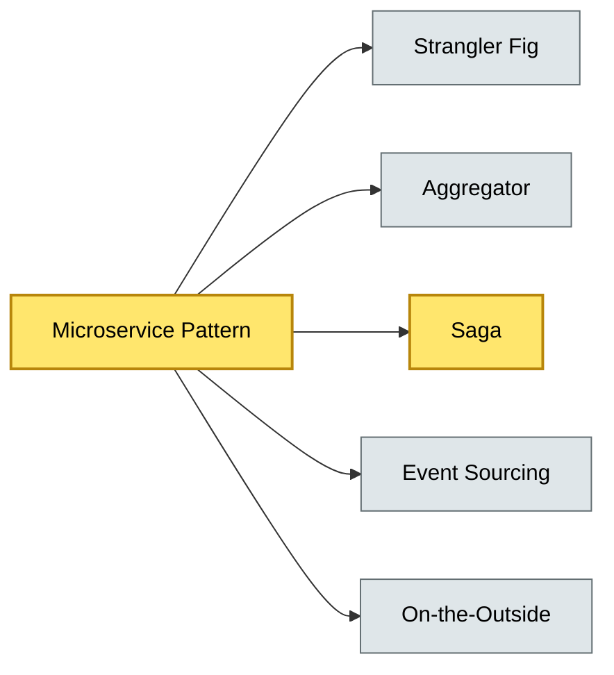

# [C5-03] Microservice Patterns — BRIEF
> **Category:** C5 — Patterns & Archetypes · **Difficulty:** ●/◑/○ · **Banking-relevant:** yes
> **One-liner:** Microservice architectural patterns are the ensemble of structural, communication, data, and organizational conventions that turn a collection of independently deployable services into a coherent, resilient, and governable banking platform.
> **Why an EA cares:** They determine deployment frequency, blast radius, and compliance surface for every business capability; without them, “microservice” becomes a distributed monolith.

## Quick definition
Microservice patterns (drawn from the *Building Microservices* canon and the O'Reilly Event Sourcing and CQRS cookbook) are reusable solutions to recurring design problems at the service-to-service boundary: versioning, failure isolation, data distribution, and observability.

## Key ideas / terms
- **Strangler Fig:** Incrementally replace a monolith with services by routing traffic via an API Gateway.
- **Aggregator:** Service that composes calls to multiple backend services into a single logical operation.
- **Saga:** Long-running transaction composed of local transactions and compensating actions.
- **Event Sourcing / CQRS:** Persist state changes as immutable events; separate read and write models.
- **On the Outside / On the Inside:** Hide internal implementation of heavyweight legacy components behind an external facade or within a single process.
- **Anti-corruption Layer (ACL):** Translate between legacy and new domain paradigms.

## The mental model
Microservice patterns are to microservices what GoF patterns are to classes: they make the *distributed* problem tractable without devolving into cross-service tight coupling.

## One diagram (mandatory)

## When to use / when NOT to use
- ✅ **Use when:** You need independent deployability, technology heterogeneity, and bounded-context ownership.
- ⚠️ **Avoid when:** Underlying network is unreliable or service count exceeds several hundred without an SRE/DevOps team.

## Banking 💳 example
A **Saga** coordinates a cross-border SWIFT MT103 through Clearing, Fraud, and AML services: if fraud rejects, a compensating transaction refunds the token; if AML is delayed, a timeout triggers a manual compliance hold.

## Common confusions (don't mix these up)
- **Saga** vs. **Two-phase commit:** Saga is *eventual* and *compensating*, not atomic and *locking*.
- **CQRS** vs. **Event Sourcing:** CQRS separates read/write; Event Sourcing persists events. You can have one without the other.

## Interview / recall prompt
"Explain the Strangler Fig pattern in 2 minutes without notes." → 1) Wrap monolith with an API Gateway; 2) Redirect one route at a time; 3) No big-bang migration; 4) Used in payment-service modernization worldwide.

---
**Status:** ✅ Covered · See detail doc: `details/C5-03-microservice-patterns.md`
