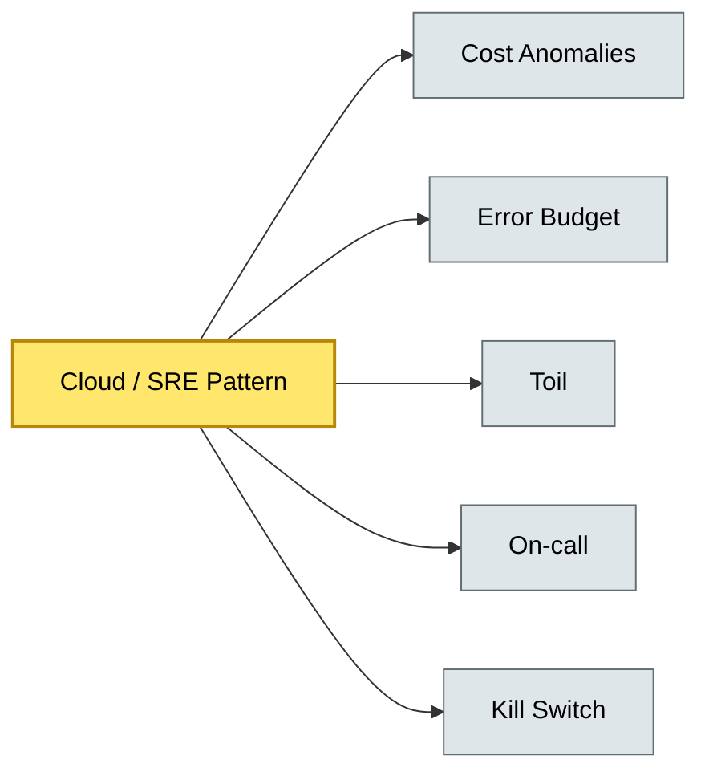

# [C5-04] Cloud & SRE Patterns — BRIEF
> **Category:** C5 — Patterns & Archetypes · **Difficulty:** ●/◑/○ · **Banking-relevant:** yes
> **One-liner:** Cloud and SRE patterns are operational and platform strategies for predictably scaling applications, achieving reliability targets (SLOs), and minimizing toil across multi-tenant, hybrid, or public-cloud banking environments.
> **Why an EA cares:** They translate business SLOs (e.g., 99.99% payment availability) into engineering behaviors; without them, “cloud-native” is a marketing term, not a resilience strategy.

## Quick definition
Cloud patterns address cloud adoption strategies, platform design, and economics. SRE patterns (from *Site Reliability Engineering*, Beyer et al.) focus on the human-to-human and human-to-machine interface: monitoring, error budgets, incident response, and capacity management.

## Key ideas / terms
- **Cloud Adoption Frameworks:** Azure CAF, AWS CAF, Google Cloud CAF.
- **Cost anomalies:** Spend mis-allocation, egress charges, unplanned usage spikes.
- **Error budget:** Allocated unreliability budget to balance velocity vs. stability.
- **Toil:** Manual, repetitive operational work.
- **SLI / SLO / SLA:** Service Level Indicator, Objective, and Agreement.
- **On-call burden:** Human cost of running the system (on-call fairness, blameless post-mortems).
- **Forecast-based horizontal scaling:** Predict load and scale pre-emptively.
- **Kill switch:** Emergency circuit breaker to terminate runaway processes or drain traffic.

## The mental model
Cloud patterns are the *where* (deployment topology, cost model); SRE patterns are the *how* (operational rituals, human feedback loops). Together they ensure a bank can move to public cloud *and* survive a flash-loan-driven traffic spike at 09:00 UTC on a trading day.

## One diagram (mandatory)

## When to use / when NOT to use
- ✅ **Use when:** You must quantify SLO compliance, run an on-call rotation, or automate cloud cost governance.
- ⚠️ **Avoid when:** The system is on-prem with no public-cloud mandate; apply only if you have the discipline for continuous reliability improvement.

## Banking 💳 example
A bank uses **forecast-based horizontal scaling** to pre-warm payment-processing nodes before a known holiday-weekend run; an **error budget** allows the payment team to absorb 0.1% error rate for 30 days in exchange for a mobile app redesign, while a **kill switch** immediately drains traffic if the new fraud-detection model’s CPU usage spikes above 80% P99.

## Common confusions (don't mix these up)
- **SLI vs. SLO vs. SLA:** SLI = measurable target (latency, success rate); SLO = internal commitment (error budget); SLA = external customer promise.
- **Toil** vs. **Automation:** Toil = repetitive manual tasks; automation = the means to remove focus so humans can do non-automateable work.

## Interview / recall prompt
"Explain the Error Budget concept in 2 minutes without notes." → 1) Target reliability (e.g., 99.9%); 2) Error budget = 0.1% of 30 days = ~43 minutes outage; 3) Burn it on experiments or feature work; 4) Stop when budget exhausted; 5) Requires accurate SLIs.

---
**Status:** ✅ Covered · See detail doc: `details/C5-04-cloud-sre-patterns.md`
