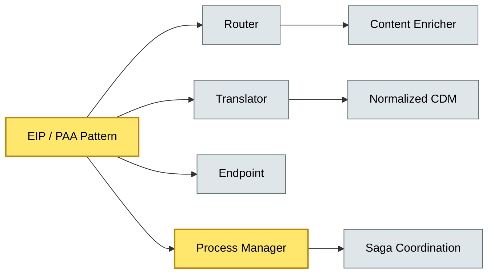

# [C5-05] EIP / PAA / Message Broker Patterns — BRIEF
> **Category:** C5 — Patterns & Archetypes · **Difficulty:** ●/◑/○ · **Banking-relevant:** yes
> **One-liner:** Enterprise Integration Patterns (EIP) and Process-Aware Application (PAA) patterns are a vendor-agnostic catalog of message routing, transformation, and mediation strategies that resolve the fundamental heterogeneity between banking systems from different eras, vendors, and geographies.
> **Why an EA cares:** They are the universal grammar for data flows in payments, trade-finance, and core-bank modernization; choosing the wrong EIP can create an impenetrable data mesh or a single point of failure.

## Quick definition
EIP (Hohpe & Woolf, 2003) defines 65 patterns for integration middleware: routing, decoration, transformation, and mediation. PAA (Pattern-Based Message Broker, from *Process-Aware Message Broker*, 2007) extends this to process-aware event mediation in BPM and ESB contexts.

## Key ideas / terms
- **Message Router:** Determines the path for messages (Recipient List, Scatter-Gather, Content-Based Router).
- **Message Translator:** Converts between data models (Canonical Data Model, Normalizer, XPath, XSLT).
- **Content-Based Router:** Routes based on message payload semantics.
- **Message Endpoint:** A communication boundary (Point-to-Point, Publish-Subscribe, Channel Adapter).
- **Process Manager:** Orchestrates a long-running business process using messaging.
- **Canonical Data Model (CDM):** A simplification of the combined data models of all participants; intermediate formats (IDoc, XML, Avro schematized).
- **Guaranteed Delivery:** At-least-once or exactly-once messaging semantics (Retry, Dead-Letter Channel, Redirect).
- **Content Enricher:** Looks up and injects missing data from a secondary source.
- **Claim Checker:** Validates message against a business rule before persistence.
- **Orchestration vs. Choreography:** Centralized (BPMN/Saga coordinator) vs. decentralized (events + event-storming).

## The mental model
EIP patterns are the *wiring diagram* for data flow; PAA patterns are the *process-aware layer* that adds workflow coordination to those wires. Together they replace fragile point-to-point wiring between mainframes, 1990s AS400s, and modern Java stacks.

## One diagram (mandatory)

## When to use / when NOT to use
- ✅ **Use when:** You need to integrate disparate systems (mainframe core, third-party SDV, payment-switch) with differing data models and failure semantics.
- ⚠️ **Avoid when:** A single-vendor homogeneous stack exists; EIP adds indirection without payload benefit.

## Banking 💳 example
A **Message Router** (Recipient List) distributes incoming **SWIFT MT103** messages to Fraud, AML, Clearing, and Client services based on the `Type` field; a **Content Enricher** enriches the message with KYC status from a real-time 3A lookup before Persistence; a **Claim Checker** rejects messages where the `RemittanceAdvice` is missing, complying with PSR 707.

## Common confusions (don't mix these up)
- **EIP (message-level)** vs. **PAA (process-level):** EIP routes/transforms messages; PAA coordinates long-running business processes across messages.
- **Canonical Data Model** vs. **Canonical Model:** CDM is a simplification of *all* participants; a Canonical Model is the shared domain model in DDD.

## Interview / recall prompt
"Explain the Content-Based Router pattern in 2 minutes without notes." → 1) Decides path based on message payload; 2) Analogy: a switchboard reading the destination address; 3) Supported by ESB / Message Broker; 4) Useful for MT103 distribution to wire-channels or fraud; 5) A Content-Based Router without correlations risks race conditions; use a Process Manager to sequence.

---
**Status:** ✅ Covered · See detail doc: `details/C5-05-eip-patterns.md`
