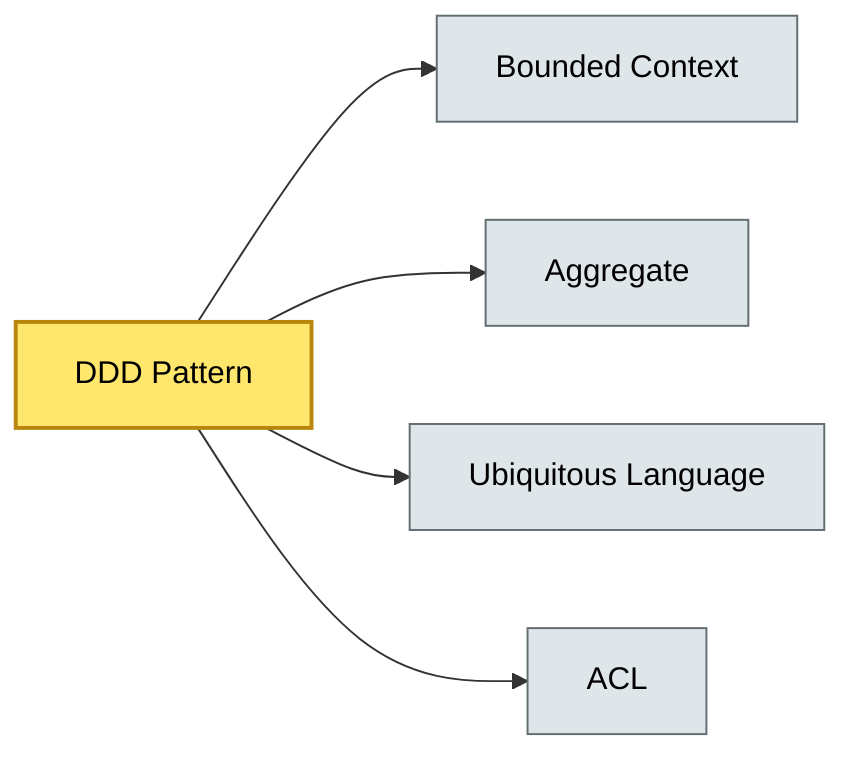

# [C5-06] Domain-Driven Design (DDD) Patterns — BRIEF
> **Category:** C5 — Patterns & Archetypes · **Difficulty:** ●/◑/○ · **Banking-relevant:** yes
> **One-liner:** Domain-Driven Design (DDD) is a strategic and tactical framework for fostering a domain-rich, ubiquitous language between business and technical teams, with patterns for aggregates, bounded contexts, and the anti-corruption layer that is the standard for modeling complex regulated systems.
> **Why an EA cares:** It determines which code-bases map to which parts of the business; without it, every microservice or monolith drift becomes a liability under DORA, SEC, or FCA audit.

## Quick definition
DDD (Evans, 2003) is an approach for focusing development on core domain logic and domain logic that evolves. It uses a shared, rigorous language (ubiquitous language) so that business and technical stakeholders reason about the same concepts. It provides a tactical toolkit (aggregates, value objects, entities) and a strategic toolkit (bounded contexts, context mapping, anti-corruption layers).

## Key ideas / terms
- **Ubiquitous Language:** A single, defined vocabulary shared by all team members.
- **Bounded Context:** A boundary in which a particular Ubiquitous Language is meaningful.
- **Aggregate:** A cluster of associated objects that are treated as a single unit for data changes.
- **Aggregate Root:** The entry point into an aggregate; all external references go through it.
- **Domain Event:** An event that marks something significant in the domain.
- **Context Mapping:** The practice of describing the relationships between bounded contexts.
- **Anti-Corruption Layer (ACL):** Coerce one bounded context's model into another (Oracle vs. other-context).
- **Strategic Model:** The organization's macro view of product segmentation and team structure.

## The mental model
DDD is the *strategic compass* of architecture: it decides *where* to draw lines and *what* each line means. Microservice patterns (C5-03) and EIP patterns (C5-05) then describe *how* those lines connect. Without DDD, every architectural pattern becomes a tangle.

## One diagram (mandatory)

## When to use / when NOT to use
- ✅ **Use when:** The domain is complex, regulated, and has multiple stakeholder vocabularies (products, risk, compliance, operations).
- ⚠️ **Avoid when:** You have a single, stable domain; the overhead of ubiquitous language review exceeds marginal clarity.

## Banking 💳 example
A **bounded context** for **Lending** defines *CreditHold*, *Principal*, *InterestRate*, with an **aggregate root** *Loan* that enforces the invariant that *InterestRate* can change only during *Offer* and *Amortization* phases. The **Anti-Corruption Layer** translates between the Lending model and the Fraud risk model's *RiskScore* using an *Adapter* pattern.

## Common confusions (don't mix these up)
- **Bounded Context** vs. **Subdomain:** Subdomain is a strategic segmentation (Evans, 2003); Bounded Context is the *architectural boundary* within which a Ubiquitous Language applies.
- **Aggregate** vs. **Entity vs. Value Object:** Aggregate is a *cluster* with a root; entity is an *identity* model; value object is *identity-poor* and immutable.

## Interview / recall prompt
"Explain the Ubiquitous Language in 2 minutes without notes." → 1) Single vocabulary shared by business and developers; 2) Model software around this language; 3) Audits and domain review; 4) Prevents confusion: a 'fee' means different things to AML vs. product; 5) Create a glossary.

---
**Status:** ✅ Covered · See detail doc: `details/C5-06-ddd-patterns.md`
