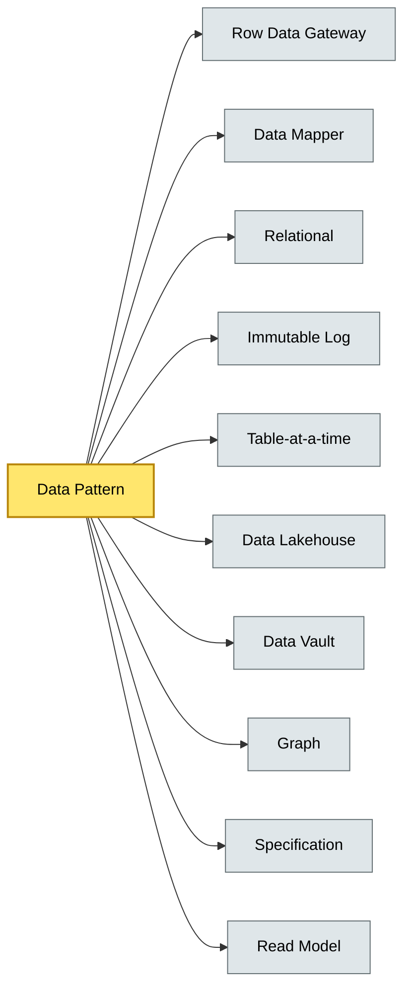

# [C5-07] Data Patterns — BRIEF
> **Category:** C5 — Patterns & Archetypes · **Difficulty:** ●/◑/○ · **Banking-relevant:** yes
> **One-liner:** Data patterns are reusable structural strategies for modeling, storing, querying, and governing data, ranging from relational schemas and globular in-memory stores to data vaults and lakehouses that power every banking decision.
> **Why an EA cares:** They determine data consistency vs. latency trade-offs, auditability, privacy-by-design, and how fast a bank can answer “show me all GICs sold post-ABI” — a question that can take 6 weeks in a legacy-relational data mart.

## Quick definition
Data patterns address how data is organized, accessed, and secured across the technology stack: relational, immutable-log-based, graph-based, column-store, and data-lakehouse formats.

## Key ideas / terms
- **Active Record:** Object contains both data and persistence logic.
- **Row Data Gateway:** Object acts on a single database row.
- **Table Data Gateway:** Object abstracts a database table.
- **Data Mapper:** Object mediates between in-memory and database.
- **Relational:** Id-based modeling, ACID, normalized schemas.
- **Immutable Log:** Append-only write-ahead log, event sourcing, Kafka topics.
- **Table-at-a-time:** Batch-oriented, columnar, analytical.
- **Data Lakehouse:** Unified storage (Delta Lake, Iceberg, Hudi), ACID + time-travel.
- **Data Vault:** Tiny granules, non-volatile sitting bases, append-only; transforms during load.
- **Graph:** Relationship-centric; risk-network analysis, AML watchlist connectivity.
- **Repository:** Encapsulates data access; hides storage details.
- **Specification:** Composable predicate query; used in Domain-Driven Design.

## The mental model
Data patterns are the *structural grammar* of the information fabric. Microservice patterns (C5-03) and Event-Storming (C5-06) define *who owns* data; data patterns define *how* each owner stores, queries, and evolves it.

## One diagram (mandatory)

## When to use / when NOT to use
- ✅ **Use when:** You have multiple persistence needs (OLTP, OLAP, audit, real-time).
- ⚠️ **Avoid when:** A single workload with a single access pattern; pick one pattern and stop.

## Banking 💳 example
A **ledger** follows the **Immutable Log** pattern (append-only, nuclear event records) to satisfy DORA auditability; a **risk engine** uses a **Graph** database to map AML watchlist ties; and a **data lakehouse** (Iceberg on S3) lets the CRO run ad-hoc P&L queries across 15 TB of trade data in seconds.

## Common confusions (don't mix these up)
- **Data Lake vs. Data Lakehouse:** A lake is raw files; a lakehouse is a lake with ACID, transactions, and governance.
- **Data Vault vs. Data Lakehouse:** Data Vault is the *load* pattern; Data Lakehouse is the *storage* format with ACID/time-travel.
- **Event Sourcing (DDD vs. Data Pattern):** In DDD, Event Sourcing is an *aggregation* software pattern; in data patterns it's an *immutable log* storage/query pattern.

## Interview / recall prompt
"Explain Data Vault in 2 minutes without notes." → 1) Tiny granules of data; 2) Non-volatile; 3) Append-only; 4) Satellites hold descriptive data, Hubs and Links capture relationships; 5) Business leads, data mart loads happen during transformation, not at extract.

---
**Status:** ✅ Covered · See detail doc: `details/C5-07-data-patterns.md`
