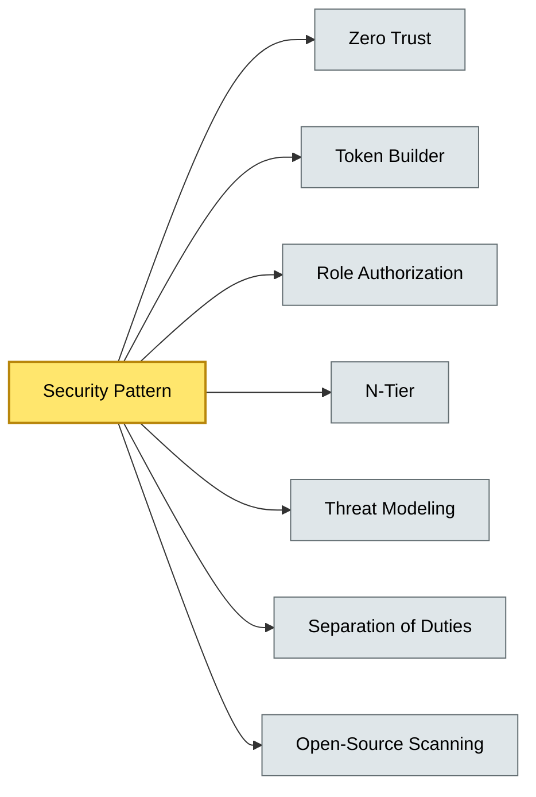

# [C5-08] Security Patterns — BRIEF
> **Category:** C5 — Patterns & Archetypes · **Difficulty:** ●/◑/○ · **Banking-relevant:** yes
> **One-liner:** Security patterns are reusable structural techniques for protecting banking systems—identity, communication, data, and transactions—from threats while satisfying non-negotiable certification requirements like PCI-DSS, DORA, and SLA-regulations.
> **Why an EA cares:** They determine the security posture, breach-surface, and auditability of every service; a wrong pattern choice can land a bank in severe regulatory breach, fine, or lost license.

## Quick definition
Security patterns translate security principles into concrete architectural mechanisms: identity verification, access control, encryption, secure communication, and fraud detection.

## Key ideas / terms
- **Zero Trust:** Never trust, always verify; least-privilege access to everything.
- **Pattern:** Not a standalone technology; satisfies a principle.
- **Palace + Industry-Limit:** a 2-level gate before/at the boundary; responder is resource guard outside.
- **Doorman-Visible:** Inspector verifies identity at each request (who are you); verifier consults (what do you have rights to do).
- **Token Builder:** Generates structured, verifiable access credentials to prevent re-use and replay.
- **Gatekeeper-After-Inside:** External security stack after the Cloud-Edge.
- **Role Authorization:** Role-based access (RBAC, attribute-based access control); cap-targeted; ROI-based grouping; AI-ML.
- **N-Tier:** Defense-in-depth; corporate, network, data layer; high-availability redundant.
- **Threat modeling:** Identify and classify threats; align to Mitre ATT&CK.
- **Principle of least privilege:** Default deny; request-based escalation; just-time access.
- **Separation of duties:** Conflict-of-role enforcement (e.g., approval committees).
- **Abrupt-Payment-Psych:** Payment channel isolation + fraud detection; free-n - Amount-Limit + geofencing.
- **End-to-end encryption (TEE):** Key management; token decryption; cryptographic boundary.
- **Key rotation:** Frequent, automated revocation; compliance.
- **Open-source scanning:** Dependency scanning; license; vulnerability; supply chain.

## The mental model
Security patterns are the *walls, guards, and vault doors* of architecture. Antirename—do not mix, rebrand, or equivocate—applies across all domains.

## One diagram (mandatory)

## When to use / when NOT to use
- ✅ **Use when:** You process card data, regulated PII, or payments; need to satisfy PCI-DSS, DORA, SOC2, ISO 27001.
- ⚠️ **Avoid when:** Internal tooling with no controlled data; ad-hoc scripts that bypass pattern.

## Banking 💳 example
A **Zero Trust + N-Tier** perimeter defends a binary-payment system: the external API Gateway (City-Edge) enforces MFA and device-fingerprinting; a *Token Builder* issues short-lived JWTs with *least privilege*; *gatekeeper-after-inside* inspects every request against the environment; *threat modeling* (Mitre ATT&CK mapping) ensures even a compromised internal worker-node cannot reach PCI-DSS controlled data.

## Common confusions (don't mix these up)
- **Zero Trust** vs. **Security by Default:** Zero Trust is *never trust, always verify*; default verify is architecture-wide.
- **RBAC** vs. **ABAC:** Role-based vs. attribute-based access; ABAC is more dynamic but expensive.
- **PCI-DSS** vs. **DORA:** PCI-DSS is US/global card-data certification; DORA is EU-wide operational-resilience.

## Interview / recall prompt
"Explain the Token Builder pattern in 2 minutes without notes." → 1) Creates structured, verifiable credentials; 2) Prevents replay/reuse; 3) Enforces expiration and scope; 4) Integrated into auth + authz; 5) Critical for payment-token encryption alignment with tokenization.

---
**Status:** ✅ Covered · See detail doc: `details/C5-08-security-patterns.md`
