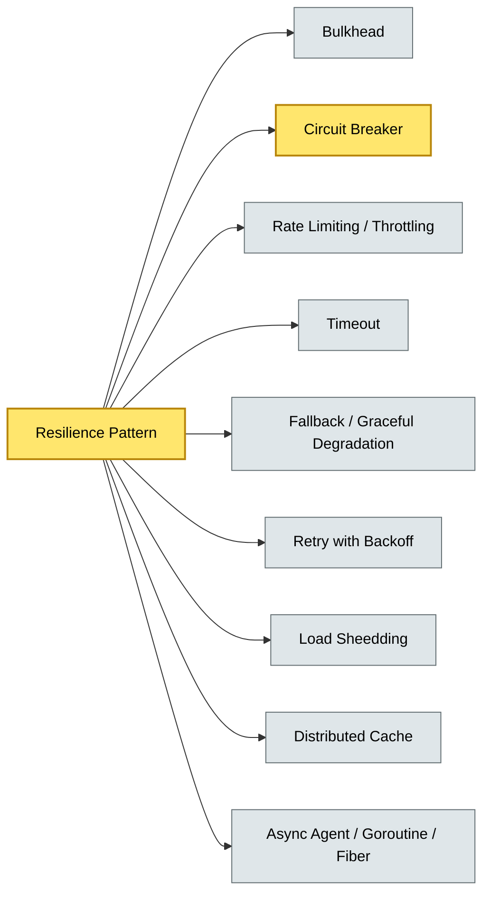

# [C5-09] Resilience Patterns — BRIEF
> **Category:** C5 — Patterns & Archetypes · **Difficulty:** ●/◑/○ · **Banking-relevant:** yes
> **One-liner:** Resilience patterns are the structural anti-fragility mechanisms—Circuit Breaker, Bulkhead, Retry, Rate Limiting, Fallback, Timeout, and Distributed Cache—that allow banking systems to degrade gracefully under stress, fraud, and partial failure rather than collapse.
> **Why an EA cares:** A poorly resilient architecture can propagate a single upstream latency spike into a systemic payment halt; these patterns are the first line of defense against DORA violations and the first path to PoC/OTA resilience.

## Quick definition
Resilience patterns are architectural and operational mechanisms that enable a system to continue operating or to fail over safely under adverse conditions. They ensure degradation, not collapse, while preserving correctness and user experience.

## Key ideas / terms
- **Circuit Breaker:** Stops calling a failing dependency to prevent cascading failure.
- **Bulkhead:** Isolates failure domains so one subsystem's failure does not flood others.
- **Retry / Retry with Exponential Backoff:** Re-attempts transient failures.
- **Trickle / Semantic Retry:** Max attempts with static or dynamic base.
- **Rate Limiting / Throttling / Load Shedding:** Sheds load or Pauses replication to prevent overload.
- **Retry Context / Policy:** Per-operation retry behavior.
- **Timeout:** Hard deadline; signals downstream latency.
- **Readiness Probe / Boot Stuttering:** Delayed activation; prevents premature traffic.
- **Graceful Degradation:** Reduces functionality; preserves core operations.
- **Extended Validation (EV):** A level of validation; prevents trust cascade.
- **Fallback:** Graceful response; extended cache/soft queue retrieval.
- **Distributed Cache:** Stores state outside the core; reduces load on primary systems.
- **Futures / Promise / Fiber / Agent (Async):** Asynchronous patterns; high concurrency; non-blocking IO and low latency.
- **Timeouts:** Hard limit; signal send help.
- **Resource Lifecycle:** End-to-end; from 1 to many; auto-scale; SRE.

## The mental model
All resilience patterns are about *graceful degradation under probability (p).* A circuit breaker, a bulkheaded fail-over, or a fallback does not prevent the root cause; it prevents it from becoming a *total* outage across the entire system.

## One diagram (mandatory)

## When to use / when NOT to use
- ✅ **Use when:** System must meet 99.99% availability; microservice calls are distributed; third-party dependencies are unreliable; fraud/AML alerts need low latency.
- ⚠️ **Avoid when:** System is *single-threaded* and *single-point-of-failure-free*; adding patterns introduces operational complexity the team cannot support.

## Banking 💳 example
A **transit-persistent** payment processor (persistent 10,000 TPS with <50µS tail) uses **Circuit Breaker + Bulkhead + Rate Limiting**. When a downstream credit-bureau API latency spikes past P95, the breaker opens, the bulkhead isolates the bureau tier (remaining 8,000 TPS unaffected), rate-limiting sheds burst load, and a **fallback** returns a *soft-hold* approval (pending TCA) for 5 minutes—keeping revenue flowing while the bureau recovers.

## Common confusions (don't mix these up)
- **Retry pattern** vs. **Grade-Backoff:** Retry *sends* the request; Backoff *retries* the request after a delay.
- **Circuit Breaker** vs. **Bulkhead:** Breaker prevents *cascade*; Bulkhead prevents *contention* between subsystems.
- **Timeout** vs. **Circuit Breaker:** Timeout is a single *call* deadline; Circuit Breaker is a *structural* trip.

## Interview / recall prompt
"Explain the circuit breaker pattern in 2 minutes without notes." → 1) Trip when latency/error threshold hit; 2) Fast-fail with fallback; 3) Recover only after cooldown; 4) In Degraded Mode it does not retry; 5) Must be rate-limited and have a known timeout.

---
**Status:** ✅ Covered · See detail doc: `details/C5-09-resilience-patterns.md`
